# BDM系统1.0需求文档

**版本：** 1.0轻量版  
**生成时间：** 2026-04-29  
**输出目录：** /Users/mac/心音跳动/BDM系统/1.0版本需求文档  
**原型来源：** /Users/mac/心音跳动/BDM系统/1.0版本原型图  
**编写规范：** 严格按照 /Users/mac/.codex/skills/prd-from-brainmaps-and-prototypes 模板


---

## 文档说明

本文档基于1.0版本原型图撰写，严格以原型展示内容为准。

材料中出现但原型未展示的逻辑和描述，不在本文档体现。

原型已拆分为独立页面和交互流程图：交互流程图置于功能模块标题下方，独立页面置于功能点标题下方。

客户端仅包含BD和BDM两种角色视角。

**重要说明：** 1.0轻量版不包含预支、借支、负资产、债务抵扣相关功能。所有涉及预支/借支的字段和流程均已移除。

<span style="color: red; font-weight: bold;">**技术规范：** 所有业务数值必须由服务端返回，禁止客户端硬编码。包括但不限于：提现最低金额、金币兑换汇率（11800）、现金提现开放日期（每月3-7号）、等级配置参数、提成比例等。客户端仅负责展示，所有计算逻辑和配置参数均由服务端控制。</span>

<span style="color:red"><strong>数据实时性要求：APP端和后台凡展示“本月”“本周期”“当月”口径的数据，均必须保证实时性。页面进入、筛选切换、标签切换、刷新或关键操作完成后，必须重新读取或实时计算最新数据；不得读取历史结算快照、过期缓存或延迟批处理结果作为当前“本月/本周期/当月”展示。历史结算记录、历史结算详情除外，仍按结算快照展示。</strong></span>


---

## 系统角色

| 角色 | 客户端入口 | 后台管理 | 说明 |
|---|---|---|---|
| BD | ✔ 查看/操作个人数据 | - | 基础商务拓展 |
| BDM | ✔ BD权限+团队数据+公会审核 | - | BD经理，管理名下BD |
| 平台管理员 | - | ✔ 全量后台管理 | 平台运营人员 |


---

## 核心规则定义

以下定义是原型中薪资字段的数据计算基础，开发前必须理解。


### BD身份限制规则

**（1）BD不可成为公会长或主播**

限制说明：
- 用户成为BD后，不能申请成为公会长或主播
- BD在APP端申请加入公会时，系统拦截并轻提示："当前为BD身份，无法申请加入公会"
- 后台创建公会时，若输入的用户ID为BD身份，系统拦截并轻提示："当前用户为BD身份，无法申请加入公会"

**（2）身份冲突检测**

检测时机：
- APP端：用户点击"申请加入公会"按钮时，前置检测
- 后台：管理员输入用户ID失焦时，前置检测

检测逻辑：
- 调用用户中心接口，查询该用户是否为BD身份
- 若为BD身份（status字段为在职或试用期），阻止操作
- 若非BD身份或已离职，允许继续操作

---

### 全局名称唯一性规则

适用范围：所有涉及公会名称、BD/BDM名称、BD政策名称的新增和编辑输入项。

| 名称类型 | 唯一性校验范围 | 校验时机 | 失败提示 |
|---|---|---|---|
| 公会名称 | 已创建公会 + 审核中公会申请记录 + 待处理公会申请记录 | 输入框失焦、提交申请、后台创建/编辑保存前 | 该公会名称已被使用或正在审核中，请修改 |
| BD/BDM名称 | BD人员表中所有未删除记录的姓名/显示名称；编辑时排除当前BD ID自身 | 新增BD/BDM、编辑BD/BDM保存前 | 该BD/BDM名称已存在，请修改 |
| BD政策名称 | BD政策配置表中所有未删除政策名称；编辑时排除当前政策ID（policy_id）自身 | 新建政策、编辑政策保存前 | 该政策名称已存在，请修改 |

**统一校验规则：**
- 名称唯一性必须由服务端最终校验，前端失焦校验只做提示，不能作为最终依据。
- 名称比较前必须做统一标准化：去除首尾空格、合并连续空格、按服务端统一大小写/全半角/Unicode规则处理，避免“同名不同写法”绕过。
- 编辑场景校验重名时，必须排除当前对象自身ID，避免未修改名称时误报重复。
- 被软删除、已驳回、已取消的历史记录是否参与重名校验按对象规则处理：公会名称不校验已驳回/已取消申请，但必须校验审核中/待处理申请；BD/BDM名称和BD政策名称只校验未删除记录。
- 同一提交事务内必须加唯一索引或数据库锁兜底，防止并发提交同名数据。

---

### 个人薪资计算规则


### 底薪有效薪资流水与Bonus有效薪资流水统一规则

BD/BDM薪资不再使用单一“公会有效薪资”字段作为页面展示和结算口径，统一拆分为“底薪有效薪资流水”和“Bonus有效薪资流水”。

| 指标 | 定义 | 统计窗口 | 门槛来源 |
|---|---|---|---|
| 底薪有效薪资流水 | 统计BD绑定公会在底薪有效期内，每个自然月满足门槛的有效薪资流水 | 当前自然月 ∩ 绑定关系有效期 ∩ 底薪有效区间 | BD政策全局配置“公会有效薪资门槛金额”，默认300$ |
| Bonus有效薪资流水 | 统计BD绑定公会在Bonus有效期内，每个自然月满足门槛的有效薪资流水 | 当前自然月 ∩ 绑定关系有效期 ∩ Bonus有效区间 | BD政策全局配置“公会有效薪资门槛金额”，默认300$ |
| 团队底薪有效薪资流水 | 统计BDM所属BD绑定所有公会在底薪有效期内的有效薪资流水，包含BDM本人作为BD绑定的个人公会 | 当前自然月 ∩ 绑定关系有效期 ∩ 底薪有效区间 | 同上 |
| 团队Bonus有效薪资流水 | 统计BDM所属BD绑定所有公会在Bonus有效期内的有效薪资流水，包含BDM本人作为BD绑定的个人公会 | 当前自然月 ∩ 绑定关系有效期 ∩ Bonus有效区间 | 同上 |

**有效期规则：**
- 底薪有效时长读取BD绑定政策中的“底薪有效时长（自然月）”，默认3个自然月。
- Bonus有效时长读取BD绑定政策中的“Bonus有效时长（自然月）”，默认6个自然月。
- 底薪起始时间和Bonus起始时间均按公会首个绑定BD当月1号00:00:00起算。
- <span style="color:red"><strong>底薪到期时间和Bonus到期时间统一按政策有效时长计算：</strong></span>先按后台配置的有效时长（自然月）从起始时间计算截止时间；若公会首次绑定时间在16号00:00:00至月底期间，则对应实际有效期 = 后台配置值（自然月） + 15个自然日。
- <span style="color:red"><strong>该+15个自然日规则同时适用于底薪到期时间、Bonus到期时间、金币奖励到期时间、游戏币奖励到期时间。</strong></span>开发不得只对Bonus或只对底薪单独处理。
- 若在16号至月底期间绑定，则最后1次结算BD底薪和BD分成时，仅统计首个公会结算周期的薪资。
- 后台公会详情更换所属BD后，Bonus奖励和底薪奖励有效时长仍按首个绑定BD当月1号00:00:00起算，不因换绑重置。

**有效薪资流水来源：**
- 公会长的公会分成薪资；
- 公会长的公会分成TG；
- 自由政策主播手动结算的底薪；
- 自由政策主播手动结算的TG。

**薪资计算：**
- BD底薪仅统计底薪有效期内每个自然月达到门槛的有效薪资流水。
- BD分成仅统计Bonus有效期内每个自然月达到门槛的有效薪资流水。
- 金币奖励和游戏币奖励的到期时间跟随BD/BDM绑定政策的Bonus有效期。

**（1）底薪有效薪资流水与Bonus有效薪资流水**

定义：BD本人本月所有绑定公会分别在“当前自然月 ∩ 绑定关系有效期 ∩ 底薪有效区间”和“当前自然月 ∩ 绑定关系有效期 ∩ Bonus有效区间”内产生的有效薪资流水汇总。

有效区间定义：
- 底薪起始时间 = 公会首个绑定BD当月1号00:00:00。
- Bonus起始时间 = 公会首个绑定BD当月1号00:00:00。
- 底薪到期时间 = 按BD绑定政策“底薪有效时长”计算出的截止时间；若公会首次绑定时间在16号00:00:00至月底期间，则在政策自然月有效时长基础上额外+15个自然日。
- Bonus到期时间 = 按BD绑定政策“Bonus有效时长”计算出的截止时间；若公会首次绑定时间在16号00:00:00至月底期间，则在政策自然月有效时长基础上额外+15个自然日。
- 底薪/Bonus有效区间均采用左闭右开口径，包含起始时间，不包含到期时间；到期日当天及之后流水不计入对应有效区间。

计算逻辑：
1. 遍历BD名下所有绑定公会。
2. 对每个公会，分别取当前自然月、绑定关系有效期、底薪有效区间三者交集内的有效薪资流水，以及当前自然月、绑定关系有效期、Bonus有效区间三者交集内的有效薪资流水。
3. 若底薪窗口内流水合计 ≥ BD政策全局配置“公会有效薪资门槛金额”，全额计入底薪有效薪资流水；否则0计入。
4. 若Bonus窗口内流水合计 ≥ BD政策全局配置“公会有效薪资门槛金额”，全额计入Bonus有效薪资流水；否则0计入。
5. 不得跨月重复累计历史有效期流水。

**（2）公会绑定规则**

**（2）公会绑定规则**

绑定时机：
- 公会创建审核通过时，自动绑定发起申请的BD

绑定前提：
- BD与公会长必须为同一大区用户
- 不同大区禁止创建绑定关系

绑定时间记录：
- 绑定时间 = 公会创建并首次绑定BD成功的实际时间戳
- 底薪起始时间 = 公会首个绑定BD当月1号00:00:00
- Bonus起始时间 = 公会首个绑定BD当月1号00:00:00
- 底薪到期时间 = 按BD绑定政策“底薪有效时长（自然月）”从底薪起始时间计算；若首次绑定时间在16号00:00:00至月底期间，则实际有效期额外+15个自然日
- Bonus到期时间 = 按BD绑定政策“Bonus有效时长（自然月）”从Bonus起始时间计算；若首次绑定时间在16号00:00:00至月底期间，则实际有效期额外+15个自然日
- 底薪有效区间 = [底薪起始时间, 底薪到期时间)，包含起始时间，不包含到期时间；到期日当天及之后流水不计入底薪有效区间
- Bonus有效区间 = [Bonus起始时间, Bonus到期时间)，包含起始时间，不包含到期时间；到期日当天及之后流水不计入Bonus有效区间

绑定关系变更：
- 公会可换绑其他BD（后台操作）
- 换绑时必须记录日志
- 当月不切割数据，当前绑定BD看本月数据，原绑定BD只能看历史已结算数据

| 字段 | 计算公式 |
|---|---|
| 底薪有效薪资流水 | 各公会在底薪有效期内达标薪资流水汇总 |
| Bonus有效薪资流水 | 各公会在Bonus有效期内达标薪资流水汇总 |
| 本月公会提成 | Bonus有效薪资流水 × 当前等级提成比 |
| 本月总薪资 | 本月底薪 + 本月公会提成 |
| 本月总薪资余额 | 本月底薪 + 本月公会提成 - 新增公会未达标扣款 |
| 本月底薪 | 按底薪有效薪资流水匹配等级后的底薪配置值 |
| 新增公会未达标扣款 | 若本月新增公会数 < 配置值，则按配置比例 × (底薪 + 公会提成) |

**（4）等级匹配规则**
- 取"上月累计Bonus有效薪资流水"和"本月当前Bonus有效薪资流水"的最大值
- 匹配等级配置表，达到门槛即升级
- 只升不降
- 新BD初始等级 Level 1


### BDM团队薪资计算规则

**（1）团队有效薪资流水计算**

定义：BDM管理范围内BD团队本月所有绑定公会在统计窗口内产生的底薪有效薪资流水和Bonus有效薪资流水，用于展示团队业绩与计算BDM管理者收益。团队公会数、团队业绩视图和BDM管理收益计算均包含BDM本人作为BD绑定的个人公会；BDM本人作为BD产生的个人收入仍在个人BD薪资页单独展示、单独结算，同时该部分公会业绩也参与BDM管理收益发放。

| 字段 | 计算公式 |
|---|---|
| BDM团队底薪有效薪资流水 | 名下所有BD的底薪有效薪资流水汇总（含BDM本人作为BD绑定的个人公会） |
| BDM团队Bonus有效薪资流水 | 名下所有BD的Bonus有效薪资流水汇总（含BDM本人作为BD绑定的个人公会） |
| BDM本月公会提成 | BDM团队Bonus有效薪资流水 × BDM等级对应提成比 |
| BDM本月总薪资 | BDM本月底薪 + BDM本月公会提成 |

## 业务流程图

以下流程图展示核心业务逻辑的流转路径。


### BD身份限制规则

#### APP端申请公会拦截

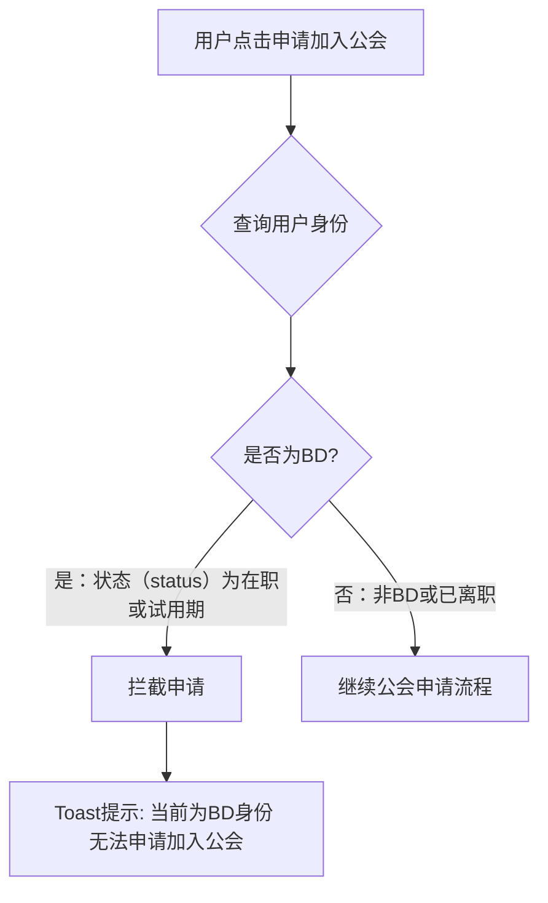

#### 后台创建公会拦截

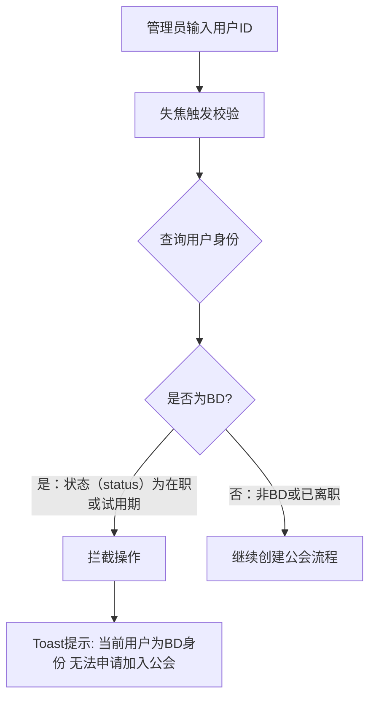

**核心规则：**
- 用户成为BD后，不可申请成为公会长或主播
- APP端：点击"申请加入公会"时前端判断，或后端接口返回拦截
- 后台：创建公会输入用户ID失焦时后端判断
- 判断逻辑：查询BD人员表，状态（status）字段为0（试用）或1（转正）时拦截
- 已离职BD（status=2）不影响其作为普通用户按普通用户流程申请成为公会长/主播
- 已离职BD不可访问BD端“申请公会/申请创建公会”入口，不能以BD身份发起公会申请

---

### 离职处理流程（后台设置）

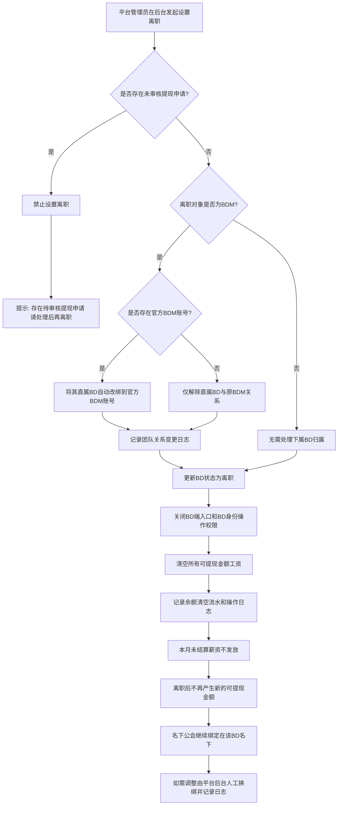

**流程规则：**
- 设置离职前必须校验是否存在未审核提现申请；存在待审核/审核中提现申请时，禁止设置为离职。
- 校验通过后才允许更新BD状态为离职，并关闭BD端入口和BD身份操作权限。
- <span style="color:red"><strong>离职后必须清空该BD/BDM所有可提现金额工资，不再换算金币、不再保留美元余额、不再进入后续提现流程。</strong></span>
- 清空动作必须记录余额清空流水和操作日志，至少包含清空前金额、清空后金额、操作人、操作时间、离职对象、离职原因。
- 本月未结算薪资不发放，不进入后续可提现余额。
- 若离职对象为BDM，则其直属BD必须先做团队关系处理：存在官方BDM账号时，自动改绑到官方BDM账号；不存在官方BDM账号时，仅解除该BD与原BDM的上下级关系，BD暂不归属任何BDM。
- 官方BDM账号使用系统配置特殊ID：`官方BDM账号ID（OFFICIAL_BDM_ID）`。该ID必须指向一个角色为BDM且在职状态不为离职的BDM账号；若配置为空、账号不存在、账号已离职或角色不是BDM，均视为“无官方BDM账号”。
- BDM改为BD或设置为离职触发的直属BD自动改绑/解除关系，必须记录团队关系变更日志，包含原BDM ID、新BDM ID、变更原因、操作人、操作时间和受影响BD列表。
- 该类团队关系变更沿用“BD变更所属BDM团队”口径：当月不按变更时点切割数据；若改绑到官方BDM，则BD本月数据归官方BDM查看并参与官方BDM管理统计；若无官方BDM账号导致上级BDM置空，则BD个人薪资继续正常计算，但本月不计入任何BDM管理收益，直到后台人工重新分配；原BDM只能查看历史已结算数据。
- 名下公会不自动转出，继续绑定在该BD名下；如需调整，由平台后台人工换绑并记录日志。

---

---

### 一、BD入驻流程（后台创建）

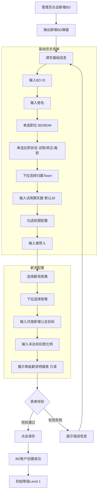

**核心规则：**
- BD由后台手动创建，非自主注册
- BD ID需校验是否已成为BD（防小号重复：同设备/同IP注册）
- 职位二选一：BD / BDM
- 在职状态三选一：试用 / 转正 / 离职
- 归属Team根据职位联动：BD选BDM，BDM无需选择上级Team
- 权限配置：审核公会申请权限（仅BDM可配置）、金币提现权限
- 政策从已有政策列表下拉选择，创建时绑定
- 月度新增公会目标及扣款比例仅BD角色显示
- 基础信息（BD ID、姓名）创建后不可更改

---

### 二、公会申请流程（含风控）

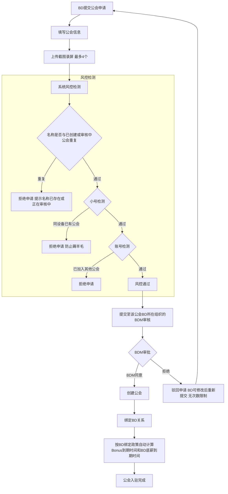

**已确认规则：**
- 审批机制：风控通过后，由该公会BD所在组织的BDM审核，BDM可同意/拒绝
- 驳回后修改重新提交：无次数限制
- Bonus到期时间和BD底薪到期时间：按BD当前绑定BD政策自动计算；若16号至月底绑定，实际有效期=配置自然月+15个自然日

---

### 三、BD薪资核算流程（核心定义）

| 字段 | 计算公式 | 算法说明 |
|---|---|---|
| 底薪有效薪资流水 | Σ(每个绑定公会在当前自然月∩绑定关系有效期∩底薪有效区间内的有效薪资流水) | 遍历BD名下所有绑定公会；对每个公会取底薪统计窗口内薪资流水；若流水合计 ≥ BD政策全局配置的公会有效薪资门槛金额，默认300$，则全额计入；若低于门槛则0计入；不得跨月重复累计历史有效期流水 |
| Bonus有效薪资流水 | Σ(每个绑定公会在当前自然月∩绑定关系有效期∩Bonus有效区间内的有效薪资流水) | 遍历BD名下所有绑定公会；对每个公会取Bonus统计窗口内薪资流水；若流水合计 ≥ BD政策全局配置的公会有效薪资门槛金额，默认300$，则全额计入；若低于门槛则0计入；不得跨月重复累计历史有效期流水 |
| 本月新增公会数量 | 统计本月首次创建且首次绑定成功的公会 | 必须同时满足：公会首次创建时间在统计周期内、首次绑定成功时间在统计周期内、首次绑定BD为当前BD；换绑、转移、重新分配、历史公会重新绑定均不计入新增公会数量 |
| 本月公会提成 | Bonus有效薪资流水 × 等级对应提成比例 | 根据Bonus有效薪资流水匹配等级配置表，获取该等级提成比例后计算 |
| 本月底薪 | 底薪有效薪资流水对应等级的底薪配置 | 根据底薪有效薪资流水匹配等级配置表，取该等级现金底薪值 |
| 本月总薪资 | 本月底薪 + 本月公会提成 | 不含预支、借支、扣款，仅底薪+提成 |
| 本月总薪资余额 | 本月总薪资 - 新增公会未达标扣款 | 实际可结算金额，红色标注（若为扣款状态） |
| 新增公会未达标扣款 | 若新增公会数 < 配置目标，则：(底薪+提成) × 扣款比例 | 查询BD绑定政策配置中的新增公会目标；若本月新增公会数低于目标数，触发扣款 |

```
对每个绑定公会：
  1. 计算底薪统计窗口 = 当前自然月 ∩ 绑定关系有效期 ∩ 底薪有效区间
  2. 计算Bonus统计窗口 = 当前自然月 ∩ 绑定关系有效期 ∩ Bonus有效区间
  3. 分别查询两个窗口内的有效薪资流水
  4. 底薪窗口流水 >= 全局公会有效薪资门槛金额 → 计入底薪有效薪资流水；否则0计入
  5. Bonus窗口流水 >= 全局公会有效薪资门槛金额 → 计入Bonus有效薪资流水；否则0计入

有效薪资流水来源：
  - 公会长的公会分成薪资
  - 公会长的公会分成TG
  - 自由政策主播手动结算的底薪
  - 自由政策主播手动结算的TG

字段说明：
  - 底薪起始时间 = 公会首个绑定BD当月1号 00:00:00
  - Bonus起始时间 = 公会首个绑定BD当月1号 00:00:00
  - 绑定生效时间（bind_start） = 公会创建并首次绑定BD成功的实际时间戳
  - 底薪到期时间 = 按BD绑定政策“底薪有效时长”计算出的截止时间；若首次绑定时间在16号00:00:00至月底期间，则实际有效期额外+15个自然日
  - Bonus到期时间 = 按BD绑定政策“Bonus有效时长”计算出的截止时间；若首次绑定时间在16号00:00:00至月底期间，则实际有效期额外+15个自然日
  - 有效区间均采用左闭右开口径，包含起始时间，不包含到期时间；到期日当天及之后流水不计入
```

**有效薪资流水定义**：每月分别统计当前自然月、绑定关系有效期、底薪/Bonus有效区间三者交集内的有效薪资流水；交集窗口内流水达到全局门槛则全额计入，低于门槛则0计入。

<span style="color: red;">**注意：** 公会有效薪资门槛金额、底薪有效时长、Bonus有效时长均由服务端配置返回，禁止客户端硬编码。</span>

### 四、BD薪资核算流程（6维度计算）

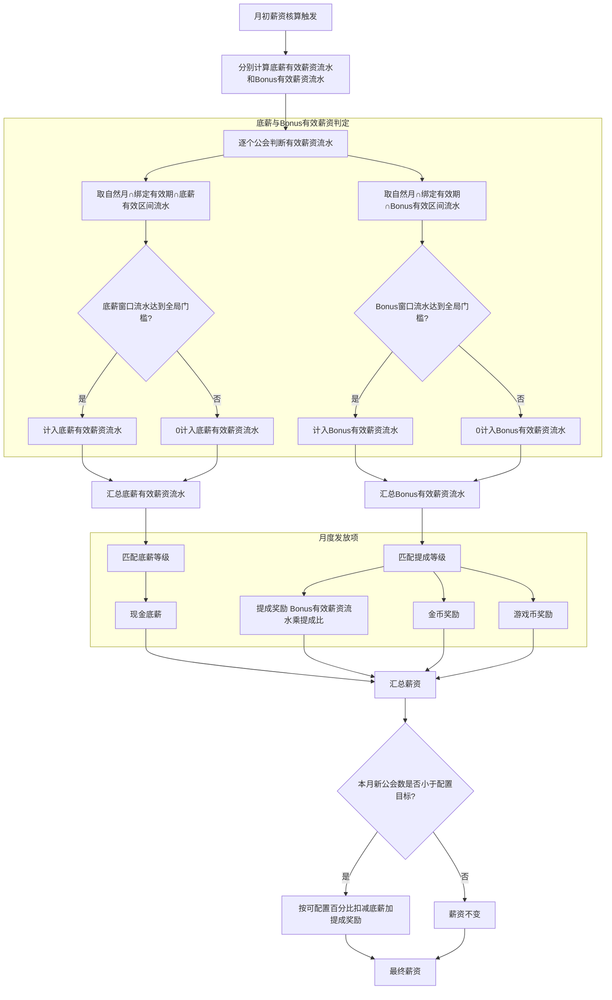

**核心规则确认：**
- **底薪有效薪资流水**：每月仅统计当前自然月、绑定关系有效期、底薪有效区间三者交集内的有效薪资流水；达到全局公会有效薪资门槛金额则全额计入，低于门槛则0计入。
- **Bonus有效薪资流水**：每月仅统计当前自然月、绑定关系有效期、Bonus有效区间三者交集内的有效薪资流水；达到全局公会有效薪资门槛金额则全额计入，低于门槛则0计入。
- 底薪到期后：该公会不再贡献BD底薪有效薪资流水。
- Bonus到期后：该公会不再贡献BD分成、金币奖励、游戏币奖励对应的Bonus有效薪资流水。
- 新公会考核：每月至少配置目标数个新公会，未完成按可配置百分比扣除（范围：底薪+提成奖励）。

<span style="color: red;">**注意：** 公会有效薪资门槛金额、新增公会目标、扣款比例、等级配置、底薪有效时长、Bonus有效时长等参数均由服务端配置返回，禁止客户端硬编码。</span>

### 五、BDM薪资核算流程

| 字段 | 计算公式 | 算法说明 |
|---|---|---|
| BDM团队底薪有效薪资流水 | Σ(管理范围内BD团队维度的底薪有效薪资流水，含BDM本人作为BD绑定的个人公会) | 获取BDM管理范围内BD团队业绩，对每个BD计算底薪有效薪资流水后汇总 |
| BDM团队Bonus有效薪资流水 | Σ(管理范围内BD团队维度的Bonus有效薪资流水，含BDM本人作为BD绑定的个人公会) | 获取BDM管理范围内BD团队业绩，对每个BD计算Bonus有效薪资流水后汇总 |
| BDM本月公会提成 | BDM团队Bonus有效薪资流水 × BDM等级对应提成比例 | 根据BDM团队Bonus有效薪资流水匹配BDM等级配置表，获取提成比例后计算 |
| BDM本月底薪 | BDM团队底薪有效薪资流水对应等级的底薪 | 根据BDM团队底薪有效薪资流水匹配BDM等级配置表，取该等级现金底薪值 |
| BDM本月总薪资 | BDM本月底薪 + BDM本月公会提成 | BDM作为管理者的薪资，不含预支/借支（1.0版本无此概念） |

**注：BDM团队薪资无“总薪资余额”字段，因为1.0版本不含预支/借支/扣款逻辑。**

**BDM本人作为BD的个人收入处理：**
- 本人作为BD绑定的公会业绩参与BDM团队底薪有效薪资流水、团队Bonus有效薪资流水和管理收益计算。
- 本人BD个人收入仍在个人薪资页单独展示、单独结算。
- BDM管理收益与本人BD个人收入不得混入同一个金额字段。

### 六、BD变更归属流程

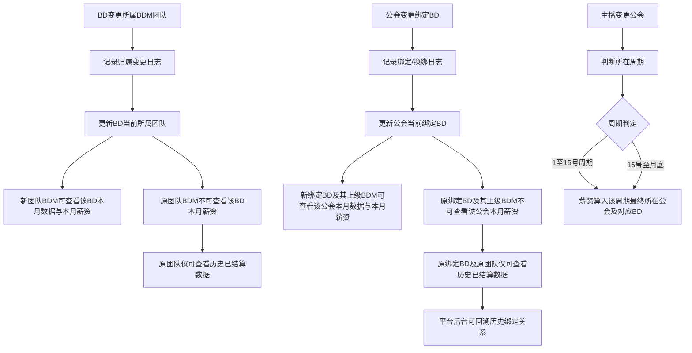

**已确认规则：**
- BD变更所属BDM团队：当月不切割数据；BD在哪个团队，哪个团队的BDM就能看到BD本月数据；发生变更后，原所属团队管理者不能查看该BD本月薪资，只能查看历史已结算数据。
- 公会变更绑定BD：同BD变更团队逻辑；当月不切割数据；公会当前绑定哪个BD，该BD及其上级BDM可查看该公会本月数据与本月薪资；原绑定BD及其上级团队不可查看该公会本月薪资，只能查看历史已结算数据。
- 公会变更绑定BD必须记录绑定/换绑日志，平台后台支持历史关系回溯。
- 主播变更公会：按周期结算（1-15号/16号-月底），薪资算进最终所在的公会及其对应的BD。

---
### 七、公会换绑BD流程（后台操作）

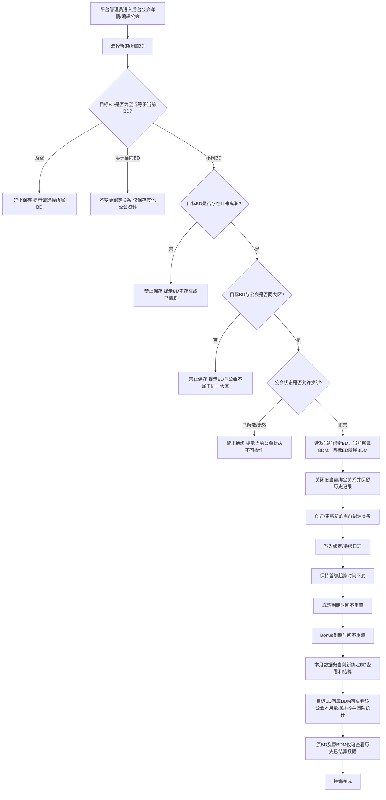

**流程规则：**
- 触发入口：平台后台“公会详情/编辑公会”中修改“所属BD”。BD客户端不可自行换绑公会。
- 保存前必须校验目标BD存在、在职状态不为离职，且目标BD与公会属于同一大区；校验失败时禁止保存。
- 若目标BD等于当前绑定BD，不生成换绑记录，不触发薪资归属变更，仅保存其他被修改的公会资料。
- 公会状态为已解散、无效或其他不可操作状态时，不允许换绑BD。
- 换绑成功后，系统必须保留旧绑定关系历史，并创建/更新新的当前绑定关系；平台后台支持按公会、原BD、新BD、操作时间回溯关系链。
- <span style="color:red"><strong>换绑BD不重置底薪有效期和Bonus有效期。</strong></span>底薪起始时间、Bonus起始时间仍按公会首个绑定BD当月1号00:00:00起算；底薪到期时间和Bonus到期时间保持原值，除非后台单独编辑到期时间。
- <span style="color:red"><strong>换绑BD当月不按换绑时间切割薪资、有效薪资流水或管理收益。</strong></span>换绑日志中的操作时间只用于审计追溯，不作为当月薪资切割边界。
- 未结算的当前自然月内，该公会数据、底薪有效薪资流水、Bonus有效薪资流水、BD提成、BDM团队统计均归当前新绑定BD及其当前所属BDM查看和结算。
- 原绑定BD及其原所属BDM不能继续查看该公会当前月未结算数据，只能查看换绑前已生成的历史结算快照。
- 换绑不计入新BD的“本月新增公会数量”；新增公会只统计首次创建且首次绑定成功的公会。
- 若换绑发生在历史月份已结算之后，不重算历史结算单；如需调整历史数据，必须走人工重算流程并记录审批与重算日志。
- 换绑日志至少记录：公会ID、原BD ID、新BD ID、原BDM ID、新BDM ID、操作人、操作时间、换绑原因、底薪到期时间、Bonus到期时间、是否影响当前月结算、备注。

---


### 八、等级升降级流程

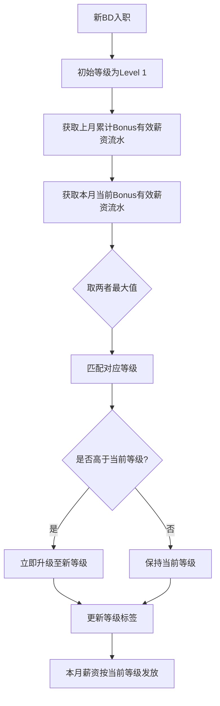

**核心规则：**
- 根据上月累计Bonus有效薪资流水或本月当前Bonus有效薪资流水实时匹配等级（取两者最大值）；底薪等级取底薪有效薪资流水，提成等级取Bonus有效薪资流水
- 新BD初始等级为Level 1

---

### 九、风控检测流程

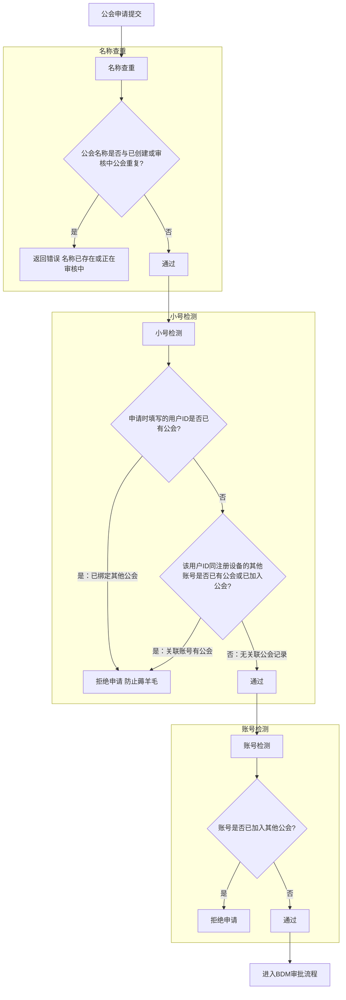

---

### 十、公会审核同大区校验流程

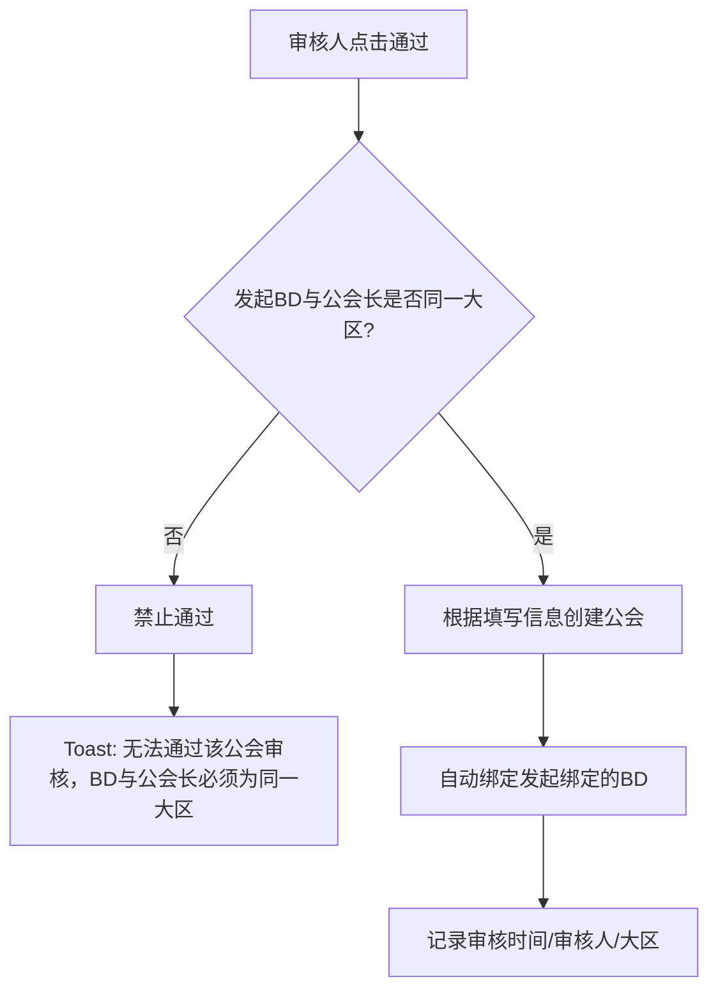

---

### 十一、Bonus到期后的处理流程

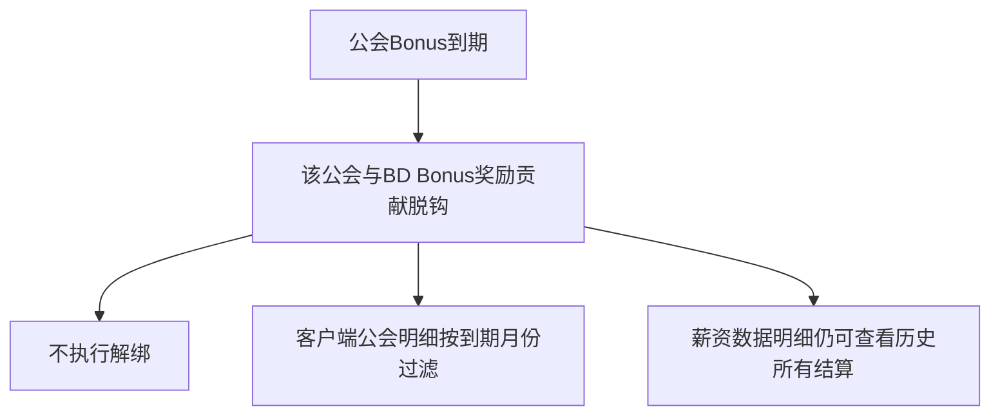

---

| 节点 | 说明 |
|---|---|
| 月初 | 薪资核算、等级匹配、底薪有效薪资流水和Bonus有效薪资流水判定 |
| 每月3-7号 | 法币提现开放期 |
| Bonus到期日 | 该公会不再贡献Bonus有效薪资流水、提成、金币奖励和游戏币奖励；不影响已经生成的历史结算快照 |
| 入驻满1个月 | 试用期考核判定；绑定公会薪资达到全局试用期转正门槛金额时可转正，未达标则状态仍为试用中 |

<span style="color: red;">**注意：** 上述数值（公会有效薪资门槛金额、法币提现开放期、试用期转正门槛金额）均由服务端配置返回，禁止客户端硬编码。</span>

---

# 一、客户端（APP端）

客户端分为BD视角和BDM视角。BDM视角包含BD全部功能，并增加团队数据、公会审核等增量功能。


---

## 1. BD薪资数据模块

### 模块背景

BD需要随时查看个人薪资状况，包括本月薪资构成、历史结算记录、公会薪资明细，以便了解收入来源和对账。

### 用户场景

BD在个人中心看到"Admin System"入口有红点提示，点击进入管理系统，查看本月薪资数据和历史结算记录。

### 对应原型


### 1.1 BD个人中心入口

#### 功能说明

BD通过APP个人中心的"Admin System"入口进入BD管理系统。入口带有红色角标提示未读消息数。

#### 前置条件

- 用户已登录APP
- 用户身份为BD或BDM
- 用户已开通BD管理系统权限

#### 触发方式

用户在APP个人中心点击"Admin System"菜单项。

| 字段 | 说明 | 统计方式 | 数据来源 |
|---|---|---|---|
| Admin System | 入口标题，固定文案 | 直接读取当前记录 | 页面固定展示 |
| 红色角标数字 | 未读消息数或待处理事项数 | 直接读取当前记录 | 系统实时计算并返回 |

#### 交互逻辑

1. 用户在个人中心看到"Admin System"入口
2. 若有未读消息，入口右上角显示红色角标（数字）
3. 用户点击"Admin System"
4. 页面跳转至BD薪资数据页面（1.2）

#### 服务端核心逻辑

- 服务端维护未读计数器，当有新的公会审核结果、薪资结算完成、系统通知时+1
- 用户进入管理系统后，清空未读计数

| 状态 | 进入条件 | 表现 |
|---|---|---|
| 有未读 | 未读计数 > 0 | 显示红色角标+数字 |
| 无未读 | 未读计数 = 0 | 无角标 |

| 边界 | 处理方式 |
|---|---|
| 用户身份变更（离职） | 入口隐藏或置灰不可点击 |
| 权限被收回 | 点击后提示"无访问权限" |

| 异常 | 处理方式 |
|---|---|
| 网络失败 | 显示上次缓存数据，角标显示"?"；点击后轻提示"网络异常，请稍后重试" |
| 权限校验失败 | 弹窗"您暂无访问权限"，确认后返回个人中心 |

#### 权限控制

- 仅BD/BDM身份可见
- 需验证用户token有效且在职状态为"在职"或"试用期"


### 1.2 BD本月薪资数据

#### 功能说明

展示BD本月的薪资构成明细，包括底薪有效薪资流水、Bonus有效薪资流水、公会提成、底薪、总薪资、扣款等数据，以及历史结算记录入口和公会薪资明细列表。

#### 对应原型


#### 前置条件

- 用户已通过1.1入口进入系统
- 用户身份为BD或BDM
- 服务端已计算本月薪资数据

<span style="color:red"><strong>APP端实时性要求：本页面及APP端所有“本月”字段必须实时读取当前最新数据；进入页面、标签切换、下拉刷新、提现/申请/审核等关键操作完成后必须重新拉取，不得用历史结算快照或本地缓存替代当前本月数据。历史结算列表和历史结算详情仅展示已结算快照，不适用实时口径。</strong></span>

#### 触发方式

- 从个人中心入口点击进入
- 从其他页面点击"薪资数据"标签切换

| 字段 | 说明 | 统计方式 | 数据来源 |
|---|---|---|---|
| BD名称 | 用户昵称 | 直接读取用户昵称字段 | 用户中心，用户基本信息 |
| BD等级 | 等级1-11 | 根据Bonus有效薪资流水匹配等级配置表（取上月Bonus有效薪资流水或本月Bonus有效薪资流水最大值） | 薪资服务：计算Bonus有效薪资流水→查等级配置表→匹配对应等级 |
| BD ID | 唯一标识 | 直接读取BD编码字段 | 用户中心，BD基本信息（6位数字） |
| 状态 | 在职/试用期 | 直接读取在职状态字段 | 人事系统，BD在职状态（在职/试用期/离职） |
| 加入日期 | YYYY.MM.DD | 直接读取入职日期字段 | 人事系统，BD入职日期 |
| 试用期剩余天数 | 整数/状态文案 | 计算公式：试用期到期日期 - 当前日期 | 人事系统计算：试用期结束日期 - 今天；若≤0但未满足转正条件，则显示"试用中"；只有后台状态变更为转正后才显示"已转正" |
| 可提现薪资 | $格式 | 计算公式：累计已结算薪资 - 所有已成功提现金额 | 薪资服务：已结算薪资汇总 - 金币提现/现金提现等所有成功提现金额汇总；金币和现金共用同一个可提现余额池 |
| 底薪有效薪资流水 | $格式 | 统计BD绑定所有公会在底薪有效期内、每个自然月达到全局门槛的有效薪资流水 | 薪资服务：读取BD政策全局配置门槛，默认300$；有效期读取BD绑定政策底薪有效时长 |
| Bonus有效薪资流水 | $格式 | 统计BD绑定所有公会在Bonus有效期内、每个自然月达到全局门槛的有效薪资流水 | 薪资服务：读取BD政策全局配置门槛，默认300$；有效期读取BD绑定政策Bonus有效时长 |
| 本月新增公会数量 | 整数 | 统计本月首次创建且首次绑定成功的公会数量 | 公会服务：筛选公会首次创建时间在本月内、首次绑定成功时间在本月内、首次绑定BD为当前BD的公会；换绑/转移/重新分配/历史公会重新绑定不计入 |
| 本月公会提成 | $格式 | 计算公式：Bonus有效薪资流水 × 等级提成比例 | 薪资服务：Bonus有效薪资流水 × 当前等级对应的提成比例 |
| 本月总薪资 | $格式 | 计算公式：底薪 + 公会提成 | 薪资服务：本月底薪 + 本月公会提成 |
| 本月总薪资余额 | $格式（红色） | 计算公式：总薪资 - 未达标扣款 | 薪资服务：本月总薪资 - 新增公会未达标扣款（若有） |
| 本月底薪 | $格式 | 查询等级配置表底薪值 | 薪资服务：根据底薪有效薪资流水匹配等级配置表，取对应底薪金额 |
| 新增公会未达标扣款 | -$格式 | 计算公式：若新增公会数<目标，则(底薪+提成)×扣款比例 | 薪资服务：查配置的新增公会目标→判断是否达标→若不达标按配置扣款比例计算 |

#### 交互逻辑

**页面加载：**
1. 进入页面时，服务端返回BD信息卡、可提现薪资、薪资数据网格、历史结算记录摘要、有效公会明细列表
2. 若数据量大，公会明细列表支持滚动加载（每页20条）

**标签切换：**
1. 点击"公会数据"标签 → 跳转至公会数据页面（见2.1）
2. 点击"薪资数据"标签（当前页）→ 无操作

**操作按钮：**
1. 点击"申请公会"按钮 → 跳转至申请创建公会页面（见2.2）
2. 点击"提现"按钮 → 校验提现条件，通过后跳转提现流程（见1.5）
3. 点击"历史结算记录"行 → 跳转至历史结算记录列表（见1.3）
4. 点击某个公会卡片 → 跳转至该公会的薪资明细（原型未提供单独公会详情页，1.0版本不展开）

**帮助图标：**
1. 点击"本月总薪资余额"旁的❓图标 → 弹窗说明计算公式

```
本月总薪资 = 本月底薪 + 本月公会提成
本月总薪资余额 = 本月总薪资 - 新增公会未达标扣款
```

**底薪有效薪资流水 / Bonus有效薪资流水计算：**
- 遍历BD名下所有绑定公会。
- 底薪有效薪资流水取底薪有效期内薪资流水，Bonus有效薪资流水取Bonus有效期内薪资流水。
- 门槛读取BD政策全局配置“公会有效薪资门槛金额”，默认300$。
- 若对应窗口流水合计 ≥ 门槛，全额计入；若 < 门槛，0计入。
- 有效薪资流水必须包含公会长公会分成薪资、公会分成TG、自由政策主播手动结算底薪、自由政策主播手动结算TG。

**等级匹配：**
- 取"上月累计Bonus有效薪资流水"和"本月当前Bonus有效薪资流水"的最大值
- 查询等级配置表，匹配对应等级
- 只升不降

**新增公会考核：**
- 从配置表读取本月新增公会最低要求（默认2个）
- 新增公会仅统计本月首次创建且首次绑定成功的公会，且必须同时满足：公会首次创建时间在本月内、首次绑定成功时间在本月内、首次绑定BD为当前BD
- 公会换绑、离职转移、重新分配、历史公会重新绑定均不计入新增公会数量，后台统计不得仅按bind_time判断新增
- 若实际新增数 < 配置值，计算扣款 = 配置比例 × (底薪 + 公会提成)

| 状态 | 进入条件 | 表现 |
|---|---|---|
| 数据正常 | 服务端返回成功 | 完整展示所有数据 |
| 数据计算中 | 本月薪资未计算完成 | 薪资数据显示"--"，轻提示"本月数据计算中，请稍后查看" |
| 用户无公会 | BD名下无有效公会 | 公会明细区显示空状态"暂无有效公会" |

| 边界 | 处理方式 |
|---|---|
| 新BD无历史结算 | 历史结算区显示"暂无结算记录" |
| 公会数超过100 | 公会明细列表分页加载，每页20条 |
| 有效薪资流水刚好等于某个等级门槛 | 匹配该等级（≤改为<时取上一级） |

| 异常 | 处理方式 |
|---|---|
| 服务端返回失败 | 页面显示骨架屏+轻提示"加载失败，点击重试"，支持点击重试 |
| 网络超时 | 同上 |
| 用户身份失效 | 弹窗"登录已失效，请重新登录"，确认后跳转登录页 |

- 仅BD/BDM身份可访问
- 需验证token有效且在职状态不为"离职"


### 1.3 BD薪资历史结算记录

#### 功能说明

展示BD历史所有月份的薪资结算记录，按时间倒序排列，每条记录展示薪资构成数据。

#### 对应原型


#### 前置条件

- 用户已进入BD薪资数据页面（1.2）

#### 触发方式

从1.2页面点击"历史结算记录"行，带参数跳转。

| 字段 | 说明 | 统计方式 | 数据来源 |
|---|---|---|---|
| 结算时间 | YYYY.MM.DD HH:MM:SS | 直接读取结算时间字段 | 薪资结算记录表结算时间字段 |
| 底薪有效薪资流水 | $格式 | 直接读取快照字段 | 薪资结算快照表的底薪有效薪资流水快照字段 |
| Bonus有效薪资流水 | $格式 | 直接读取快照字段 | 薪资结算快照表的Bonus有效薪资流水快照字段 |
| 本月新增公会数量 | 整数 | 直接读取快照字段 | 薪资结算快照表（salary_settlement_snapshot）的新增公会数量（new_guild_count）字段 |
| 本月公会提成 | $格式 | 直接读取快照字段 | 薪资结算快照表（salary_settlement_snapshot）的提成金额（commission_amount）字段 |
| 本月总薪资 | $格式 | 直接读取快照字段 | 薪资结算快照表（salary_settlement_snapshot）的总薪资（total_salary）字段（底薪+提成） |
| 本月总薪资余额 | $格式 | 直接读取快照字段 | 薪资结算快照表（salary_settlement_snapshot）的薪资余额（salary_balance）字段（总薪资-扣款） |
| 本月底薪 | $格式 | 直接读取快照字段 | 薪资结算快照表（salary_settlement_snapshot）的底薪（base_salary）字段 |
| 新增公会未达标扣款 | -$格式 | 直接读取快照字段 | 薪资结算快照表（salary_settlement_snapshot）的扣款金额（deduction_amount）字段（若未达标） |

#### 交互逻辑

**页面加载：**
1. 进入页面，请求服务端返回历史结算记录列表（按结算时间倒序）
2. 首次加载返回最近12个月数据
3. 下拉加载更早记录（每次加载12个月）

**点击记录：**
1. 点击某条记录右侧">"箭头 → 跳转至该月份的公会薪资明细（见1.4）

**返回：**
1. 点击左上角"<"返回箭头 → 返回至1.2页面

#### 服务端核心逻辑

- <span style="color:red"><strong>结算记录为历史快照，创建后不可直接修改；历史列表和详情页必须读取结算快照字段，不得按当前政策、当前人员归属、当前等级配置实时回算。</strong></span>
- 每月结算完成后生成一条记录
- 记录包含当时计算的完整薪资构成字段，包括 政策ID（policy_id）、政策版本号（policy_version_no）、等级快照、底薪有效薪资流水快照、Bonus有效薪资流水快照、底薪/提成/扣款/余额快照

| 状态 | 进入条件 | 表现 |
|---|---|---|
| 有记录 | 结算记录数 > 0 | 正常列表展示 |
| 无记录 | 新BD无结算记录 | 显示空状态"暂无结算记录" |

| 边界 | 处理方式 |
|---|---|
| 记录超过36条 | 支持无限下拉加载 |
| 用户离职 | 仍可查看历史记录，数据只读 |

| 异常 | 处理方式 |
|---|---|
| 加载失败 | 轻提示"加载失败，请稍后重试"，显示骨架屏 |
| 网络超时 | 同上 |

#### 权限控制

- 仅BD/BDM可访问
- 数据仅展示本人历史记录


### 1.4 BD薪资历史结算记录-公会薪资明细

#### 功能说明

展示某次历史结算中，该BD名下所有公会的底薪有效薪资流水、Bonus有效薪资流水和达标状态。

#### 对应原型


#### 前置条件

- 用户已在历史结算记录列表页（1.3）
- 点击了某条结算记录

#### 触发方式

从1.3页面点击某条记录的">"箭头，携带结算ID和结算时间跳转。

| 字段 | 说明 | 统计方式 | 数据来源 |
|---|---|---|---|
| 结算时间 | YYYY.MM.DD HH:MM:SS | 直接读取结算时间字段 | 薪资结算表中的结算时间 |
| 底薪有效薪资流水 | $格式 | 直接读取快照字段 | 薪资结算快照表的底薪有效薪资流水快照字段 |
| Bonus有效薪资流水 | $格式 | 直接读取快照字段 | 薪资结算快照表的Bonus有效薪资流水快照字段 |
| 本月新增公会数量 | 整数 | 直接读取快照字段 | 薪资结算快照表（salary_settlement_snapshot）的新增公会数量（new_guild_count）字段 |
| 本月公会提成 | $格式 | 直接读取快照字段 | 薪资结算快照表（salary_settlement_snapshot）的提成金额（commission_amount）字段 |
| 本月总薪资 | $格式 | 直接读取快照字段 | 薪资结算快照表（salary_settlement_snapshot）的总薪资（total_salary）字段 |
| 本月总薪资余额 | $格式 | 直接读取快照字段 | 薪资结算快照表（salary_settlement_snapshot）的薪资余额（salary_balance）字段 |
| 本月底薪 | $格式 | 直接读取快照字段 | 薪资结算快照表（salary_settlement_snapshot）的底薪（base_salary）字段 |
| 新增公会未达标扣款 | -$格式 | 直接读取快照字段 | 薪资结算快照表（salary_settlement_snapshot）的扣款金额（deduction_amount）字段 |
| 公会名称 | 文本 | 直接读取快照字段 | 结算公会快照表（settlement_guild_snapshot）的公会名称（guild_name）字段（结算时的公会名称快照） |
| 公会ID | 6位数字 | 直接读取快照字段 | 结算公会快照表（settlement_guild_snapshot）的公会ID（guild_id）字段 |
| 公会总薪资 | $格式 | 直接读取快照字段 | 结算公会快照表（settlement_guild_snapshot）的公会薪资（guild_salary）字段（该公会在结算时的薪资流水） |
| 底薪有效薪资流水 | $格式 | 直接读取结算时该公会底薪有效薪资流水快照 | 结算公会快照表，按底薪有效期和全局门槛计算后落库 |
| Bonus有效薪资流水 | $格式 | 直接读取结算时该公会Bonus有效薪资流水快照 | 结算公会快照表，按Bonus有效期和全局门槛计算后落库 |
| 达标角标 | 已达标/未达标 | 若该公会本月薪资满足有效薪资流水条件，且BD与该公会绑定的Bonus时间未过期，则显示“已达标”；否则显示“未达标” | 结算公会快照表 + 绑定关系快照 |

**页面加载：**
1. 接收结算ID，请求服务端返回该次结算的完整数据和公会明细列表
2. 顶部展示结算时间戳
3. 8项统计卡片展示结算快照数据
4. 下方列表展示公会明细

**返回：**
1. 点击"<"返回箭头 → 返回至历史结算记录列表（1.3）

#### 服务端核心逻辑

- 公会明细为结算时的快照，不随后续公会状态变化而变化
- 快照数据只读，不可修改

| 状态 | 进入条件 | 表现 |
|---|---|---|
| 有公会 | 公会明细数 > 0 | 正常列表展示 |
| 无公会 | 该月无有效公会 | 公会明细区显示空状态 |

| 边界 | 处理方式 |
|---|---|
| 公会数超过50 | 支持滚动加载，每页20条 |

| 异常 | 处理方式 |
|---|---|
| 结算ID不存在 | 轻提示"记录不存在"，2秒后返回上一页 |
| 加载失败 | 轻提示"加载失败" |

#### 权限控制

- 仅BD/BDM可访问
- 仅可查看本人历史结算数据


### 1.5 BD/BDM提现流程

#### 功能说明

BD/BDM可通过薪资页面申请提现，支持金币提现和现金提现两种方式。金币提现入口根据后台配置的"金币提现权限"控制显示/隐藏。

#### 对应原型


#### 前置条件

- 用户已登录APP
- 用户身份为BD或BDM
- 有可提现薪资余额
- 现金提现：当前日期在每月3-7号之间
- 金币提现：后台已授予"金币提现权限"

#### 触发方式

在薪资数据页面点击"提现"按钮。

#### 交互流程

**提现入口：**
1. 进入薪资数据页面（1.2 BD本月薪资数据）
2. 查看可提现薪资余额
3. 点击"提现"按钮 → 进入提现页面

**提现类型选择：**
1. 进入提现页面后，系统查询当前BD的"金币提现权限"配置
2. 提现页面顶部展示两个切换标签：Coins（金币）、Cash（现金）
3. 若有金币提现权限 → 显示"Coins"和"Cash"两个标签，默认选中"Coins"；
4. 若无金币提现权限 → 仅显示"Cash"标签，隐藏Coins金币提现入口；
5. 金币提现权限由后台BD管理模块配置，实时生效

**提现限制：**
- 金币提现：最低1$，无开放日期限制（仅授权BD可见）
- 现金提现：最低50$，仅每月3-7号开放（所有BD/BDM可见）


### 1.6 金币提现

#### 功能说明

将可提现薪资按汇率兑换为平台金币，实时到账。

<span style="color: red;">**注意：** 汇率（11800）、最低提现金额（1$）等数值由服务端配置返回，禁止客户端硬编码。客户端仅展示服务端返回的数值。</span>

#### 对应原型


#### 前置条件

- 用户已登录APP
- 用户身份为BD或BDM
- **已被授予"金币提现权限"**（后台BD管理模块配置）
- 可提现薪资余额 ≥ 1$

#### 触发方式

**金币提现入口显示规则：**
1. 用户在BD薪资数据页面点击"提现"按钮，进入提现页面
2. 系统查询当前用户的"金币提现权限"配置
3. **有权限**：显示"Coins"和"Cash"两个切换标签，默认选中"Coins"
4. **无权限**：仅显示"Cash"切换标签，金币提现入口隐藏

**触发操作：** 在提现页面点击"Coins"切换标签

| 字段 | 说明 | 统计方式 | 数据来源 |
|---|---|---|---|
| 可提现余额 | 当前可提现的薪资总额（美元） | 累计已结算薪资 - 所有已成功提现金额 | 薪资结算表汇总已结算金额 - 薪资提现表汇总所有成功提现金额；筛选条件：BD为当前BD；金币提现和现金提现共用同一个余额池 |
| 提现金额 | 用户输入的提现金额（美元） | 用户输入 | 用户输入 |
| 兑换汇率 | 金币兑换比例，当前配置为1$ = 11800金币 | 直接读取服务端配置 | 系统配置表，查询金币兑换汇率配置项；客户端禁止硬编码 |
| 可获得金币 | 根据提现金额和服务端返回汇率计算的金币数量 | 提现金额 × 兑换汇率（exchange_rate） | 前端仅基于服务端返回兑换汇率（exchange_rate）做预览展示，最终到账金币数以服务端计算结果为准 |
| 最低提现提示 | "Minimum withdraw amount is $1" | 固定文案 | 客户端固定展示，系统配置最低提现限额为1$ |

**页面加载：**
1. 读取并显示当前可提现余额
2. 显示服务端返回的当前金币兑换汇率（当前配置为1$ = 11800金币）
3. 显示最低提现限制提示

**金额输入：**
1. 用户在输入框输入提现金额（美元）
2. 基于服务端返回的兑换汇率（exchange_rate）实时预览可获得金币数量，最终以服务端计算结果为准
3. 点击"All balance"按钮 → 自动填入全部可提现余额

**提交提现：**
1. 点击"Withdrawal Amount"按钮
2. 校验提现金额 ≥ 1$
3. 校验通过 → 提交提现请求 → 金币实时到账 → 轻提示"提现成功" → 更新余额显示
4. 校验失败 → 轻提示"最低提现金额为1$"

**查看记录：**
1. 点击右上角历史记录图标 → 跳转提现记录页面

#### 服务端核心逻辑

1. 校验用户身份（BD/BDM）
2. 校验"金币提现权限"（查询BD人员表的金币提现权限（coin_withdraw_permission）字段）
3. 若无权限 → 拦截并返回错误提示
4. 校验可提现余额 ≥ 提现金额
5. 校验提现金额 ≥ 1$
6. 扣减用户可提现余额
7. 按服务端配置汇率增加用户金币余额（提现金额 × 兑换汇率（exchange_rate），当前配置1$=11800金币）
8. 记录提现流水（提现时间、金额、金币数量、汇率、提现来源=BD薪资提现）

#### 状态设计

无状态流转，提现即时完成。

| 边界 | 处理方式 |
|---|---|
| 余额为0时 | "Withdrawal Amount"按钮置灰不可点击 |
| 输入金额超过余额时 | 轻提示"余额不足" |
| 输入金额小于1$时 | 轻提示"最低提现金额为1$" |

| 异常 | 处理方式 |
|---|---|
| 余额不足 | 轻提示"余额不足" |
| 网络错误 | 轻提示"网络错误，请重试" |
| 提现失败 | 轻提示"提现失败，请联系客服" |

- 仅BD/BDM可访问
- 仅可提现本人BD薪资余额


### 1.7 现金提现

#### 功能说明

将可提现薪资提现为法币（USDT/银行转账/移动支付），需人工审核后到账。

<span style="color: red;">**注意：** 最低提现金额（50$）、开放日期（每月3-7号）等数值由服务端配置返回，禁止客户端硬编码。客户端仅展示服务端返回的数值。</span>

#### 对应原型


#### 前置条件

- 用户已登录APP
- 用户身份为BD或BDM
- 可提现薪资余额 ≥ 50$
- 当前日期在每月3-7号之间

#### 触发方式

在提现页面选择"Cash"标签。

| 字段 | 说明 | 统计方式 | 数据来源 |
|---|---|---|---|
| 可提现余额 | 当前可提现的薪资总额（美元） | 累计已结算薪资 - 所有已成功提现金额 | 薪资结算表汇总已结算金额 - 薪资提现表汇总所有成功提现金额；筛选条件：BD为当前BD；现金提现与金币提现共用同一个余额池，不按提现类型拆分余额 |
| 提现金额 | 用户输入的提现金额（美元） | 用户输入 | 用户输入 |
| 提现方式 | USDT/Bank/Vodafone/Shamcash四种方式单选 | 用户选择 | 用户选择，记录为提现方式 |
| 收款账户 | 根据提现方式输入对应账号 | 用户输入 | 用户输入，记录为收款账户 |
| 手续费提示 | USDT方式显示"If you choose to receive USDT, the maximum fee is $1 per transaction" | 固定文案 | 前端固定，实际手续费从平台配置读取 |
| 开放日期限制 | 现金提现仅每月3-7号开放 | 系统校验 | 系统配置表，查询现金提现开放日期配置项（值为3-7号） |

**提现方式说明：**
- USDT：需输入区块链钱包地址
- Bank：需输入银行账号/IBAN
- Vodafone：需输入手机号
- Shamcash：需输入电子钱包账号

#### 交互逻辑

**页面加载：**
1. 读取并显示当前可提现余额
2. 显示提现方式选项（默认选中USDT）
3. 显示最低提现限制提示（最低50$）
4. 显示开放日期限制提示："现金提现仅在每月3-7号开放"

**日期限制校验：**
1. 检查当前日期是否在每月3-7号之间
2. 若不在开放期 → 轻提示"现金提现仅每月3-7号开放" → 禁用提现功能
3. 若在开放期 → 允许提现操作

**金额输入：**
1. 用户在输入框输入提现金额（美元）
2. 点击"All balance"按钮 → 自动填入全部可提现余额

**提现方式选择：**
1. 点击提现方式卡片 → 选中对应方式（高亮边框）
2. Account输入框提示文案动态变化：
   - USDT："Please Enter USDT wallet address"
   - Bank："Please Enter bank account/IBAN"
   - Vodafone："Please Enter phone number"
   - Shamcash："Please Enter Shamcash account"

**提交提现：**
1. 点击"Withdrawal Amount"按钮
2. 校验提现金额 ≥ 50$
3. 校验收款账号格式（根据提现方式）
4. 校验通过 → 创建提现申请（待审核，不占用可提现余额）→ 轻提示"提现申请已提交，等待审核" → 跳转提现记录页
5. 校验失败 → 轻提示具体错误

#### 服务端核心逻辑

1. 校验用户身份（BD/BDM）
2. 校验当前日期是否在开放期（3-7号）
3. 校验可提现余额 ≥ 提现金额
4. 校验提现金额 ≥ 50$
5. 校验收款账号格式
6. 创建提现申请记录（待审核状态，不占用用户可提现余额）
7. 通知审核人员
8. 审核通过时再次校验可提现余额是否充足；若不足则不可通过并提示"可提现余额不足"
9. 审核通过且余额充足后：
   - 扣减用户可提现余额
   - 调用第三方支付接口
   - 更新提现记录为"已到账"状态
   - 通知用户"提现已到账"

| 状态 | 说明 |
|---|---|
| 审核中 | 提现申请已提交，等待财务审核；不冻结余额 |
| 已到账 | 财务审核通过且款项已打到用户账户；通过前需复检余额，复检通过后先扣余额再打款 |
| 已拒绝 | 财务审核拒绝，余额不变 |

| 边界 | 处理方式 |
|---|---|
| 余额为0时 | "Withdrawal Amount"按钮置灰不可点击 |
| 输入金额超过余额时 | 轻提示"余额不足" |
| 输入金额小于50$时 | 轻提示"最低提现金额为50$" |
| 非开放期（非3-7号） | 禁用提现功能 |

| 异常 | 处理方式 |
|---|---|
| 非开放期 | 轻提示"现金提现仅每月3-7号开放"，禁用提现按钮 |
| 余额不足 | 轻提示"余额不足" |
| 账号格式错误 | 轻提示"账号格式错误" |
| 网络错误 | 轻提示"网络错误，请重试" |
| 提现申请失败 | 轻提示"提现申请失败，请稍后重试" |

- 仅BD/BDM可访问
- 仅可提现本人薪资余额


### 1.8 BD/BDM提现记录

#### 功能说明

查看BD/BDM的所有提现申请记录，包括金币提现和现金提现的历史记录。

#### 对应原型


#### 前置条件

- 用户已登录APP
- 用户身份为BD或BDM
- 已进入提现页面

#### 触发方式

在提现页面点击右上角历史记录图标。

#### 字段与数据来源

| 字段 | 说明 | 统计方式 | 数据来源 |
|------|-----|---------|---------|
| 提现时间 | 提现申请提交时间 | 直接读取申请时间 | 薪资提现表，按创建时间倒序排列 |
| 提现类型 | 金币/现金 | 直接读取提现类型 | 薪资提现表，1=金币提现，2=现金提现 |
| 提现金额 | 提现金额（美元） | 直接读取提现金额 | 薪资提现表 |
| 提现状态 | 审核中/已到账/已拒绝 | 直接读取提现状态 | 薪资提现表，0=审核中，1=已到账，2=已拒绝；金币提现即时完成，记录状态为“已到账” |
| 金币数量 | 金币提现时显示金币数 | 提现金额 × 兑换汇率（exchange_rate） | 薪资提现表，仅金币提现有此字段；汇率取提现发生时服务端配置快照 |
| 收款方式 | 现金提现时显示收款方式 | 直接读取收款方式 | 薪资提现表，仅现金提现有此字段 |

#### 交互逻辑

**页面加载：**
1. 进入提现记录页面
2. 默认显示"审核中"标签
3. 列表加载当前BD的所有提现记录，最近申请的排在前面

**标签切换：**
1. 点击"审核中"标签 → 仅显示状态为待审核的记录
2. 点击"已审核"标签 → 显示状态为已通过和已拒绝的记录

**记录详情：**
1. 点击某条记录 → 展开查看详情
2. 金币提现详情：提现时间、金额、金币数量、汇率、到账时间
3. 现金提现详情：提现时间、金额、收款方式、收款账号、审核状态、打款时间

#### 服务端核心逻辑

1. 查询当前BD的所有提现记录
2. 按申请时间倒序排列
3. 金币提现记录标记为"已到账"（即时到账）
4. 现金提现记录统一显示：审核中/已到账/已拒绝

#### 状态设计

| 状态 | 说明 |
|------|-----|
| 审核中 | 现金提现申请待审核，不冻结余额 |
| 已到账 | 提现已完成，金币即时到账/现金已审核通过并打款 |
| 已拒绝 | 提现申请被拒绝，余额不变 |

---

## 2. BD公会数据模块

### 模块背景

BD需要管理名下所有公会，查看公会状态、薪资、bonus到期情况，并申请新公会入驻。

### 用户场景

BD想了解当前绑定了哪些公会、每个公会的薪资贡献、bonus何时到期，并向平台申请新公会入驻。

### 对应原型


### 2.1 BD公会数据

#### 功能说明

展示BD名下所有公会的统计数据和明细列表，提供申请公会的入口。

#### 对应原型


#### 前置条件

- 用户已进入BD管理系统
- 点击"公会数据"标签

#### 触发方式

- 从薪资数据页（1.2）点击"公会数据"标签
- 从申请公会记录页返回

| 字段 | 说明 | 统计方式 | 数据来源 |
|---|---|---|---|
| BD信息卡 | 同1.2 | 同1.2 | 同1.2 |
| 可提现薪资 | 同1.2 | 同1.2 | 同1.2 |
| 总公会数 | 整数 | 统计(所有绑定公会) | 公会绑定关系表，筛选绑定BD为当前BD的所有公会（含bonus已到期公会） |
| Bonus未到期公会数 | 整数 | 统计Bonus未到期的公会 | 公会绑定关系表，筛选绑定BD为当前BD且Bonus到期时间大于当前日期的公会；该字段仅表示Bonus状态，不等于Bonus有效薪资流水达标公会数 |
| 本月新增公会 | 整数 | 统计本月首次创建且首次绑定成功的公会 | 公会表+首次绑定关系表，筛选首次创建且首次绑定BD为当前BD且时间在本月内的公会；换绑/转移/重新分配不计入 |
| 本月有效新增公会数 | 整数 | 统计本月首次创建且首次绑定成功、且Bonus有效薪资流水达到全局门槛的公会 | 公会表+首次绑定关系表，筛选首次创建且首次绑定BD为当前BD且时间在本月内、Bonus有效薪资流水达到全局门槛；换绑/转移/重新分配不计入 |
| 申请中公会 | 整数 | 统计(审核中的公会申请) | 公会申请记录表，筛选申请人为当前BD且状态为审核中的记录 |

<span style="color:red"><strong>APP端本周期实时性要求：“本周期薪资”属于当前半月周期展示字段，必须按当前时刻所属半月周期实时计算和展示；用户进入BD公会数据、BDM团队公会、BD成员公会详情等页面时均需重新读取，不得沿用上次页面缓存。</strong></span>
| 公会名称 | 文本 | 直接读取公会名称 | 公会表中的公会名称 |
| 公会ID | 6位数字 | 直接读取公会编码 | 公会表中的公会编码 |
| Bonus到期时间 | YYYY-MM-DD | 读取公会绑定关系表中的Bonus到期时间；该时间由系统在首次绑定时按“Bonus有效时长（自然月）”计算，若首次绑定时间在16号00:00:00至月底期间，则实际有效期额外+15个自然日 | 公会绑定关系表中的Bonus到期时间 |
| 入驻时间 | YYYY-MM-DD | 直接读取绑定日期 | 公会绑定关系表中的绑定日期 |
| 主播人数 | 整数 | 统计(公会内所有主播) | 主播表，筛选所属公会为当前公会的所有主播 |
| 本周期薪资 | $格式 | 汇总当前薪资周期内主播薪资流水 | 主播薪资流水表，筛选公会为当前公会且薪资日期落在当前半月薪资周期内：上半月为[每月1日00:00:00, 每月16日00:00:00)，下半月为[每月16日00:00:00, 下月1日00:00:00)；该字段为半月薪资周期展示字段，不等同于底薪有效薪资流水或Bonus有效薪资流水统计窗口 |
| 本月薪资 | $格式 | 汇总(本自然月主播薪资流水) | 主播薪资流水表，筛选公会为当前公会且薪资日期在本月内的流水 |

#### 交互逻辑

**标签切换：**
1. 点击"薪资数据"标签 → 跳转至1.2
2. 点击"公会数据"标签（当前页）→ 无操作

**操作按钮：**
1. 点击"申请公会"按钮（BD信息卡右上角）→ 跳转至2.2申请创建公会
2. 点击"申请创建公会"按钮（底部蓝色全宽按钮）→ 跳转至2.2
3. 点击"提现"按钮 → 触发提现流程（见1.5）

**申请中公会入口：**
1. 点击"申请中公会"统计项右侧的">"箭头 → 跳转至申请公会记录列表（2.5）

**公会明细列表：**
1. 列表展示所有绑定公会，按入驻时间降序排列（最新入驻的在前）
2. 公会卡片展示基本信息和薪资数据

#### 服务端核心逻辑

**公会排序规则：**
- 入驻时间降序（最新入驻的在前）
- 同入驻时间按公会ID倒序

**公会展示状态判断：**
- Bonus未到期公会：Bonus到期时间 > 当前时间，仅表示Bonus状态
- Bonus有效薪资流水达标公会：当前自然月 ∩ 绑定关系有效期 ∩ Bonus有效区间内薪资流水达到全局门槛，用于提成、金币奖励和游戏币奖励计算
- 公会列表展示不因薪资低于门槛而隐藏，但字段命名必须区分“Bonus未到期公会数”和“Bonus有效薪资流水达标公会数”

| 状态 | 进入条件 | 表现 |
|---|---|---|
| 有公会 | 公会数 > 0 | 正常列表展示 |
| 无公会 | 公会数 = 0 | 显示空状态"暂无绑定公会" |

| 边界 | 处理方式 |
|---|---|
| 公会数超过50 | 支持滚动加载，每页20条 |
| bonus当天到期 | 正常显示到期日期，不特殊标记 |

| 异常 | 处理方式 |
|---|---|
| 加载失败 | 轻提示"加载失败，点击重试"，支持点击重试 |

- 仅BD/BDM可访问
- 仅展示本人绑定公会


### 2.2 申请创建公会

#### 功能说明

BD填写公会入驻申请表单，提交后进入风控检测，通过后提交BDM审核。

#### 对应原型


#### 前置条件

- 用户已进入公会数据页面（2.1）
- 用户有BD端申请公会权限：BD/BDM处于试用或在职状态，且未离职；已离职BD不可通过BD端入口申请公会

#### 触发方式

点击"申请公会"或"申请创建公会"按钮进入表单页面。

| 字段 | 类型 | 校验规则 | 数据来源 |
|---|---|---|---|
| 公会名称 | 文本输入 | 必填，支持多语言，≤50字符；名称不能与已创建公会、审核中/待处理公会申请重复 | 用户输入 |
| 公会长ID（wechill账号ID） | 文本输入 | 必填，纯数字，唯一性校验 | 用户输入 |
| 公会主播人数 | 数字输入 | 必填，正整数 | 用户输入 |
| 来源平台名称 | 文本输入 | 必填，≤30字符 | 用户输入 |
| 来源平台用户ID | 文本输入 | 必填，≤50字符 | 用户输入 |
| WhatsApp | 文本输入 | 必填，支持+、数字、空格，≤20字符 | 用户输入 |
| 截图/录屏 | 图片/视频上传 | 选填，最多4个，支持jpg/png/mp4，单文件≤20MB | 用户上传 |

**表单填写：**
1. 用户逐项填写表单字段
2. 每个字段失去焦点时进行前端校验，错误时输入框下方显示红色提示文案
3. 截图/录屏支持预览、删除、添加操作

**图片上传：**
1. 点击"+"号 → 弹出选择框：拍照/从相册选择
2. 选择后上传，显示上传进度
3. 上传成功后显示缩略图预览
4. 点击缩略图右上角"×"删除该文件
5. 已上传4个文件后，"+"号隐藏

**提交操作：**
1. 点击"提交申请"按钮
2. 前端校验所有必填项，有错误则滚动到第一个错误字段并提示
3. 校验通过后，显示加载中状态
4. 服务端进行风控检测（见服务端逻辑），其中公会名称必须校验已创建公会和审核中/待处理申请记录
5. 风控不通过 → 弹窗提示拒绝原因，表单保留已填数据，用户可修改后重提
6. 风控通过 → 创建审核记录，跳转成功页（见2.3）

**返回操作：**
1. 点击"<"返回箭头 → 弹窗确认"确定要离开吗？已填写的内容将不会保存"
2. 确认返回 → 返回上一页
3. 取消 → 留在当前页

#### 服务端核心逻辑

| 规则 | 检测逻辑 | 失败提示 |
|---|---|---|
| 名称查重 | 按标准化后的公会名称校验：不能与已创建公会、审核中/待处理公会申请重复；已驳回/已取消申请不占用名称 | "该公会名称已被使用或正在审核中，请修改" |
| 小号检测-用户ID | 填写的用户ID已绑定其他公会 | "该用户ID已绑定其他公会，无法重复申请" |
| 小号检测-同设备 | 该用户ID同注册设备的其他账号已有/已加入公会 | "检测到同设备账号已绑定公会，无法申请" |
| 账号检测 | 本账号已加入其他公会 | "您当前账号已加入其他公会，无法再次申请" |

**审核流程：**
- 风控通过 → 记录状态为"审核中" → 通知上级BDM审核
- 无超时自动处理机制
- 驳回后BD可修改重提，无次数限制

| 状态 | 进入条件 | 表现 |
|---|---|---|
| 表单初始 | 页面刚进入 | 所有字段为空，提交按钮置灰 |
| 表单填写中 | 用户开始输入 | 实时校验，错误提示 |
| 提交中 | 点击提交后 | 按钮显示加载中，禁用操作 |
| 风控拒绝 | 风控检测失败 | 弹窗提示原因，表单可编辑 |
| 提交成功 | 风控通过 | 跳转成功页 |

| 边界 | 处理方式 |
|---|---|
| 图片上传失败 | 轻提示"上传失败，请重试"，缩略图显示重试按钮 |
| 网络中断提交 | 轻提示"网络异常，请稍后重试"，保留表单数据 |
| 文件过大 | 前端拦截，轻提示"文件不能超过20MB" |

| 异常 | 处理方式 |
|---|---|
| 服务端返回错误 | 轻提示"提交失败，请稍后重试" |
| 风控服务超时 | 轻提示"风控检测超时，请稍后重试" |
| 重复提交 | 前端禁用按钮防抖 |

- 仅BD/BDM在职或试用状态可通过BD端入口申请
- 离职状态点击BD端申请入口提示"您已离职，无法以BD身份申请公会"
- 已离职BD作为普通用户时，可按普通用户流程申请成为公会长/主播，不走BD端申请入口


### 2.3 申请创建公会成功页

#### 功能说明

展示公会申请提交成功的提示，告知用户等待平台审核。

#### 对应原型


#### 前置条件

- 用户在2.2页面提交表单
- 风控检测通过

#### 触发方式

从2.2页面提交成功后自动跳转。

#### 交互逻辑

**页面展示：**
1. 显示提示文案"创建公会申请已提交，请等待平台审核"
2. 显示"知道了"按钮

**操作：**
1. 点击"知道了"按钮 → 返回公会数据页面（2.1）


### 2.4 申请创建公会详情

#### 功能说明

展示某条公会申请的完整信息，包括申请内容和审核结果。

#### 对应原型

  


#### 前置条件

- 用户在申请公会记录列表（2.5）点击某条记录

#### 触发方式

从2.5页面点击记录跳转，携带申请ID。

| 字段 | 说明 | 统计方式 | 数据来源 |
|---|---|---|---|
| 公会名称 | 文本 | 直接读取公会名称字段 | 公会申请记录表中的公会名称（申请人填写的公会名称） |
| 公会ID | 6位数字 | 直接读取公会编码字段 | 公会申请记录表中的公会编码（申请时自动生成或平台分配） |
| 公会长名称 | 文本 | 直接读取公会会长名称字段 | 公会申请记录表中的公会会长名称（申请人昵称） |
| 申请时间 | YYYY.MM.DD | 直接读取申请提交时间字段 | 公会申请记录表中的申请提交时间 |
| 处理时间 | YYYY.MM.DD | 直接读取审核处理时间字段 | 公会申请记录表中的审核处理时间 |
| 状态 | 审核中/已拒绝/已通过 | 直接读取申请状态字段 | 公会申请记录表中的申请状态（0=审核中，1=已通过，2=已拒绝） |
| 截图/录屏 | 图片/视频列表 | 直接读取当前记录 | 申请记录 |
| 状态 | 审核中/已拒绝/已通过 | 直接读取当前记录 | 申请记录 |
| 审核备注 | 文本 | 直接读取当前记录 | 审核记录 |

**页面加载：**
1. 根据申请ID请求详情数据
2. 所有字段只读展示
3. 状态标签根据值显示不同颜色

**状态标签：**
- 审核中：灰色背景
- 已拒绝：粉红色背景
- 已通过：绿色背景

**返回：**
1. 点击"<"返回箭头 → 返回申请公会记录列表（2.5）

| 状态 | 颜色 | 说明 |
|---|---|---|
| 审核中 | 灰色 | 等待BDM审核 |
| 已拒绝 | 粉红色 | 审核未通过 |
| 已通过 | 绿色 | 审核通过，公会已创建 |

#### 功能说明

展示BD提交的所有公会申请记录，支持按状态筛选。

#### 对应原型

  


#### 前置条件

- 用户在公会数据页面（2.1）点击"申请中公会"入口

#### 触发方式

从2.1页面点击"申请中公会"右侧">"箭头跳转。

| 字段 | 说明 | 统计方式 | 数据来源 |
|---|---|---|---|
| 公会名称 | 文本 | 直接读取公会名称字段 | 公会申请记录表中的公会名称（申请人填写的公会名称） |
| 公会ID | 6位数字 | 直接读取公会编码字段 | 公会申请记录表中的公会编码（申请时自动生成或平台分配） |
| 公会长名称 | 文本 | 直接读取公会会长名称字段 | 公会申请记录表中的公会会长名称（申请人昵称） |
| 申请时间 | YYYY.MM.DD | 直接读取申请提交时间字段 | 公会申请记录表中的申请提交时间 |
| 处理时间 | YYYY.MM.DD | 直接读取审核处理时间字段 | 公会申请记录表中的审核处理时间 |
| 状态 | 审核中/已拒绝/已通过 | 直接读取申请状态字段 | 公会申请记录表中的申请状态（0=审核中，1=已通过，2=已拒绝） |

#### 交互逻辑

**页面加载：**
1. 请求服务端返回申请记录列表，按申请时间倒序
2. 默认展示全部状态的记录

**筛选：**
1. 点击顶部"全部"下拉框 → 弹出筛选选项：全部/审核中/已拒绝/已通过
2. 选择后，列表筛选显示对应状态记录

**点击记录：**
1. 点击某条记录 → 跳转至该申请详情页（2.4）

**返回：**
1. 点击"<"返回箭头 → 返回公会数据页面（2.1）

#### 服务端核心逻辑

- 申请记录创建后状态仅由审核操作变更
- 记录不可删除，永久保留

| 状态 | 进入条件 | 表现 |
|---|---|---|
| 有记录 | 记录数 > 0 | 正常列表展示 |
| 无记录 | 记录数 = 0 | 显示空状态"暂无申请记录" |


---

## 3. BD勋章与标签模块

### 模块背景

平台需要在多处场景展示BD身份标识，包括个人主页、聊天、直播间等，以区分BD等级和身份。

### 对应原型


### 3.1 BD勋章与标签展示规范

#### 功能说明

定义BD勋章和标签的展示样式和规则。

| 规则 | 说明 |
|---|---|
| 勋章分类 | 按BD/BDM区分样式 |
| 标签分类 | 同勋章，按BD/BDM区分样式 |
| 标签内容 | BD标签内需要展示BD等级（等级1-11） |
| 展示场景 | BD勋章和BD标签需要在全局的勋章和标签场景展示 |

#### 前端实现说明

- 勋章样式由服务端返回角色类型（BD/BDM），前端根据类型渲染对应图标
- 标签需组合角色类型和等级两个字段渲染


---

## 4. BDM薪资数据模块

### 模块背景

BDM需要查看两类薪资：一类是用户作为BDM管理者获得的团队管理收益，另一类是用户作为BD获得的个人BD收入。两类薪资算法和统计维度不同，分开展示、分开结算，不做叠加计算。

### 用户场景

BDM登录后可查看本月团队管理收益构成，下钻查看团队BD的业绩贡献；同时也能切换查看自己作为BD身份产生的个人BD收入。

### 对应原型

  


### 4.1 BDM本月团队薪资

#### 功能说明

展示BDM管理范围内BD团队的薪资汇总数据，以及本月BD薪资明细列表；团队公会数、团队业绩视图和BDM管理收益计算均包含BDM本人作为BD绑定的个人公会。BDM本人作为BD的个人收入仍在“个人薪资”模块单独展示并单独结算，同时该部分公会业绩参与BDM管理收益发放。

#### 对应原型


#### 前置条件

- 用户身份为BDM
- 用户已进入薪资数据页面
- 标签切换至"团队薪资"

#### 触发方式

- 从个人中心入口进入，默认展示薪资数据标签
- 从其他标签切换至"薪资数据"+"团队薪资"

| 字段 | 说明 | 统计方式 | 数据来源 |
|---|---|---|---|
| BD信息卡 | 同1.2 | 同1.2 | 同1.2 |
| 可提现薪资 | 同1.2 | 同1.2 | 同1.2 |
| 团队底薪有效薪资流水 | $格式 | Σ(管理范围内BD团队的底薪有效薪资流水，含BDM本人作为BD绑定的个人公会) | 薪资服务：遍历BDM管理范围内BD团队，按底薪有效期、全局门槛计算后汇总 |
| 团队Bonus有效薪资流水 | $格式 | Σ(管理范围内BD团队的Bonus有效薪资流水，含BDM本人作为BD绑定的个人公会) | 薪资服务：遍历BDM管理范围内BD团队，按Bonus有效期、全局门槛计算后汇总 |
| 本月总薪资 | $格式 | BDM本月底薪 + BDM本月公会提成 | 薪资服务：根据BDM团队底薪有效薪资流水和团队Bonus有效薪资流水匹配BDM等级配置表，计算底薪和提成 |
| 本月公会提成 | $格式 | BDM团队Bonus有效薪资流水 × BDM等级提成比例 | 薪资服务：团队Bonus有效薪资流水 × BDM等级配置表中该等级对应的提成比例 |
| 本月底薪 | $格式 | BDM团队底薪有效薪资流水对应等级的底薪 | 薪资服务：根据团队底薪有效薪资流水匹配BDM等级配置表，取对应底薪金额 |
| BD名称 | 文本 | 直接读取BD昵称 | BD人员表中的昵称 |
| BD ID | 6位数字 | 直接读取BD编码 | BD人员表中的BD编码 |
| 所属公会总薪资 | $格式 | 该BD名下所有公会的薪资汇总 | 薪资服务：遍历该BD绑定的所有公会，汇总主播薪资流水（主播薪资流水表） |

**标签切换：**
1. 一级切换标签：薪资数据（当前）/ 公会数据 / 团队数据
2. 二级切换标签：团队薪资（当前）/ 个人薪资
3. 点击"个人薪资"标签 → 跳转至4.6

**历史结算记录入口：**
1. 点击"历史结算记录"行 → 跳转至团队薪资历史结算记录列表（4.3）

**BD薪资明细列表：**
1. 列表展示所有名下BD，按所属公会总薪资降序排列
2. 点击某个BD卡片右侧">"箭头 → 跳转至4.2

**操作按钮：**
1. 申请公会、提现按钮功能同BD视角

#### 服务端核心逻辑

**BDM团队薪资计算：**
```
BDM团队底薪有效薪资流水 = 名下BD团队维度的底薪有效薪资流水汇总，用于计算BDM管理者底薪；团队公会数、团队业绩视图和管理收益计算均包含BDM本人作为BD绑定的个人公会
BDM团队Bonus有效薪资流水 = 名下BD团队维度的Bonus有效薪资流水汇总，用于计算BDM管理者提成
BDM本月公会提成 = BDM团队Bonus有效薪资流水 × BDM等级对应提成比
BDM本月总薪资 = BDM本月底薪 + BDM本月公会提成
```

| 边界 | 处理方式 |
|---|---|
| 名下无BD | BD列表显示空状态"暂无团队成员" |
| BD数超过20 | 支持滚动加载 |

#### 权限控制

- 仅BDM身份可见"团队薪资"标签
- BD身份看不到团队薪资入口


### 4.2 BDM本月团队薪资-BD明细

#### 功能说明

展示团队薪资中某个BD的公会薪资明细。

#### 对应原型


#### 前置条件

- 用户在4.1页面点击某个BD卡片

#### 触发方式

从4.1页面点击BD卡片的">"箭头，携带BD ID跳转。

| 字段 | 说明 | 统计方式 | 数据来源 |
|---|---|---|---|
| BD名称 | 文本 | 直接读取当前记录 | 页面参数或系统返回 |
| BD ID | 6位数字 | 直接读取当前记录 | 页面参数或系统返回 |
| 所属公会总薪资 | $格式 | 实时计算 | 薪资服务 |
| 公会名称 | 文本 | 直接读取当前记录 | 公会服务 |
| 公会ID | 6位数字 | 直接读取当前记录 | 公会服务 |
| 公会总薪资 | $格式 | 实时计算 | 薪资服务 |

#### 交互逻辑

**页面加载：**
1. 接收BD ID参数
2. 请求服务端返回BD概要信息和公会明细列表
3. 顶部灰色卡片展示BD概要信息
4. 下方列表展示公会明细

**返回：**
1. 点击"<"返回箭头 → 返回至4.1


### 4.3 BDM团队薪资历史结算记录

#### 功能说明

展示BDM团队薪资的历史结算记录列表。

#### 对应原型


#### 前置条件

- 用户在4.1页面点击"历史结算记录"行

#### 触发方式

从4.1页面点击"历史结算记录"行跳转。

#### 字段与数据来源

同BD薪资历史结算记录（1.3），但数据口径为团队汇总。

#### 交互逻辑

同BD薪资历史结算记录（1.3）。

点击记录 → 跳转至4.4


### 4.4 BDM团队薪资历史结算记录-BD明细

#### 功能说明

展示某次历史结算记录中，团队所有BD的薪资明细。

#### 对应原型


#### 前置条件

- 用户在4.3页面点击某条记录

#### 触发方式

从4.3页面点击记录跳转，携带结算ID。

#### 交互逻辑

**页面加载：**
1. 接收结算ID
2. 顶部展示结算时间戳
3. 展示8项统计卡片（同4.3的记录字段）
4. 下方列表展示BD明细

**点击BD卡片：**
1. 点击BD卡片">"箭头 → 跳转至4.5，携带结算ID和BD ID


### 4.5 BDM团队薪资历史结算记录-BD明细-公会明细

#### 功能说明

展示某次历史结算中，某个BD名下所有公会的薪资明细。

#### 对应原型


#### 前置条件

- 用户在4.4页面点击某个BD卡片

#### 触发方式

从4.4页面点击BD卡片的">"箭头跳转，携带结算ID和BD ID。

#### 交互逻辑

**页面加载：**
1. 接收结算ID和BD ID
2. 顶部展示结算时间戳
3. 灰色卡片展示BD概要信息
4. 下方列表展示公会明细

**返回：**
1. 点击"<"返回箭头 → 返回至4.4


### 4.6 BDM本月作为BD个人薪资

#### 功能说明

展示BDM本人作为BD的个人薪资数据，计算逻辑与BD薪资完全相同。

#### 对应原型

  


#### 前置条件

- 用户身份为BDM
- 标签切换至"薪资数据" + "个人薪资"

#### 触发方式

从4.1页面点击"个人薪资"标签切换。

#### 字段与数据来源

同BD本月薪资数据（1.2），但数据仅计算BDM本人作为BD的部分。

#### 交互逻辑

同BD薪资数据页（1.2）。

**标签切换：**
1. 点击"团队薪资"标签 → 跳转至4.1

**历史结算记录：**
1. 点击"历史结算记录"行 → 跳转至4.7

**公会薪资明细：**
1. 点击公会卡片 → 跳转至该公会详情（原型未提供独立详情页）

#### 服务端核心逻辑

- 个人薪资计算逻辑完全同BD（见1.2服务端逻辑）
- BDM同时拥有"团队薪资"和"个人薪资"两份数据；团队薪资代表BDM管理者收益，个人薪资代表其作为BD的收入，两者分开展示、分开结算；按业务确认，BDM本人作为BD绑定的公会业绩同时参与BDM管理收益发放，但金额字段必须分开，不能混入同一个收入字段


### 4.7 BDM作为BD个人薪资历史结算记录

#### 功能说明

展示BDM作为BD身份的历史薪资结算记录。

#### 对应原型


#### 前置条件

- 用户在4.6页面点击"历史结算记录"行

#### 触发方式

从4.6页面点击"历史结算记录"行跳转。

#### 交互逻辑

同BD薪资历史结算记录（1.3）。

点击记录 → 跳转至4.8


### 4.8 BDM作为BD个人薪资历史结算记录-公会明细

#### 功能说明

展示某次历史结算中，BDM作为BD名下所有公会的底薪有效薪资流水、Bonus有效薪资流水和达标状态。

#### 对应原型


#### 前置条件

- 用户在4.7页面点击某条记录

#### 触发方式

从4.7页面点击记录跳转，携带结算ID。

#### 交互逻辑

**页面加载：**
1. 接收结算ID
2. 顶部展示结算时间戳
3. 展示6项统计卡片
4. 下方列表展示公会明细


---

## 5. BDM公会数据模块

### 模块背景

BDM需要查看名下所有BD绑定的公会情况，同时也能查看自己作为BD绑定的个人公会。

### 用户场景

BDM想了解团队绑定的公会分布、每个公会的贡献情况，以及自己的个人公会状态。

### 对应原型


### 5.1 BDM查看团队公会

#### 功能说明

展示BDM名下所有BD绑定的公会列表，支持按BD筛选。

#### 对应原型


#### 前置条件

- 用户身份为BDM
- 标签切换至"公会数据" + "团队公会"

#### 触发方式

- 从薪资数据页切换至"公会数据"标签
- 从其他页面返回

| 字段 | 说明 | 统计方式 | 数据来源 |
|---|---|---|---|
| 团队公会总数 | 整数 | 统计管理范围内BD团队绑定的公会，包含BDM本人作为BD绑定的个人公会 | 公会绑定关系表筛选 BD ID（bd_id） 在BDM管理范围内BD列表 + BDM本人ID |
| 总公会数 | 整数 | 统计管理范围内BD团队所有绑定公会，包含BDM本人作为BD绑定的个人公会，含bonus已到期 | 公会绑定关系表筛选 BD ID（bd_id） 在BDM管理范围内BD列表 + BDM本人ID，不限bonus状态 |
| 本月有效公会数 | 整数 | 统计BDM管理范围内BD团队绑定公会中，在当前自然月 ∩ 绑定关系有效期 ∩ Bonus有效区间内Bonus有效薪资流水达到全局门槛的公会；包含BDM本人作为BD绑定的个人公会 | 公会绑定关系表+薪资流水表，筛选 BD ID（bd_id） 在BDM管理范围内BD列表 + BDM本人ID，并按Bonus有效薪资流水口径计算 |
| 本月新增公会 | 整数 | 统计本月首次创建且首次绑定成功的公会 | 公会表+首次绑定关系表，筛选首次创建且首次绑定成功时间在本月内的公会；换绑/转移/重新分配不计入 |
| 本月有效新增公会数 | 整数 | 统计本月首次创建且首次绑定成功、Bonus未到期且Bonus有效薪资流水达到全局门槛的公会 | 公会表+首次绑定关系表，筛选首次创建且首次绑定成功时间在本月内、Bonus有效薪资流水达到全局门槛的公会；换绑/转移/重新分配不计入 |
| 公会名称 | 文本 | 直接读取公会名称 | 公会表中的公会名称 |
| 公会ID | 6位数字 | 直接读取公会编码 | 公会表中的公会编码（平台分配的唯一标识） |
| bonus到期时间 | YYYY-MM-DD | 读取公会绑定关系表中的Bonus到期时间；该时间由系统在首次绑定时按“Bonus有效时长（自然月）”计算，若首次绑定时间在16号00:00:00至月底期间，则实际有效期额外+15个自然日 | 公会绑定关系表中的bonus到期时间（bonus奖励截止日期） |
| 入驻时间 | YYYY-MM-DD | 直接读取绑定日期 | 公会绑定关系表中的绑定日期（公会与BD建立绑定关系的时间） |
| 所属BD | 文本 | 关联查询BD昵称 | 公会绑定关系表关联BD人员表，取BD昵称字段 |
| 主播人数 | 整数 | 统计(公会内所有主播) | 主播表，筛选所属公会为当前公会的所有主播 |
| 本周期薪资 | $格式 | 汇总公会内当前薪资周期主播薪资流水 | 主播薪资流水表，筛选公会为当前公会且薪资日期落在当前半月薪资周期内：上半月为[每月1日00:00:00, 每月16日00:00:00)，下半月为[每月16日00:00:00, 下月1日00:00:00)；该字段为半月薪资周期展示字段，不等同于底薪有效薪资流水或Bonus有效薪资流水统计窗口 |
| 本月薪资 | $格式 | 汇总(公会内主播本自然月薪资流水) | 主播薪资流水表，筛选公会为当前公会且薪资日期在本月内的流水 |

**标签切换：**
1. 一级切换标签：薪资数据 / 公会数据（当前）/ 团队数据
2. 二级切换标签：团队公会（当前）/ 个人公会
3. 点击"个人公会"标签 → 跳转至5.2

**筛选：**
1. 顶部下拉筛选"所属BD名称"
2. 选择某个BD后，列表仅展示该BD名下的公会
3. 选择"全部"展示所有公会

**公会列表：**
1. 列表展示所有团队公会，按入驻时间降序排列（最新入驻的在前）
2. 每张卡片包含公会基本信息和薪资数据

#### 服务端核心逻辑

- 团队公会范围 = BDM管理范围内BD团队绑定的公会 + BDM本人作为BD绑定的个人公会；个人公会模块仍可单独展示BDM本人绑定公会用于对账
- 排序规则：入驻时间降序；同入驻时间按公会ID倒序

| 状态 | 进入条件 | 表现 |
|---|---|---|
| 有公会 | 公会数 > 0 | 正常列表展示 |
| 无公会 | 公会数 = 0 | 显示空状态"暂无团队公会" |


### 5.2 BDM查看个人公会

#### 功能说明

展示BDM本人作为BD绑定的个人公会列表。

#### 对应原型


#### 前置条件

- 用户身份为BDM
- 标签切换至"公会数据" + "个人公会"

#### 触发方式

从5.1页面点击"个人公会"标签切换。

#### 字段与数据来源

同BD公会数据（2.1），但数据仅计算BDM本人绑定的公会。

#### 交互逻辑

**标签切换：**
1. 点击"团队公会"标签 → 跳转至5.1

**申请中公会入口：**
1. 点击"申请中公会"统计项右侧">"箭头 → 跳转至申请公会记录列表（2.5）

**操作按钮：**
1. 点击"申请创建公会"按钮 → 跳转至申请创建公会表单（2.2）

**与团队公会页区别：**
- 标题：当前公会总数（非"团队公会总数"）
- 增加"申请中公会"入口（带">"箭头）
- 增加底部"申请创建公会"全宽按钮
- 公会卡片无"所属BD"字段


---

## 6. BDM公会审核模块

### 模块背景

BDM需要审核名下BD提交的公会入驻申请。

### 用户场景

BDM收到公会审核待办提醒，进入审核列表查看待处理申请，点击进入详情页审核通过或拒绝。

### 对应原型


### 6.1 BDM公会审核列表

#### 功能说明

展示待审核的公会申请列表，支持按状态筛选，列表上方标签有红点角标提示待处理数量。

#### 对应原型


#### 前置条件

- 用户身份为BDM
- 有审核权限（权限开关开启）

#### 触发方式

- 从薪资数据页切换至"公会审核"标签
- 从审核详情页返回

| 字段 | 说明 | 统计方式 | 数据来源 |
|---|---|---|---|
| 公会名称 | 文本 | 直接读取公会名称字段 | 公会申请记录表中的公会名称（申请人填写的公会名称） |
| 公会ID | 6位数字 | 直接读取公会编码字段 | 公会申请记录表中的公会编码（申请时自动生成或平台分配） |
| 公会长名称 | 文本 | 直接读取公会会长名称字段 | 公会申请记录表中的公会会长名称（申请人昵称） |
| 申请时间 | YYYY.MM.DD | 直接读取申请提交时间字段 | 公会申请记录表中的申请提交时间 |
| 处理时间 | YYYY.MM.DD | 直接读取审核处理时间字段 | 公会申请记录表中的审核处理时间 |
| 状态 | 审核中/已拒绝/已通过 | 直接读取申请状态字段 | 公会申请记录表中的申请状态（0=审核中，1=已通过，2=已拒绝） |

#### 交互逻辑

**标签切换：**
1. 一级切换标签：薪资数据 / 公会数据 / 公会审核（当前）/ 团队成员
2. "公会审核"标签右上角显示红色角标，数字为"审核中"状态的申请数量

**筛选：**
1. 顶部下拉筛选"全部"
2. 可选：全部/审核中/已拒绝/已通过
3. 选择后列表筛选展示

**点击记录：**
1. 点击某条申请记录 → 根据状态判断跳转：
   - 审核中 → 跳转至未审核详情页（6.2）
   - 已拒绝/已通过 → 跳转至已审核详情页（6.3）

#### 服务端核心逻辑

- 可见范围：仅限名下BD提交的申请
- 审核权限可后台开关

| 状态 | 颜色 | 说明 |
|---|---|---|
| 审核中 | 深灰色 | 等待审核 |
| 已拒绝 | 粉红色 | 审核未通过 |
| 已通过 | 黄绿色 | 审核通过 |

| 边界 | 处理方式 |
|---|---|
| 无审核权限 | 标签隐藏或置灰，点击提示"您暂无审核权限" |
| 无申请记录 | 显示空状态"暂无审核任务" |

#### 权限控制

- 仅BDM身份可见
- 需验证审核权限开关开启
- 离职状态无法访问


### 6.2 BDM公会审核详情-未审核

#### 功能说明

展示待审核申请的完整信息，提供审核操作（同意/拒绝）。

#### 对应原型


#### 前置条件

- 用户在6.1页面点击状态为"审核中"的记录

#### 触发方式

从6.1页面点击记录跳转，携带申请ID。

| 字段 | 说明 | 统计方式 | 数据来源 |
|---|---|---|---|
| 公会名称 | 文本 | 直接读取当前记录 | 申请记录 |
| 公会长ID（wechill账号ID） | 数字 | 直接读取当前记录 | 申请记录 |
| 公会主播人数 | 整数 | 实时统计 | 申请记录 |
| 来源平台名称 | 文本 | 直接读取当前记录 | 申请记录 |
| 来源平台用户ID | 文本 | 直接读取当前记录 | 申请记录 |
| WhatsApp | 文本 | 直接读取当前记录 | 申请记录 |
| 截图/录屏 | 图片/视频列表 | 直接读取当前记录 | 申请记录 |
| 审核备注 | 文本输入 | 直接读取当前记录 | 审核员输入 |

#### 交互逻辑

**页面加载：**
1. 接收申请ID，请求详情数据
2. 所有申请信息只读展示（灰色背景输入框）
3. 截图/录屏缩略图支持点击放大查看
4. 底部展示审核操作区

**审核操作：**
1. 在"审核备注"输入框填写审核意见（选填）
2. 点击"同意"按钮：
   - 弹窗确认"确定同意该公会入驻申请？"
   - 确认后提交，状态变更为"已通过"
   - 轻提示"审核成功"，返回列表页
3. 点击"拒绝"按钮：
   - 弹窗确认"确定拒绝该公会入驻申请？"
   - 确认后提交，状态变更为"已拒绝"
   - 轻提示"已拒绝"，返回列表页

**返回：**
1. 点击"<"返回箭头 → 返回审核列表（6.1）

#### 服务端核心逻辑

**审核提交逻辑：**
1. 校验申请状态仍为"审核中"
2. 点击"同意"时，必须校验发起BD与公会长是否同一大区
3. 若不同大区 → 返回错误"无法通过该公会审核，BD与公会长必须为同一大区"，审核不会通过
4. 若同大区 → 继续执行通过逻辑
5. 更新状态为"已通过"或"已拒绝"
6. 记录审核人ID、审核时间、审核备注
7. 若通过，创建公会记录，自动绑定发起申请的BD，并按该BD当前绑定BD政策自动设置Bonus到期时间和BD底薪到期时间；若16号至月底绑定，则实际有效期为后台配置值（自然月）+15个自然日

**大区校验逻辑：**
- 获取申请BD的用户大区（从用户服务获取）
- 获取公会长ID对应的用户大区（通过公会长wechill账号ID查询用户服务）
- 比较两者是否一致

**绑定逻辑：**
- 公会创建成功后，自动创建公会-BD绑定关系
- 绑定时间 = 公会创建并首次绑定BD成功的实际时间戳
- bonus奖励起始时间 = 绑定当月1号 00:00:00
- Bonus有效区间 = [Bonus起始时间, Bonus到期时间)，包含起始时间，不包含到期时间；到期日当天及之后流水不计入Bonus有效区间
- 底薪有效区间 = [底薪起始时间, 底薪到期时间)，包含起始时间，不包含到期时间；到期日当天及之后流水不计入底薪有效区间

**并发控制：**
- 使用乐观锁或分布式锁防止多人同时审核
- 状态已变更时返回错误"该申请已被处理"

| 状态 | 进入条件 | 表现 |
|---|---|---|
| 正常 | 申请状态为审核中 | 可编辑审核备注，可点击同意/拒绝 |
| 已处理 | 申请状态已变更 | 轻提示"该申请已被处理"，返回列表 |

| 边界 | 处理方式 |
|---|---|
| 审核备注为空 | 允许提交，备注字段存空值 |
| 申请被他人抢先审核 | 轻提示"该申请已被处理"，刷新列表 |
| BD与公会长不同大区 | 轻提示"无法通过该公会审核，BD与公会长必须为同一大区"，审核不通过 |

| 异常 | 处理方式 |
|---|---|
| 提交失败 | 轻提示"审核失败，请稍后重试" |
| 网络超时 | 同上 |
| 大区校验失败 | 轻提示"无法通过该公会审核，BD与公会长必须为同一大区"，不同大区禁止通过 |
| 公会长ID不存在 | 轻提示"公会长账号不存在，无法完成审核" |

#### 权限控制

- 仅BDM有审核权限可访问
- 需验证申请属于自己可见范围


### 6.3 BDM公会审核详情-已审核

#### 功能说明

展示已完成审核的申请详情，只读不可操作。

#### 对应原型


#### 前置条件

- 用户在6.1页面点击状态为"已拒绝"或"已通过"的记录

#### 触发方式

从6.1页面点击记录跳转，携带申请ID。

#### 字段与数据来源

| 字段 | 说明 | 统计方式 | 数据来源 |
|---|---|---|---|
| 状态 | 审核中/已拒绝/已通过 | 直接读取申请状态字段 | 公会申请记录表中的申请状态（0=审核中，1=已通过，2=已拒绝），高亮当前状态 |
| 审核备注 | 文本 | 直接读取审核备注字段 | 审核备注字段（审核人填写的备注） |
| 审核人 | 名称 + ID + /平台 | 关联查询审核人信息 | 公会审核记录表关联BD人员表，拼接显示：审核人昵称 + BD编码（bd_code） + /平台 |
| 可见性说明 | 固定文案"此公会申请仅BD、BDM、平台可见" | 页面固定展示 | 页面固定展示，提示用户权限范围 |

#### 交互逻辑

**页面加载：**
1. 接收申请ID，请求详情数据
2. 所有信息只读展示
3. 状态区展示三个状态标签，高亮当前状态
4. 展示审核人信息和可见性说明

**状态标签：**
- 审核中（灰色）
- 已拒绝（粉红色）
- 已通过（绿色）
- 当前状态高亮显示

**返回：**
1. 点击"<"返回箭头 → 返回审核列表（6.1）

| 项目 | 未审核页 | 已审核页 |
|---|---|---|
| 状态展示 | 无 | 三状态标签+高亮 |
| 审核备注 | 可输入 | 只读展示 |
| 操作按钮 | 同意/拒绝 | 无 |
| 审核人信息 | 无 | 展示 |
| 可见性说明 | 无 | 展示 |

## 7. BDM团队数据模块

### 模块背景

BDM需要查看名下BD成员的公会绑定情况和业绩数据。

### 用户场景

BDM想了解团队有哪些BD成员，每个BD绑定了多少公会、贡献了多少薪资。

### 对应原型


### 7.1 BDM团队成员数据

#### 功能说明

展示BDM名下所有BD成员的统计数据和详细列表。

#### 对应原型


#### 前置条件

- 用户身份为BDM
- 标签切换至"团队成员"

#### 触发方式

- 从薪资数据页切换至"团队成员"标签
- 从其他页面返回

| 字段 | 说明 | 统计方式 | 数据来源 |
|---|---|---|---|
| BD总人数 | 整数 | 统计(名下所有BD) | BD关系表，筛选上级BDM为当前BDM且在职状态不为离职的BD |
| BD试用期人数 | 整数 | 统计(名下试用期BD) | BD关系表，筛选上级BDM为当前BDM且在职状态为试用期的BD |
| BD名称 | 文本 | 直接读取BD昵称 | BD人员表中的昵称（BD的用户昵称） |
| BD ID | 6位数字 | 直接读取BD编码 | BD人员表中的BD编码（平台分配的BD唯一标识） |
| 入职时间 | YYYY.MM.DD | 直接读取入职日期 | 入职日期字段（BD入职日期） |
| 状态 | 试用期/转正 | 直接读取BD在职状态 | BD人员表中的在职状态（试用期/转正/离职） |
| 试用期到期时间 | YYYY.MM.DD | 直接读取试用期到期日期 | 试用期到期日期字段（试用期截止日期，转正后为空） |
| 绑定公会数量 | 整数 | 统计(该BD绑定的所有公会) | 公会绑定关系表筛选条件：BD为当前BD |
| Bonus有效薪资流水达标公会数量 | 整数 | 统计当前自然月∩绑定关系有效期∩Bonus有效区间内薪资达到全局门槛的公会 | 公会绑定关系表 + 薪资流水表，按Bonus有效薪资流水窗口计算每个公会薪资，达到全局门槛才计入 |
| 本月新增公会数量 | 整数 | 统计本月首次创建且首次绑定成功的公会 | 公会表+首次绑定关系表，筛选首次创建且首次绑定BD为当前BD且时间在本月内的公会 |
| 本月新增有效公会数量 | 整数 | 统计本月首次创建且首次绑定成功、且Bonus有效薪资流水达到全局门槛的公会 | 公会表+首次绑定关系表，筛选首次创建且首次绑定BD为当前BD且时间在本月内、Bonus有效薪资流水达到全局门槛的公会；换绑/转移/重新分配不计入 |
| 查看绑定公会 | 文本链接 | 页面固定展示"查看绑定公会 >" | 页面固定展示，点击跳转至公会详情页 |

#### 交互逻辑

**标签切换：**
1. 一级切换标签：薪资数据 / 公会数据 / 团队成员（当前）

**角色切换：**
1. BD信息卡右侧下拉框显示"BD"
2. 点击可切换角色视图（若BDM有多重身份）

**搜索：**
1. 输入框"输入ID或名称搜索BD成员"
2. 输入后实时搜索，展示匹配结果

**点击成员：**
1. 点击某个BD卡片的"查看绑定公会 >"链接 → 跳转至7.2，携带BD ID

#### 服务端核心逻辑

- 团队成员范围 = 直接下级BD
- 统计卡片聚合计算后返回

| 状态 | 进入条件 | 表现 |
|---|---|---|
| 有成员 | 成员数 > 0 | 正常列表展示 |
| 无成员 | 成员数 = 0 | 显示空状态"暂无团队成员" |


### 7.2 BDM-BD成员绑定公会详情

#### 功能说明

展示某个BD绑定的所有公会详细信息。

#### 对应原型


#### 前置条件

- 用户在7.1页面点击某个BD的"查看绑定公会"链接

#### 触发方式

从7.1页面点击链接跳转，携带BD ID。

| 字段 | 说明 | 统计方式 | 数据来源 |
|---|---|---|---|
| BD名称 | 文本 | 直接读取BD昵称 | 页面参数传入或BD人员表查询 |
| BD ID | 6位数字 | 直接读取BD编码 | 页面参数传入或BD人员表查询 |
| 所属公会总薪资 | $格式 | 汇总(该BD所有公会的薪资流水) | 主播薪资流水表筛选 公会ID（guild_id） 在(该BD绑定的公会列表) |
| 公会名称 | 文本 | 直接读取公会名称 | 公会表中的公会名称 |
| 公会ID | 6位数字 | 直接读取公会编码 | 公会表中的公会编码 |
| bonus到期时间 | YYYY-MM-DD | 读取公会绑定关系表中的Bonus到期时间；该时间由系统在首次绑定时按“Bonus有效时长（自然月）”计算，若首次绑定时间在16号00:00:00至月底期间，则实际有效期额外+15个自然日 | 公会绑定关系表中的bonus到期时间 |
| 入驻时间 | YYYY-MM-DD | 直接读取绑定日期 | 公会绑定关系表中的绑定日期 |
| 主播人数 | 整数 | 统计(公会内所有主播) | 主播表，筛选所属公会为当前公会的所有主播 |
| 本周期薪资 | $格式 | 汇总当前薪资周期内主播薪资流水 | 主播薪资流水表，筛选公会为当前公会且薪资日期落在当前半月薪资周期内：上半月为[每月1日00:00:00, 每月16日00:00:00)，下半月为[每月16日00:00:00, 下月1日00:00:00)；该字段为半月薪资周期展示字段，不等同于底薪有效薪资流水或Bonus有效薪资流水统计窗口 |
| 本月薪资 | $格式 | 汇总(本自然月主播薪资流水) | 主播薪资流水表，筛选公会为当前公会且薪资日期在本月内的流水 |

#### 交互逻辑

**页面加载：**
1. 接收BD ID参数
2. 顶部灰色卡片展示BD概要信息
3. 下方列表展示公会明细

**返回：**
1. 点击"<"返回箭头 → 返回团队成员页面（7.1）


---

# 二、平台后台

平台后台用于平台方统一查看、管理、追踪所有BD/BDM及其关联公会信息。后台查询的公会数据、薪资明细必须与客户端口径一致。


---

## 8. BD数据面板模块

### 模块背景

平台需要实时掌握公会薪资数据，包括公会维度的主播薪资、bonus状态、绑定关系等核心信息。

### 对应原型


### 8.1 公会薪资数据列表

#### 功能说明

展示平台所有公会的薪资数据，以公会为主维度，展示公会薪资、bonus状态、绑定BD及上级信息。

#### 前置条件

- 用户身份为平台管理员
- 有数据查看权限

#### 触发方式

登录后台后，进入"BD管理"模块的"BD数据面板"页面。

<span style="color:red"><strong>后台实时性要求：后台所有“本月”“本周期”“当月”统计卡片、列表字段和筛选结果必须按查询时刻实时计算或读取最新汇总结果；平台管理员切换筛选条件、点击查询、重置、进入详情页或完成绑定/审核/政策调整后，必须重新刷新当前数据。历史结算类页面仍读取结算快照，不按当前数据实时回算。</strong></span>

#### 字段与数据来源

| 字段 | 说明 | 统计方式 | 数据来源 |
|---|---|---|---|
| 所属BDM ID | 下拉多选+可切换搜索维度（所属BDM ID/所属BDM名称） | 选择BDM ID或名称作为筛选条件 | BD人员表，筛选 角色（role） = 1（BDM）且 状态（status） != 2，下拉列表展示BDM ID + 昵称 |
| BD ID | 下拉多选+可切换搜索维度（BD ID/BD名称） | 选择BD ID或名称作为筛选条件 | BD人员表，筛选 角色（role） = 0（BD）且 状态（status） != 2，下拉列表展示BD ID + 昵称 |
| 公会 ID | 输入公会唯一标识 | 直接输入作为筛选条件 | 用户输入，用于筛选 公会编码（guild_code） = 输入值 |
| 结算日期 | 日期范围选择器 | 选择起止日期 | 用户选择，用于筛选薪资日期在开始日期与结束日期之间 |
| 绑定政策 | 下拉选择薪资政策 | 直接选择政策ID（policy_id） | 政策配置表，下拉列表展示政策名称（policy_name），选项值为政策ID（policy_id），默认"全部" |

| 字段 | 说明 | 统计方式 | 数据来源 |
|---|---|---|---|
| 当月底薪有效薪资流水 | 筛选范围内所有公会按底薪有效期计入的有效薪资流水汇总 | 对每个公会取当前自然月∩绑定关系有效期∩底薪有效区间内有效薪资流水，窗口薪资达到全局门槛则全额计入，低于门槛则0计入 | 薪资流水表 + 公会绑定关系表，筛选条件应用后按底薪有效薪资流水口径汇总 |
| 当月Bonus有效薪资流水 | 筛选范围内所有公会按Bonus有效期计入的有效薪资流水汇总 | 对每个公会取当前自然月∩绑定关系有效期∩Bonus有效区间内有效薪资流水，窗口薪资达到全局门槛则全额计入，低于门槛则0计入 | 薪资流水表 + 公会绑定关系表，筛选条件应用后按Bonus有效薪资流水口径汇总 |
| 当月Bonus未到期公会数量 | 筛选范围内Bonus未到期公会总数 | 统计(公会ID（guild_id）) 筛选 Bonus到期时间 > 当前时间 且筛选条件 | 公会绑定关系表，统计Bonus未到期的公会数量 |
| 当月公会总薪资 | 筛选范围内所有公会的自然月主播薪资流水汇总 | 汇总自然月窗口内主播薪资流水，仅作为流水展示字段；不等同于底薪有效薪资流水或Bonus有效薪资流水 | 薪资流水表 |

| 字段 | 说明 | 统计方式 | 数据来源 |
|---|---|---|---|
| 公会名称 | 公会显示名称 | 直接读取公会名称 | 公会表 |
| 公会 ID | 公会唯一标识 | 直接读取公会编码 | 公会表 |
| BD名称 | 当前绑定BD昵称 | 关联查询用户昵称 筛选 BD编码 = BD ID（bd_id） | 公会绑定关系表关联BD人员表关联用户表 |
| BD ID | 当前绑定BD唯一标识 | 直接读取绑定BD的编码 | 公会绑定关系表 |
| 所属BDM名称 | BD直属上级BDM昵称 | 关联查询上级BDM的用户昵称 筛选 上级BDM的ID = 上级ID | BD关系表关联用户表 |
| 所属BDM ID | BD直属上级BDM唯一标识 | 直接读取上级BDM的编码 | BD关系表 |
| 当月公会总薪资 | 公会本月主播薪资累计 | 汇总(薪资金额) 筛选 公会ID（guild_id） = 当前公会 且 薪资日期在本月开始时间与下月开始时间之间 | 主播薪资流水表 |
| 当月公会底薪有效薪资流水 | 公会本自然月内符合底薪窗口的有效薪资流水 | 汇总满足底薪窗口条件的薪资流水：当前自然月 ∩ 绑定关系有效期 ∩ 底薪有效区间；达到全局门槛则计入，否则0计入 | 薪资流水表 + 公会绑定关系表 |
| 当月公会Bonus有效薪资流水 | 公会本自然月内符合Bonus窗口的有效薪资流水 | 汇总满足Bonus窗口条件的薪资流水：当前自然月 ∩ 绑定关系有效期 ∩ Bonus有效区间；达到全局门槛则计入，否则0计入 | 薪资流水表 + 公会绑定关系表 |
| Bonus到期时间 | 公会Bonus奖励截止日期 | 读取Bonus到期时间；该时间由系统在首次绑定时按“Bonus有效时长（自然月）”计算，若首次绑定时间在16号00:00:00至月底期间，则实际有效期额外+15个自然日 | 公会绑定关系表，格式YYYY-MM-DD |
| 公会加入时间 | 公会绑定BD的时间 | 直接读取绑定时间 | 公会绑定关系表，格式YYYY-MM-DD HH:mm:ss |

**口径对齐说明：**
- 当月公会总薪资：本自然月内的主播薪资流水，仅作为流水展示字段
- 当月底薪有效薪资流水、当月Bonus有效薪资流水：统一按核心规则定义分别计算；底薪取底薪有效区间，Bonus取Bonus有效区间，均按全局公会有效薪资门槛金额判断是否计入
- 当月公会底薪有效薪资流水：用于底薪等级计算，统计窗口取当前自然月 ∩ 绑定关系有效期 ∩ 底薪有效区间；达到全局公会有效薪资门槛金额才计入。
- 当月公会Bonus有效薪资流水：用于提成、金币奖励、游戏币奖励计算，统计窗口取当前自然月 ∩ 绑定关系有效期 ∩ Bonus有效区间；达到全局公会有效薪资门槛金额才计入。

**时间维度说明：**
- 当月：当前自然月，统一采用左闭右开窗口 [本月1日00:00:00, 下月1日00:00:00)
- Bonus到期时间：Bonus奖励截止日期，到期后该公会不再贡献提成、金币奖励和游戏币奖励对应的Bonus有效薪资流水
- BD底薪到期时间：底薪奖励截止日期，到期后该公会不再贡献底薪有效薪资流水
- 公会加入时间：公会与BD建立绑定关系的时间戳

#### 交互逻辑

**页面加载：**
1. 请求服务端返回统计卡片数据和BD列表
2. 列表支持分页，每页20条

**筛选：**
1. 所属BDM ID：下拉多选，支持切换搜索维度（按BDM ID搜索/按BDM名称搜索），可多选
2. BD ID：下拉多选，支持切换搜索维度（按BD ID搜索/按BD名称搜索），可多选
3. 公会 ID：输入框，精确匹配
4. 结算日期：日期范围选择器
5. 绑定政策：下拉选择，默认"全部"
6. 点击"查询"按钮 → 按筛选条件刷新列表和统计卡片
7. 点击"重置"按钮 → 清空筛选条件并刷新

**导出：**
1. 点击"导出Excel"按钮 → 导出当前筛选结果到Excel文件

**操作：**
1. 点击"查看详情" → 跳转至BD详情页（原型未提供详情页，不展开）

#### 服务端核心逻辑

- 统计数据实时计算
- 列表支持多条件组合筛选


---

## 9. BD人员管理模块

### 模块背景

平台需要维护BD人员档案，包括创建、编辑、查询BD信息。

### 对应原型


### 9.1 BD人员列表

#### 功能说明

展示所有BD/BDM人员列表，支持新增、编辑、查看操作。

#### 前置条件

- 用户身份为平台管理员
- 有人员管理权限

#### 触发方式

登录后台后，进入"BD管理"模块的"人员管理"页面。

#### 字段与数据来源

| 字段 | 说明 | 统计方式 | 数据来源 |
|---|---|---|---|
| 所属BDM | 下拉多选+可切换搜索维度（所属BDM ID/所属BDM名称） | 选择BDM ID或名称作为筛选条件 | BD人员表，筛选 角色（role） = 1（BDM）且 状态（status） != 2，下拉列表展示BDM ID + 昵称 |
| BD | 下拉多选+可切换搜索维度（BD ID/BD名称） | 选择BD ID或名称作为筛选条件 | BD人员表，筛选 角色（role） = 0（BD）且 状态（status） != 2，下拉列表展示BD ID + 昵称 |
| 绑定政策 | 下拉选择薪资政策 | 直接选择政策ID作为筛选条件；可筛选BD政策或BDM政策 | 政策配置表，筛选状态为可绑定（状态（status）=1），下拉列表展示政策名称（policy_name）并显示政策对象（BD政策/BDM政策），默认"全部" |

| 字段 | 说明 | 统计方式 | 数据来源 |
|---|---|---|---|
| BDM人数 | 平台在职BDM总数 | 统计(BD ID) 筛选 角色（role） = 1 且 状态（status） != 2 | BD人员表 |
| BD人数 | 平台在职BD总数 | 统计(BD ID) 筛选 角色（role） = 0 且 状态（status） != 2 | BD人员表 |
| 试用期人数 | 平台试用期人员总数 | 统计(BD ID) 筛选状态为试用（状态（status）=0） | BD人员表 |
| 本月有效公会数 | 平台当前有效公会总数 | 统计当前自然月内Bonus有效薪资流水达到全局门槛的绑定公会数，且绑定关系有效 | 公会绑定关系表 + 薪资流水表 |
| 本月新增公会数 | 平台本自然月新增公会数 | 统计(公会ID) 筛选 创建时间（created_at） 在 本月初 且 本月末 | 公会表 |

| 字段 | 说明 | 统计方式 | 数据来源 |
|---|---|---|---|
| BD名称 | 用户昵称 | 直接读取用户昵称 | BD人员表关联用户表 |
| BD ID | 用户唯一标识 | 直接读取BD编码 | BD人员表 |
| 所属BDM名称 | 直属上级BDM昵称 | 关联查询用户昵称 筛选 上级BDM的ID = 上级BD（parent_BD） ID；BDM本人可为空或显示其上级/官方归属（按组织配置） | BD关系表关联BD人员表关联用户表 |
| 所属BDM ID | 直属上级BDM唯一标识 | 直接读取上级BDM的编码；BDM本人可为空或显示其上级/官方归属（按组织配置） | BD关系表 |
| 职位 | BD/BDM | 直接读取人员职位 | BD人员表，角色（role）：0=BD，1=BDM |
| 称呼 | BD/Admin/BDM/Superadmin | 直接读取对外称呼 | BD人员表，对外称呼字段 |
| BD等级 | 等级1-11 | 最大值（上月Bonus有效薪资流水、本月当前Bonus有效薪资流水） → 匹配BD政策等级，筛选目标值小于等于该最大值；若人员为BDM，则该字段展示其作为BD身份绑定BD政策后的BD等级 | 薪资流水表计算Bonus有效薪资流水 + 当前BD政策等级配置表匹配等级 |
| 本月新公会数 | BD本自然月首次创建且首次绑定成功公会数 | 统计首次创建且首次绑定成功的公会：公会首次创建时间在本月窗口内、首次绑定成功时间在本月窗口内、首次绑定BD=当前BD；换绑/转移/重新分配/历史公会重新绑定不计入 | 公会表 + 首次绑定关系表 |
| 本月有效公会数 | BD当前有效公会数 | 统计当前自然月内该BD名下Bonus有效薪资流水达到全局门槛的绑定公会数，且绑定关系有效 | 公会绑定关系表 + 薪资流水表 |
| 推荐人 | 入职推荐人姓名 | 直接读取推荐人姓名 | BD人员表 |
| 在职状态 | 试用/转正/离职 | 直接读取BD在职状态（0=试用，1=转正，2=离职） | BD人员表 |
| 入职时间 | 入职日期 | 直接读取BD入职日期 | BD人员表，格式YYYY-MM-DD |
| 当前BD政策 | 当前绑定BD政策名称 | 关联查询BD政策名称，筛选 BD政策ID（bd_policy_id） = 人员当前绑定BD政策ID；BD和BDM均展示该字段 | BD人员表关联政策配置表，政策对象（policy_target）=BD |
| 当前BDM政策 | 当前绑定BDM政策名称 | 若职位为BDM，关联查询BDM政策名称，筛选 BDM政策ID（bdm_policy_id） = 人员当前绑定BDM政策ID；若职位为BD则显示“-”或为空 | BD人员表关联政策配置表，政策对象（policy_target）=BDM |
| 操作 | 编辑 | 前端功能入口 |-|

**时间维度说明：**
- 本月：当前自然月，统一采用左闭右开窗口 [本月1日00:00:00, 下月1日00:00:00)
- 实时：页面查询当前时刻

#### 交互逻辑

**页面加载：**
1. 请求服务端返回人员列表
2. 支持分页，每页20条

**筛选：**
1. 所属BDM：下拉多选，支持切换搜索维度（按BDM ID搜索/按BDM名称搜索），可多选
2. BD：下拉多选，支持切换搜索维度（按BD ID搜索/按BD名称搜索），可多选
3. 绑定政策：下拉选择，默认"全部"；选择BD政策时匹配当前BD政策字段，选择BDM政策时匹配当前BDM政策字段
4. 点击"查询"按钮 → 按筛选条件刷新列表和统计卡片
5. 点击"重置"按钮 → 清空筛选条件并刷新
6. 点击"展开"按钮 → 展开/收起更多筛选条件

**新增BD：**
1. 点击"新增BD"按钮 → 弹出新增BD表单

**编辑：**
1. 点击某行"编辑"操作 → 弹出编辑BD表单

> 原型说明：1.0范围不包含BDSV角色，BD人员列表不展示BDSV统计卡片、BDSV筛选项或BDSV字段列；若原型图存在BDSV文案，均视为历史残留，不进入开发和验收范围。

### 9.2 新增BD弹窗

#### 功能说明

新增BD人员账号，配置基础信息、权限和政策等级。

#### 对应原型


#### 前置条件

- 用户身份为平台管理员
- 有BD人员管理权限
- 已进入BD人员列表页

#### 触发方式

点击BD人员列表页的"新增"按钮。

#### 字段与数据来源

| 字段 | 说明 | 统计方式 | 数据来源 |
|---|---|---|---|
| BD ID | BD用户唯一标识（需校验小号是否已成为BD） | 直接输入作为BD ID | 用户输入，校验规则：查询 统计(*) 从BD人员表中查询 筛选 ID（id） = 输入值，若>0则提示"该用户已是BD" |
| 姓名 | BD/BDM真实姓名或显示名称；不能与已有BD/BDM名称重复 | 直接输入写入BD姓名，保存前服务端校验名称唯一 | 用户输入 |
| 职位 | BD/BDM | 单选写入BD职位 | 用户选择，映射值：0=BD，1=BDM |
| 对外称呼 | BD/Admin 或 BDM/Superadmin | 根据职位联动显示单选项并写入对外称呼 | 职位为BD时显示BD、Admin；职位为BDM时显示BDM、Superadmin；每个称呼对应端内展示的BD、BDM身份标签 |
| 在职状态 | 试用/转正/离职 | 单选写入BD在职状态 | 用户选择，映射值：0=试用，1=转正，2=离职 |
| 归属TEAM | 上级管理者（选填项） | 下拉选择写入上级管理者ID（根据职位联动：BD选BDM） | BD人员表，筛选角色（role）为BDM且在职状态不为离职，下拉列表展示昵称 |
| 试用期天数 | 试用期时长（默认30天） | 直接输入写入试用期天数 | 用户输入，默认值30 |
| 审核公会申请权限 | 勾选后该BDM可审核公会入驻申请（仅BDM角色可见该配置入口） | 复选框写入审核权限 | 用户选择，1=有权限，0=无权限，仅职位为BDM时显示 |
| 金币提现权限 | 勾选后该BD提现时可见金币提现入口 | 复选框写入金币提现权限 | 用户选择，1=有权限，0=无权限 |
| 推荐人 | 入职推荐人姓名 | 直接输入写入推荐人姓名 | 用户输入 |
| BD政策 | 人员作为BD身份时绑定的薪资政策 | 下拉选择写入BD政策ID（bd_policy_id），支持名称搜索；职位为BD和BDM时均必填 | 政策配置表，筛选状态为可绑定（状态（status）=1） 且 政策对象（policy_target）=BD，下拉列表展示政策名称（policy_name） |
| BDM政策 | 人员作为BDM管理者身份时绑定的薪资政策 | 仅职位选择BDM时显示；下拉选择写入BDM政策ID（bdm_policy_id），支持名称搜索；职位为BDM时必填，职位为BD时隐藏且清空 | 政策配置表，筛选状态为可绑定（状态（status）=1） 且 政策对象（policy_target）=BDM，下拉列表展示政策名称（policy_name） |
| 月度新增公会目标 | BD角色专属，每月新增公会数目目标 | 直接输入写入新增公会目标 | 用户输入，仅角色（role）=0时显示 |
| 月度新增公会目标未达标扣除工资比例 | BD角色专属，未达标扣款比例 | 直接输入写入扣款比例 | 用户输入，百分比格式，仅角色（role）=0时显示 |

| 字段 | 说明 | 统计方式 | 数据来源 |
|---|---|---|---|
| 政策详情Tab | BD政策 / BDM政策 | 点击Tab切换查看已选择的BD政策或BDM政策等级详情；职位为BD时仅展示BD政策详情，职位为BDM时展示BD政策和BDM政策两个Tab | 前端根据当前表单职位和已选政策动态展示 |
| 等级 | 等级1-11 | 直接读取当前Tab对应政策的等级 | BD等级配置表，筛选 政策ID（policy_id） = 当前Tab对应的已选政策ID |
| TG目标 | 该等级有效薪资流水门槛 | 直接读取有效薪资目标 | BD等级配置表，美元格式；原型表头展示为“TG目标” |
| 底薪$ | 该等级现金底薪 | 直接读取底薪 | BD等级配置表，美元格式 |
| 金币奖励 | 该等级金币奖励数量 | 直接读取金币奖励 | BD等级配置表，整数 |
| 游戏币奖励 | 该等级游戏币奖励数量 | 直接读取游戏币奖励 | BD等级配置表，整数 |
| 提成比例 | 该等级公会提成百分比 | 直接读取提成比例 | BD等级配置表，百分比格式 |

**业务规则：**
- BD离职后不可见端内入口
- 同一自然月内多次调整绑定政策时，以月末结算时人员当前绑定的BD政策ID（bd_policy_id）和BDM政策ID（bdm_policy_id）为准；BD身份收入读取BD政策，BDM管理者收益读取BDM政策；不按调整时间切割，不按天/小时分段计算；历史已结算月份不因绑定政策变更自动重算
- 输入BD ID需校验小号是否已成为BD（小号定义：同注册设备/同IP注册）
- BD/BDM名称不能与已有BD/BDM名称重复；新增时校验全表未删除记录，编辑时排除当前BD ID自身
- 试用期默认1个月
- 设置离职前必须校验该BD是否存在待审核提现申请；若存在未审核提现申请，禁止设置为离职，并提示“存在待审核提现申请，请处理后再离职”
- 设为离职后，本月未结算薪资不发放
- 离职后清空所有可提现金额工资，不换算金币、不保留美元余额，并记录余额清空流水和操作日志。
- 离职后名下公会不自动转出，继续绑定在该BD名下；后续如需调整，由平台后台人工换绑
- BDM被改为BD或设置为离职后，其直属BD自动改绑到官方BDM账号；若无官方BDM账号，则仅解除直属BD与原BDM的上下级关系
- 官方BDM账号使用系统配置特殊ID：`官方BDM账号ID（OFFICIAL_BDM_ID）`。该ID必须指向一个角色为BDM且在职状态不为离职的BDM账号；否则视为无官方BDM账号
- "审核公会申请权限"仅职位为BDM时才显示，若BDM职位改为BD则自动取消审核权限
- "金币提现权限"控制该BD在客户端提现页面是否可见金币提现入口

**联动规则：**
- 选择BD时，归属TEAM自动列出所有在职BDM，并增加"官方"选项（默认选中）；"官方"选项对应系统配置特殊ID `官方BDM账号ID（OFFICIAL_BDM_ID）`
- 过滤已离职的BDM
- 选择器支持名称搜索
- 选择BD政策后，自动刷新“BD政策”Tab下的政策等级明细表；选择BDM政策后，自动刷新“BDM政策”Tab下的政策等级明细表
- 点击“BD政策”/“BDM政策”Tab，可切换查看所选BD政策或BDM政策的等级、TG目标、底薪、金币奖励、游戏币奖励、提成比例详情
- 职位变更时，自动联动控制字段显示：
  - 职位选BD：隐藏"审核公会申请权限"和"BDM政策"选择项，自动取消该权限并清空BDM政策ID（bdm_policy_id）；仅保留"BD政策"且必填；若原职位为BDM，则保存后触发其直属BD团队关系处理
  - 职位选BDM：显示"审核公会申请权限"和"BDM政策"选择项；"BD政策"和"BDM政策"均必填，缺任一项禁止保存
- BDM改为BD或设置为离职时，直属BD处理规则：优先改绑到`官方BDM账号ID（OFFICIAL_BDM_ID）`对应的官方BDM账号；若官方BDM账号不可用，则解除直属BD与原BDM关系，BD暂不归属任何BDM

#### 交互逻辑

**表单填写：**
1. 输入BD ID → 校验是否为小号（同设备/同IP）→ 校验是否已存在BD账号
2. 选择职位 → 归属TEAM下拉联动显示对应上级 → 联动控制"审核公会申请权限"和"对外称呼"字段显示；职位为BD时对外称呼仅可选BD/Admin，职位为BDM时对外称呼仅可选BDM/Superadmin
3. 选择BD政策/BDM政策 → 自动刷新对应政策详情Tab；点击"BD政策"/"BDM政策"Tab可切换查看所选政策详情
4. 勾选"审核公会申请权限" → 该BDM获得公会审核能力（仅BDM可操作）
5. 勾选"金币提现权限" → 该BD提现页面显示金币提现入口

**提交保存：**

1. 点击"保存"按钮 → 校验表单完整性；职位为BD时必须已选择BD政策，职位为BDM时必须同时已选择BD政策和BDM政策
2. 校验通过 → 创建BD账号 → 轻提示"BD已创建" → 关闭抽屉
3. 校验失败 → 轻提示具体错误 → 保持抽屉

**关闭抽屉：**
1. 点击右上角"X"按钮 → 关闭抽屉，不保存数据

#### 服务端核心逻辑

1. 校验BD ID唯一性（同设备/同IP不可重复创建）
2. 校验BD/BDM名称唯一性：标准化后不能与已有未删除BD/BDM名称重复
3. 校验归属TEAM与职位匹配（BD→BDM，BDM无需上级Team）
4. 校验政策存在且状态为可绑定；BD政策必须为政策对象=BD，BDM政策必须为政策对象=BDM；职位为BD时校验BD政策必填并清空BDM政策；职位为BDM时校验BD政策和BDM政策均必填；若为历史已绑定但已停用政策，仅允许保留当前绑定，不允许新增绑定
5. 创建BD账号记录，写入权限配置、BD政策ID（bd_policy_id）和BDM政策ID（bdm_policy_id）；职位为BD时BDM政策ID必须为空，职位为BDM时两个政策ID均必须有值
6. 若勾选"审核公会申请权限"，写入权限表
7. 记录操作日志（创建人、创建时间）

**离职处理业务流程：**

完整流程见「业务流程图 / 离职处理流程（后台设置）」；本章节只保留服务端处理规则，避免流程图在人员编辑章节重复维护。

**离职处理规则：**
- 离职动作保存前必须先校验是否存在未审核提现申请；存在待审核/审核中提现申请时，禁止保存离职状态。
- 无未审核提现申请时，离职动作保存后立即生效。
- 离职后BD不可访问端内BD入口。
- 若离职对象为BDM，其直属BD按官方BDM规则处理：有可用`官方BDM账号ID（OFFICIAL_BDM_ID）`则自动改绑到官方BDM账号；无可用官方BDM账号则解除与原BDM关系并置空上级BDM。上级BDM置空期间，BD个人薪资正常计算，但不计入任何BDM管理收益。
- 离职后清空所有可提现金额工资，不换算金币、不保留美元余额，并记录余额清空流水和操作日志。
- 本月未结算薪资不发放，不进入后续可提现余额。
- 名下公会不自动转出，继续绑定在该BD名下；如运营需要调整，由平台后台人工换绑并记录日志。


### 9.3 编辑BD弹窗

#### 功能说明

编辑BD人员信息、权限和政策配置。

#### 对应原型


#### 前置条件

- 用户身份为平台管理员
- 有BD人员管理权限
- 已进入BD人员列表页
- 已选择一条BD记录

#### 触发方式

点击BD人员列表某行的"编辑"操作按钮。

#### 字段与数据来源

**基础信息区：**
| 字段 | 说明 | 统计方式 | 数据来源 |
|---|---|---|---|
| BD ID | BD用户唯一标识（灰色，不可编辑） | 直接读取BD编码（不可编辑） | BD人员表，灰色显示 |
| 姓名 | BD/BDM真实姓名或显示名称；不能与已有BD/BDM名称重复，编辑时排除当前BD ID自身 | 直接输入写入BD姓名（预填当前值），保存前服务端校验名称唯一 | 用户输入，预填值来自BD姓名 |
| 职位 | BD/BDM | 单选写入BD职位（预填当前值） | 用户选择，预填值来自BD职位（0=BD，1=BDM） |
| 对外称呼 | BD/Admin 或 BDM/Superadmin | 根据职位联动显示单选项并预填当前对外称呼 | 职位为BD时显示BD、Admin；职位为BDM时显示BDM、Superadmin；每个称呼对应端内展示的BD、BDM身份标签 |
| 在职状态 | 试用/转正/离职 | 单选写入BD在职状态（预填当前值） | 用户选择，预填值来自BD在职状态（0=试用，1=转正，2=离职） |
| 归属TEAM | 上级管理者 | 下拉选择写入上级管理者ID（预填当前值） | BD人员表，预填值来自上级管理者ID，下拉列表筛选角色（role）为BDM且在职状态不为离职 |
| 试用期天数 | 试用期时长 | 直接输入写入试用期天数（预填当前值） | 用户输入，预填值来自试用期天数 |
| 审核公会申请权限 | 勾选后该BDM可审核公会入驻申请（仅BDM可配置） | 复选框写入审核权限（预填当前权限状态） | 用户选择，预填值来自审核权限（1=勾选，0=未勾选），仅职位为BDM时显示 |
| 金币提现权限 | 勾选后该BD提现时可见金币提现入口 | 复选框写入金币提现权限（预填当前权限状态） | 用户选择，预填值来自金币提现权限（1=勾选，0=未勾选） |
| 推荐人 | 入职推荐人姓名 | 直接输入写入推荐人姓名（预填当前值） | 用户输入，预填值来自推荐人姓名 |
| BD政策 | 人员作为BD身份时绑定的薪资政策 | 下拉选择写入BD政策ID（bd_policy_id），预填当前BD政策；职位为BD和BDM时均必填 | 政策配置表，预填值来自BD政策ID（bd_policy_id），下拉列表筛选状态为可绑定（状态（status）=1）且 政策对象（policy_target）=BD |
| BDM政策 | 人员作为BDM管理者身份时绑定的薪资政策 | 仅职位为BDM时显示；下拉选择写入BDM政策ID（bdm_policy_id），预填当前BDM政策；职位为BDM时必填，职位为BD时隐藏且清空 | 政策配置表，预填值来自BDM政策ID（bdm_policy_id），下拉列表筛选状态为可绑定（状态（status）=1）且 政策对象（policy_target）=BDM |
| 月度新增公会目标 | BD角色专属，每月新增公会数目目标 | 直接输入写入新增公会目标（预填当前值） | 用户输入，预填值来自新增公会目标，仅角色（role）=0时显示 |
| 月度新增公会目标未达标扣除工资比例 | BD角色专属，未达标扣款比例 | 直接输入写入扣款比例（预填当前值） | 用户输入，预填值来自扣款比例，百分比格式，仅角色（role）=0时显示 |

**政策等级明细表：**
同9.2新增BD弹窗，根据当前选择的BD政策/BDM政策自动填充。职位为BD时仅展示BD政策详情；职位为BDM时展示“BD政策”和“BDM政策”两个Tab，点击Tab切换查看对应政策详情。

**预填规则：**
- 所有字段预填当前BD账号的配置值
- BD ID灰色显示，不可编辑
- 审核公会申请权限复选框根据当前权限状态预填（已授权则勾选），仅BDM职位时显示
- 金币提现权限复选框根据当前权限状态预填（已授权则勾选）
- 若BDM职位改为BD，自动取消审核公会申请权限、隐藏并清空BDM政策ID（bdm_policy_id），并在保存后处理其直属BD团队关系
- 若BD职位改为BDM，必须补选BDM政策；同时仍必须保留或选择BD政策，用于其作为BD身份的个人薪资结算

**表单修改：**
1. 可修改姓名、职位、在职状态、归属TEAM、试用期天数、审核公会申请权限、金币提现权限、推荐人、BD政策、BDM政策、月度新增公会目标、未达标扣款比例等人员字段
2. BD ID灰色显示，不可编辑
3. 职位变更时联动控制字段显示：职位改为BD时隐藏并取消“审核公会申请权限”，隐藏并清空BDM政策ID（bdm_policy_id），对外称呼切换为BD/Admin；若原职位为BDM且改为BD，保存后触发其直属BD自动改绑/解除关系；职位改为BDM时显示“审核公会申请权限”和“BDM政策”选择项，对外称呼切换为BDM/Superadmin，且BD政策与BDM政策均必填
4. 绑定政策变更时，BD政策仅允许选择政策对象=BD且状态为“可绑定”的政策，BDM政策仅允许选择政策对象=BDM且状态为“可绑定”的政策；同一自然月内多次变更时，以月末结算时人员当前绑定的BD政策ID（bd_policy_id）和BDM政策ID（bdm_policy_id）为准，不按调整时间切割，不按天/小时分段计算；历史已结算月份不因绑定政策变更自动重算
5. 点击“BD政策”/“BDM政策”Tab可切换查看当前已选BD政策或BDM政策详情；切换Tab只改变详情预览，不自动修改已选政策

**提交保存：**
1. 点击"保存"按钮 → 校验表单完整性；职位为BD时必须已选择BD政策，职位为BDM时必须同时已选择BD政策和BDM政策
2. 校验通过 → 更新BD账号信息 → 轻提示"BD信息已更新" → 关闭抽屉
3. 校验失败 → 轻提示具体错误 → 保持抽屉

**关闭抽屉：**
1. 点击右上角"X"按钮 → 关闭抽屉，不保存修改

#### 服务端核心逻辑

1. 校验BD ID是否存在（编辑时不可修改ID）
2. 校验BD/BDM名称唯一性：标准化后不能与已有未删除BD/BDM名称重复，编辑时排除当前BD ID自身
3. 校验归属TEAM与职位匹配（BD→BDM，BDM无需上级Team）
4. 校验绑定政策存在：BD政策ID（bd_policy_id）必须指向政策对象=BD且状态可绑定的政策；BDM政策ID（bdm_policy_id）必须指向政策对象=BDM且状态可绑定的政策；职位为BD时BD政策必填并清空BDM政策，职位为BDM时BD政策和BDM政策均必填
5. 若职位从BDM改为BD，自动清空审核公会申请权限字段和BDM政策ID（bdm_policy_id），并触发其直属BD团队关系处理：
   - 若系统配置`官方BDM账号ID（OFFICIAL_BDM_ID）`存在且对应账号角色（role）=BDM、在职状态不为离职，则将该BDM名下直属BD的上级BDM统一改为官方BDM账号
   - 若`官方BDM账号ID（OFFICIAL_BDM_ID）`为空、账号不存在、账号已离职或角色不是BDM，则仅解除直属BD与原BDM关系，直属BD的上级BDM置空
   - 记录团队关系变更日志，包含原BDM ID、新BDM ID、变更原因=BDM改为BD、操作人、操作时间、受影响BD列表
6. 若状态变更为离职，先校验不存在待审核提现申请，再执行“离职处理业务流程”；若离职对象为BDM，同步按上述官方BDM规则处理其直属BD；存在待审核提现申请时禁止保存离职状态
7. 更新BD账号记录，写入权限配置、BD政策绑定变更、BDM政策绑定变更和团队关系变更结果
8. 记录操作日志（修改人、修改时间、修改内容）


---

## 10. BD政策配置模块

### 模块背景

平台需要配置BD薪资政策的等级档位和各项规则参数。

### 对应原型


### 10.1 政策配置列表

#### 功能说明

配置BD/BDM两种角色的薪资政策，包括政策基础信息、等级配置、奖励、提成比例、底薪、月度新增公会目标及未达标扣款比例。页面支持按政策对象、政策名称、状态筛选，支持新建政策和编辑已有政策。

> 原型说明：最新原型图中“政策对象”示例值存在历史角色文案；需求文档按已确认的1.0范围保留 BD/BDM 两类政策对象，不恢复已移除角色。

#### 前置条件

- 用户身份为平台管理员
- 有政策配置权限

#### 触发方式

登录后台后，进入"BD管理"模块的"BD政策配置"页面。

#### 页面结构

| 区域 | 内容 | 说明 |
|---|---|---|
| 左侧导航 | BD管理 / BD政策配置 | 当前菜单高亮BD政策配置 |
| 筛选区 | 政策对象、政策名称、状态 | 支持查询、重置、展开 |
| 操作区 | 全局政策配置、新建按钮 | 点击“全局政策配置”打开全局配置弹窗；点击“新建”打开新增BD政策右侧抽屉 |
| 列表区 | 政策配置表格 | 展示政策对象、政策名称、更新时间、编辑人、操作 |
| 分页区 | 总条数、页码、每页条数、跳页 | 默认按更新时间倒序分页 |

#### 筛选字段与数据来源

| 字段 | 说明 | 统计方式 | 数据来源 |
|---|---|---|---|
| 政策对象 | 下拉选择 BD/BDM | 直接选择作为筛选条件 | 政策配置表，政策对象（policy_target）字段值（BD=0，BDM=1），下拉列表展示 |
| 政策名称 | 输入政策名称搜索 | 直接输入作为筛选条件 | 用户输入，用于筛选 政策名称（policy_name） 匹配 包含输入值 |
| 状态 | 下拉选择 停用/可绑定/全部 | 直接选择作为筛选条件 | 政策配置表，状态（status）字段值（0=停用，1=可绑定），下拉列表展示；状态用于绑定筛选和后台管理，列表原型不单独展示状态列 |

#### 列表字段与数据来源

| 字段 | 说明 | 统计方式 | 数据来源 |
|---|---|---|---|
| 政策对象 | 该政策适用的角色 BD/BDM | 直接读取政策对象 | 政策配置表（0=BD，1=BDM），映射显示为BD/BDM |
| 政策名称 | 政策显示名称 | 直接读取政策名称 | 政策配置表 |
| 更新时间 | 最后修改时间 | 直接读取更新时间 | 政策配置表，格式YYYY-MM-DD HH:mm:ss |
| 编辑人 | 最后修改人姓名 | 关联查询用户昵称 筛选 用户ID = 更新人 | 政策配置表关联用户表 |
| 操作 | 编辑 | 前端功能入口 | 点击后打开编辑BD政策右侧抽屉 |

#### 等级配置字段说明

等级配置不在列表页逐列展开，统一在新增/编辑政策右侧抽屉中维护。

| 字段 | 说明 | 统计方式 | 数据来源 |
|---|---|---|---|
| 等级 | 该行配置对应的等级 等级1-N | 直接读取等级 | BD等级配置表，按政策ID（policy_id）分组，每行一个等级 |
| 有效薪资目标 | 达到该等级所需的最低有效薪资流水金额 | 直接读取有效薪资目标 | BD等级配置表，美元格式 |
| 提成比例 | 该等级公会提成百分比 | 直接读取提成比例 | BD等级配置表，百分比格式 |
| 底薪$ | 该等级每月现金底薪 | 直接读取底薪 | BD等级配置表，美元格式 |
| 金币奖励 | 该等级每月平台金币奖励数量 | 直接读取金币奖励 | BD等级配置表，整数 |
| 游戏币奖励 | 该等级每月游戏内货币奖励数量 | 直接读取游戏币奖励 | BD等级配置表，整数 |
| 月度新增公会目标 | BD角色专属，每月新增公会数目目标（仅BD政策有此字段） | 直接读取新增公会目标 筛选政策对象为BD（政策对象（policy_target）=BD） | 政策配置表或等级配置扩展字段，仅政策对象（policy_target）=BD时生效 |
| 月度新增公会目标未达标扣除工资比例 | BD角色专属，未达标时扣除工资比例（仅BD政策有此字段） | 直接读取扣款比例 筛选政策对象为BD（政策对象（policy_target）=BD） | 政策配置表或等级配置扩展字段，百分比格式，仅政策对象（policy_target）=BD时生效 |

**政策版本日志字段：**

| 字段 | 说明 | 数据来源 |
|---|---|---|
| 版本号（version_no） | 政策版本号，每次保存自增 | 政策版本日志表 |
| 政策ID（policy_id） | 被修改的政策ID | 政策配置表 |
| 变更前快照（before_snapshot） | 修改前完整配置快照 | 保存前政策配置和等级配置内容 |
| 变更后快照（after_snapshot） | 修改后完整配置快照 | 保存后政策配置和等级配置内容 |
| 变更字段列表（changed_fields） | 本次变更字段列表 | 服务端对比生成 |
| 受影响绑定人数（affected_bind_count） | 当前绑定该政策的人数 | BD人员表按政策ID（policy_id）统计 |
| 操作人ID（operator_id） | 操作人ID | 当前登录管理员 |
| 操作时间（operate_time） | 操作时间 | 服务端时间 |

**配置规则说明：**
- 每个政策对象（BD/BDM）可配置多个政策模板，可多个同时处于“可绑定”状态
- 政策状态只表示该政策是否允许被BD/BDM绑定，不代表全局唯一生效政策
- 同一政策对象下允许多个可绑定政策并存，不做“唯一使用中”限制
- BD薪资计算以人员当前绑定的BD政策ID（bd_policy_id）为准；BDM管理者薪资计算以人员当前绑定的BDM政策ID（bdm_policy_id）为准
- BDM同时具备管理者身份和BD个人身份：新建或编辑BDM时必须同时绑定BD政策和BDM政策；BD政策用于其个人BD收入结算，BDM政策用于其团队管理收益结算
- 新建或编辑BD/BDM时，BD政策下拉仅展示政策对象=BD且状态为“可绑定”的政策；BDM政策下拉仅展示政策对象=BDM且状态为“可绑定”的政策
- 停用政策后：已绑定该政策的人员继续按原BD政策ID（bd_policy_id）或BDM政策ID（bdm_policy_id）计算，直到后台人工调整对应绑定政策；停用后不允许新增绑定
- 等级配置按有效薪资目标升序排序
- <span style="color:red"><strong>政策立即生效仅影响保存后的薪资试算、未生成结算单的薪资计算；不得追溯修改已生成结算单。</strong></span>
- <span style="color:red"><strong>已生成的薪资结算记录必须保存 政策版本号（policy_version_no） 和等级配置快照；历史结算展示、详情、提现依据均必须读取结算快照，不得读取当前政策重新计算。</strong></span>
- <span style="color:red"><strong>如需重算已生成结算记录，必须由后台发起人工重算，并记录操作日志、重算原因、重算前后金额；禁止因政策编辑、人员政策改绑、等级配置调整自动触发历史重算。</strong></span>
- 最新原型列表操作仅展示“编辑”；状态展示和状态变更入口不在当前原型中展开，但服务端仍保留状态（status）字段作为政策绑定筛选和结算边界字段。

**时间维度说明：**
- 更新时间：记录最后修改的时间戳

#### 交互逻辑

**页面加载：**
1. 请求服务端返回政策配置列表
2. 默认按更新时间倒序展示
3. 支持分页，原型示例每页10条

**筛选：**
1. 政策对象：下拉选择BD/BDM
2. 政策名称：输入政策名称
3. 状态：下拉选择停用/可绑定/全部
4. 点击"查询"按钮 → 按筛选条件刷新列表
5. 点击"重置"按钮 → 清空筛选条件并刷新列表
6. 点击"展开"按钮 → 展开更多筛选项；当前原型未展示额外筛选字段，预留扩展

**新建政策：**
1. 点击"新建"按钮 → 打开新增BD政策右侧抽屉

**编辑：**
1. 点击某行"编辑"操作 → 打开编辑BD政策右侧抽屉


### 10.1.1 全局政策配置弹窗

#### 功能说明

配置BD政策全局门槛，影响所有BD/BDM薪资有效流水判定和试用期转正规则。

#### 对应原型


| 字段 | 说明 | 统计方式 | 数据来源 |
|---|---|---|---|
| 公会有效薪资门槛金额$（≥） | 可定义BD绑定公会每个自然月薪资大于等于该值时，计入底薪有效薪资流水和Bonus有效薪资流水 | 直接输入金额，仅可输入大于等于0的数字，默认300$ | 用户输入，保存到BD政策全局配置 |
| 试用期转正门槛金额$（≥） | 可定义BD试用期内绑定公会薪资大于等于该值时，可自动进行转正 | 直接输入金额，仅可输入大于等于0的数字，默认1000$ | 用户输入，保存到BD政策全局配置 |

**交互逻辑：**
1. 点击列表页“全局政策配置”按钮 → 打开全局政策配置弹窗。
2. 点击“保存” → 校验金额格式 → 保存全局配置 → 关闭弹窗并轻提示“保存成功”。
3. 全局配置修改后，仅影响保存后的实时试算和未生成结算单的薪资计算；已生成历史结算记录不自动重算。

### 10.2 新增BD政策抽屉

#### 功能说明

新建BD/BDM薪资政策，配置政策基础信息、月度新增公会考核规则和等级参数。

#### 对应原型


#### 前置条件

- 用户身份为平台管理员
- 有政策配置权限
- 已进入政策配置列表页

#### 触发方式

点击政策配置列表页右上角"新建"按钮。

#### 抽屉结构

| 区域 | 内容 | 说明 |
|---|---|---|
| 标题栏 | 新增BD政策、关闭X | 右侧抽屉展示 |
| 基础信息区 | 政策名称、政策对象、是否启用、月度新增公会目标、月度新增公会目标未达标扣除工资比例、底薪有效时长、Bonus有效时长 | 按原型顺序上下排列 |
| 等级配置区 | 等级配置表 | 支持录入等级、有效薪资目标、提成比例、底薪、金币奖励、游戏币奖励 |
| 操作区 | +、保存 | +新增等级行，保存提交配置 |

#### 基础字段与数据来源

| 字段 | 说明 | 统计方式 | 数据来源 |
|---|---|---|---|
| 政策名称 | 政策显示名称，用于标识该政策版本；不能与已有BD政策名称重复 | 直接输入，保存前服务端校验名称唯一 | 用户输入 |
| 政策对象 | 该政策适用的角色类型 | 下拉选择BD/BDM | 用户选择；原型示例值存在历史角色文案，1.0需求范围按BD/BDM处理 |
| 月度新增公会目标 | BD角色专属，每月需新绑定公会数目目标 | 直接输入整数 | 用户输入；政策对象为BD时必填，BDM时不可编辑或隐藏 |
| 月度新增公会目标未达标扣除工资比例 | BD角色专属，未达标时扣除工资的百分比 | 直接输入百分比 | 用户输入；政策对象为BD时必填，BDM时不可编辑或隐藏 |
| 底薪有效时长（自然月） | BD底薪有效期配置，仅可输入整数，默认3个自然月 | 直接输入整数；以绑定当月为第1个月；若16号至月底绑定则实际有效期额外+15个自然日 | 用户输入；修改后仅对新绑定公会生效，已绑定公会不追溯 |
| Bonus有效时长（自然月） | BD分成、金币奖励、游戏币奖励有效期配置，仅可输入整数，默认6个自然月 | 直接输入整数；以绑定当月为第1个月；若16号至月底绑定则实际有效期额外+15个自然日 | 用户输入；修改后仅对新绑定公会生效，已绑定公会不追溯 |

#### 等级配置字段与数据来源

| 字段 | 说明 | 统计方式 | 数据来源 |
|---|---|---|---|
| 等级 | 职级序号，等级1-N（可增删行） | 默认按行序生成，可编辑或由服务端校验 | 用户输入/系统生成 |
| 有效薪资目标 | 达到该等级所需的最低有效薪资流水门槛（美元） | 直接输入金额 | 用户输入 |
| 提成比例 | 该等级公会提成百分比 | 直接输入百分比 | 用户输入 |
| 底薪$ | 该等级每月现金底薪（美元） | 直接输入金额 | 用户输入 |
| 金币奖励 | 该等级每月平台金币奖励数量 | 直接输入数量 | 用户输入 |
| 游戏币奖励 | 该等级每月游戏内货币奖励数量 | 直接输入数量 | 用户输入 |
| 删除 | 删除当前等级行 | 点击"-"按钮删除对应行 | 前端交互 |

**操作按钮：**
- "+"按钮：新增一行等级配置
- "-"按钮：删除对应等级行
- "保存"按钮：提交政策配置
- "X"按钮：关闭抽屉，不保存数据

**配置规则说明：**
- 等级配置可动态增删，最少1级，最多11级
- 有效薪资目标必须按等级递增（Level 1门槛最低）
- 提成比例、底薪、金币奖励、游戏币奖励均为必填项
- BD政策必须配置月度新增公会目标和未达标扣款比例
- BDM政策不参与BD新增公会未达标扣款，月度新增公会目标和扣款比例不可编辑或隐藏

#### 交互逻辑

**表单校验：**
1. 政策名称：必填，标准化后不能与已有BD政策名称重复；编辑时排除当前政策ID（policy_id）自身
2. 政策对象：必选
3. 月度新增公会目标：政策对象为BD时必填，BDM时不可编辑或隐藏
4. 未达标扣款比例：政策对象为BD时必填，BDM时不可编辑或隐藏
5. 底薪有效时长、Bonus有效时长：必填，仅可输入正整数
6. 等级配置表：至少配置1级，每级所有字段必填
7. 有效薪资目标：按等级递增，Level N+1门槛必须大于Level N

**提交保存：**
1. 点击"保存"按钮 → 校验表单完整性
2. 校验通过 → 创建政策记录，状态默认"停用" → 写入等级配置 → 轻提示"政策已创建" → 关闭抽屉并刷新列表
3. 校验失败 → 轻提示具体错误 → 保持抽屉

**关闭抽屉：**
1. 点击右上角"X"按钮 → 关闭抽屉，不保存数据

#### 服务端核心逻辑

1. 校验政策名称唯一性：标准化后不能与已有BD政策名称重复
2. 校验有效薪资目标递增规则（Level N+1门槛必须大于Level N）
3. 创建政策记录，状态默认停用
4. 写入等级配置表
5. 记录操作日志（创建人、创建时间）

### 10.3 编辑BD政策抽屉

#### 功能说明

编辑已有薪资政策的等级参数和业绩考核规则。

#### 对应原型


#### 前置条件

- 用户身份为平台管理员
- 有政策配置权限
- 已进入政策配置列表页
- 已选择一条政策记录

#### 触发方式

点击政策配置列表某行的"编辑"操作按钮。

#### 字段与数据来源

字段同10.2新增BD政策抽屉，预填当前政策配置值。

**预填规则：**
- 基础信息区：显示当前政策名称、政策对象、月度目标、扣款比例
- 等级配置表：显示当前政策的所有等级配置行

#### 交互逻辑

**表单修改：**
1. 可修改政策名称、月度目标、扣款比例、底薪有效时长、Bonus有效时长、等级配置表所有字段
2. 政策对象不可修改（政策创建后适用对象固定）
3. 可新增/删除等级行
4. 政策编辑仅支持立即生效，不支持预约生效、次月生效或草稿发布
5. 每次编辑保存必须生成政策版本日志，记录修改前快照、修改后快照、修改人、修改时间、影响的政策ID（policy_id）和影响的绑定人数；已生成的薪资结算记录必须保留当时的政策版本号（policy_version_no）、等级配置快照、底薪有效时长快照和Bonus有效时长快照
6. 底薪有效时长和Bonus有效时长修改后，仅对新绑定公会生效；已绑定公会的底薪到期时间和Bonus到期时间不追溯变更

**提交保存：**
1. 点击"保存"按钮 → 校验表单完整性和等级配置合法性
2. 校验通过 → 更新政策记录和等级配置 → 写入政策版本日志 → 轻提示"政策已更新" → 关闭抽屉并刷新列表
3. 校验失败 → 轻提示具体错误 → 保持抽屉

**关闭抽屉：**
1. 点击右上角"X"按钮 → 关闭抽屉，不保存修改

#### 服务端核心逻辑

1. 校验政策名称唯一性：标准化后不能与已有BD政策名称重复，编辑时排除当前政策ID（policy_id）自身
2. 校验有效薪资目标递增规则
3. 校验政策对象不可变更
4. 更新政策记录，覆盖等级配置表
5. 写入政策版本日志：版本号（version_no）、政策ID（policy_id）、变更前快照（before_snapshot）、变更后快照（after_snapshot）、变更字段列表（changed_fields）、受影响绑定人数（affected_bind_count）、操作人ID（operator_id）、操作时间（operate_time）
6. 若政策状态为“可绑定”，修改保存后立即生效，仅影响保存后的薪资试算和未生成结算单的薪资计算；已生成结算记录不自动重算
7. 记录操作日志（修改人、修改时间、修改内容）


### 11.1 公会审核列表

#### 对应原型


#### 功能说明

展示待审核和已审核的公会申请列表。

#### 前置条件

- 用户身份为平台管理员
- 有公会审核权限

#### 触发方式

登录后台后，进入"公会管理"模块的"公会审核"页面。

#### 字段与数据来源

| 字段 | 说明 | 统计方式 | 数据来源 |
|---|---|---|---|
| 发起BD ID | 输入发起申请的BD唯一标识 | 直接输入作为筛选条件 | 用户输入，用于筛选 BD编码（bd_code） 匹配 包含输入值 |
| 状态 | 下拉选择 待审核/已通过/已拒绝/全部 | 直接选择作为筛选条件 | 公会申请记录表，状态（status）字段（0=待审核，1=已通过，2=已拒绝），下拉列表映射 |
| 大区 | 下拉选择大区 | 直接选择作为筛选条件，默认"中东区" | 地区配置表，下拉列表展示大区名称（region_name） |
| 发起审核日期 | 日期范围选择器 | 选择起止日期作为筛选条件 | 用户选择，用于筛选发起时间在开始日期与结束日期之间 |

| 字段 | 说明 | 统计方式 | 数据来源 |
|---|---|---|---|
| 发起BD名称 | 发起申请的BD昵称 | 关联查询用户昵称 筛选 用户ID = 申请BD的ID | 公会申请记录表关联BD人员表关联用户表 |
| 发起BD ID | 发起申请的BD唯一标识 | 直接读取申请BD的编码 | 公会申请记录表 |
| 申请公会名称 | 申请的公会显示名称 | 直接读取申请的公会名称 | 公会申请记录表 |
| 公会长ID | 公会长wechill账号ID | 直接读取公会长ID | 公会申请记录表 |
| 公会会长名称 | 公会长昵称 | 关联查询用户昵称 筛选 用户ID = 公会长ID | 公会申请记录表关联用户表 |
| 公会主播人数 | 申请时填写的主播人数 | 直接读取主播人数 | 公会申请记录表 |
| 来源平台名称 | 公会长来源平台名称（如YouTube、TikTok等） | 直接读取来源平台 | 公会申请记录表 |
| WhatsApp账号 | 公会长联系方式 | 直接读取WhatsApp账号 | 公会申请记录表 |
| 截图/录屏 | 申请时上传的截图/录屏附件缩略图 | 直接读取附件 | 公会申请记录表，以配置内容格式存储的附件链接数组 |
| 审核备注 | 审核时填写的备注说明 | 直接读取审核备注 | 公会审核记录表，关联申请记录ID |
| 状态 | 待审核/已通过/已拒绝 | 直接读取申请状态（0=待审核，1=已通过，2=已拒绝） | 公会申请记录表 |
| 发起时间 | 申请提交时间 | 直接读取申请时间 | 公会申请记录表，格式YYYY-MM-DD HH:mm:ss |
| 审核时间 | 审核处理时间 | 直接读取审核时间 | 公会审核记录表，格式YYYY-MM-DD HH:mm:ss |
| 操作人 | 处理审核的人员姓名 | 关联查询用户昵称 筛选 用户ID = 审核人ID | 公会审核记录表关联用户表 |
| 操作人身份 | 审核人的角色身份（平台/BDM） | 关联查询BD职位名称 筛选 BD ID = 审核人ID | 公会审核记录表关联BD人员表，角色名称（role_name）显示为平台或BDM |
| 操作 | 查看/审核 | 前端功能入口 |-|

**审核人统计说明：**
- 待审核状态：审核人为空，审核时间为空
- 已通过/已拒绝状态：操作人和操作人身份为实际处理审核的人员

**时间维度说明：**
- 发起时间：申请提交时刻
- 审核时间：审核人点击通过或拒绝的时刻

#### 交互逻辑

同BDM公会审核列表（6.1），但平台可审核所有申请，不受上下级关系限制。

**审核通过规则：**
- 必须校验发起BD与公会长是否同一大区
- 不同大区禁止通过，轻提示"无法通过该公会审核，BD与公会长必须为同一大区"
- 同大区则创建公会并自动绑定发起申请的BD


---

## 12. 公会管理模块

### 模块背景

平台需要查看和管理所有公会信息，包括基础信息、绑定关系、bonus状态等。

### 对应原型


### 12.1 公会列表

#### 功能说明

展示平台所有公会列表，支持按多维度筛选、编辑公会信息、查看公会详情等操作。

#### 前置条件

- 用户身份为平台管理员
- 有公会管理权限

#### 触发方式

登录后台后，进入"公会管理"模块的"公会列表"页面。

#### 字段与数据来源

| 字段 | 说明 | 统计方式 | 数据来源 |
|---|---|---|---|
| 修改时间 | 日期范围选择器 | 选择起止日期 | 用户选择 |
| 公会名称 | 输入公会名称搜索 | 直接输入 | 用户输入 |
| 公会ID | 输入公会唯一标识 | 直接输入 | 用户输入 |
| 主播ID | 输入主播wechill账号ID | 直接输入 | 用户输入 |
| 会长ID | 输入公会长wechill账号ID | 直接输入 | 用户输入 |
| 地区 | 下拉选择大区 | 直接选择 | 公会系统 |
| 结算政策 | 下拉选择结算政策 | 直接选择 | 政策配置系统 |
| 所属BD | 输入BD ID查找 | 直接输入BD ID | 用户输入，用于筛选 BD编码（bd_code） = 输入值 |
| 所属BDM | 输入BDM ID查找 | 直接输入BDM ID | 用户输入，用于筛选 BDM编码（bdm_code） = 输入值 |
| bonus到期日期 | 日期范围选择器 | 选择起止日期 | 用户选择 |
| bonus到期状态 | 下拉选择已到期/未到期/全部 | 直接选择，默认"全部" | 公会系统 |
| 邀请人ID | 输入邀请人ID | 直接输入 | 用户输入 |

| 字段 | 说明 | 统计方式 | 数据来源 |
|---|---|---|---|
| 公会总数量 | 平台公会总数 | 统计(公会ID) | 公会表 |
| 公会成员总数量 | 平台公会成员总数 | 统计(主播ID) 筛选 主播所属公会 非空 | 主播表 |

| 字段 | 说明 | 统计方式 | 数据来源 |
|---|---|---|---|
| 序号 | 行号 | 自动生成（从1开始） | 前端，按查询结果顺序生成 |
| 公会ID | 公会唯一标识 | 直接读取公会编码 | 公会表 |
| 公会头像 | 公会显示头像 | 直接读取公会头像 | 公会表，展示头像图片链接 |
| 公会长ID | 公会长wechill账号ID | 直接读取公会长ID | 公会表 |
| 公会长昵称 | 公会长昵称 | 关联查询用户昵称 筛选 用户ID = 公会长ID | 公会表关联用户表 |
| 地区 | 公会所属大区 | 直接读取公会地区 | 公会表 |
| 结算政策 | 公会结算政策名称 | 关联查询政策名称 筛选 政策ID（policy_id） = 公会绑定的政策ID | 公会表关联政策配置表 |
| 所属BD名称 | 当前绑定BD昵称 | 关联查询用户昵称 筛选 BD ID = 绑定BD的ID 且 当前时间 在 绑定生效时间（bind_start） 且 绑定失效时间（bind_end） | 公会绑定关系表关联BD人员表关联用户表 |
| 所属BD ID | 当前绑定BD唯一标识 | 直接读取绑定BD的编码 筛选 当前时间 在 绑定生效时间（bind_start） 且 绑定失效时间（bind_end） | 公会绑定关系表 |
| 所属BDM名称 | BD直属上级BDM昵称 | 关联查询用户昵称 筛选 上级BDM的ID = (从BD关系表（bd_relation）查询BDM ID（bdm_id），筛选条件为BD ID（bd_id）等于绑定BD的ID) | BD关系表关联用户表 |
| 所属BDM ID | BD直属上级BDM唯一标识 | 直接读取上级BDM的编码 筛选 BD ID（bd_id） = 绑定BD的ID | BD关系表 |
| bonus到期时间 | 公会Bonus奖励截止日期 | 读取Bonus到期时间，当前时间在绑定有效期内；到期时间按首个绑定BD当月1号00:00:00 + 政策Bonus有效时长（自然月）计算，若首次绑定时间在16号00:00:00至月底期间，则额外+15个自然日 | 公会绑定关系表，格式YYYY-MM-DD |
| BD底薪到期时间 | 公会BD底薪奖励截止日期 | 读取底薪到期时间，当前时间在绑定有效期内；到期时间按首个绑定BD当月1号00:00:00 + 政策底薪有效时长（自然月）计算，若首次绑定时间在16号00:00:00至月底期间，则额外+15个自然日 | 公会绑定关系表 |
| 真实姓名 | 公会长真实姓名 | 直接读取公会长真实姓名 | 公会表 |
| 联系电话 | 公会长联系电话 | 直接读取公会长电话 | 公会表 |
| 联系地址 | 公会长联系地址 | 直接读取公会长地址 | 公会表 |
| 公会人数 | 公会成员总数 | 统计(主播数量) 筛选 主播所属公会 = 公会ID | 主播表 |
| 邀请人ID | 邀请该公会入驻的邀请人ID | 直接读取邀请人ID | 公会表 |
| 工作历史 | 公会长之前工作平台 | 直接读取之前工作平台 | 公会申请记录表关联公会表 |
| 创建人 | 创建该公会记录的操作人姓名 | 关联查询用户昵称 筛选 用户ID = 创建人 | 公会表关联用户表（操作人） |
| 状态 | 正常/已解散 | 直接读取公会状态（0=正常，1=已解散） | 公会表 |
| 创建时间 | 公会创建时间 | 直接读取公会创建时间 | 公会表，格式YYYY-MM-DD HH:mm:ss |
| 最后操作人 | 最后修改该公会记录的操作人姓名 | 关联查询用户昵称 筛选 用户ID = 最后操作人 | 公会表关联用户表（最后操作人） |
| 最后操作时间 | 最后修改时间 | 直接读取公会更新时间 | 公会表，格式YYYY-MM-DD HH:mm:ss |
| 操作 | 查看/编辑 | 前端功能入口 |-|

**时间维度说明：**
- 创建时间：公会首次创建的时间戳
- 最后操作时间：记录最后修改的时间戳
- bonus到期时间：bonus奖励截止日期，过期后BD与公会Bonus类奖励脱钩；该字段按政策Bonus有效时长计算，若首次绑定时间在16号00:00:00至月底期间，则实际有效期额外+15个自然日。底薪脱钩以BD底薪到期时间为准，BD底薪到期时间同样适用16号至月底绑定额外+15个自然日规则。


### 12.2 新增公会弹窗

#### 功能说明

平台手动创建公会并配置基础信息。

| 字段 | 说明 | 统计方式 | 数据来源 |
|---|---|---|---|
| 公会长ID | 公会长wechill账号ID（输入后失焦自动拉取ID） | 直接输入写入公会长ID，失焦后调用用户中心接口查询wechill账号对应的昵称，若查到则自动填充昵称 | 用户输入，校验规则：查询 统计(*) 从用户表中查询 筛选 Wechill账号ID（wechill_id） = 输入值，若=0则提示"该用户ID不存在" |
| 联系电话 | 公会长联系电话 | 直接输入写入公会长电话 | 用户输入 |
| 联系地址 | 公会长联系地址 | 直接输入写入公会长地址 | 用户输入 |
| 选择地区 | 公会所属大区 | 下拉选择写入公会地区ID | 地区配置表，下拉列表展示大区名称（region_name），选项值（value）为大区ID（region_id） |
| 之前工作的平台 | 公会长之前工作平台 | 直接输入写入之前工作平台 | 用户输入 |

#### 功能说明

编辑公会基础信息和绑定关系。

| 字段 | 说明 | 统计方式 | 数据来源 |
|---|---|---|---|
| 公会ID | 公会唯一标识（灰色，不可编辑） | 直接读取公会编码（不可编辑） | 公会表，灰色显示 |
| 公会长ID | 公会长wechill账号ID（红色文字提示） | 直接读取公会长ID（红色显示） | 公会表，红色提示"请确保公会长ID准确" |
| 公会头像 | 公会显示头像 | 支持上传更换写入公会头像 | 公会表，上传后存储URL |
| 联系电话 | 公会长联系电话 | 直接输入写入公会长电话（预填当前值） | 用户输入，预填值来自公会长电话 |
| 联系地址 | 公会长联系地址 | 直接输入写入公会长地址（预填当前值） | 用户输入，预填值来自公会长地址 |
| 真实姓名 | 公会长真实姓名 | 直接输入写入公会长真实姓名（预填当前值） | 用户输入，预填值来自公会长真实姓名 |
| 选择地区 | 公会所属大区 | 下拉选择写入公会地区ID（预填当前值） | 地区配置表，预填值来自公会地区ID，下拉列表展示大区名称（region_name） |
| 之前工作的平台 | 公会长之前工作平台 | 直接输入写入之前工作平台（预填当前值） | 用户输入，预填值来自之前工作平台 |
| 所属BD | 当前绑定BD | 下拉选择写入绑定BD的ID（预填当前值） | BD人员表，预填值来自绑定BD的ID，下拉列表筛选在职状态不为离职（状态（status）!=2），展示BD编码（bd_code） + 昵称 |

**编辑规则说明：**
- 绑定/换绑BD必须记录操作日志（写入guild_binding_log表），完整流程见“业务流程图 - 七、公会换绑BD流程（后台操作）”。
- 允许在编辑公会时更换所属BD；更换BD后，Bonus奖励和底薪奖励有效时长仍按首个绑定BD当月1号0点起算，不因换绑重置。
- 换绑BD当月不按换绑时间切割薪资、有效薪资流水或管理收益；未结算当前月数据归当前新绑定BD及其当前所属BDM查看和结算，原BD/原BDM仅可查看历史已结算快照。
- 换绑不计入新BD的“本月新增公会数量”。
- bonus到期时间调整必须记录操作日志（写入guild_binding_log表）
- bonus到期后只将BD和公会的奖励/底薪脱钩，不是解绑逻辑
- 平台可查看BD绑定公会关系，BD端内不可见绑定公会列表


---

## 13. BD薪资明细模块

### 模块背景

平台需要查看BD维度的薪资明细数据，用于核对和发放。

### 对应原型


### 13.1 BD薪资明细列表

#### 功能说明

展示BD维度的薪资明细数据，包含筛选区、统计卡片和数据列表，口径与客户端BD薪资数据一致。

#### 前置条件

- 用户身份为平台管理员
- 有薪资数据查看权限

#### 触发方式

登录后台后，进入"薪资管理"模块的"BD薪资明细"页面。

<span style="color:red"><strong>后台薪资明细实时性要求：BD薪资明细中的“当月/本月”字段必须与客户端当前月口径保持实时一致；筛选日期为当前月时展示实时当前值，筛选历史已结算月份时展示结算快照，不得混用。</strong></span>

#### 字段与数据来源

| 字段 | 说明 | 统计方式 | 数据来源 |
|---|---|---|---|
| 所属BDM ID | 下拉多选+可切换搜索维度（所属BDM ID/所属BDM名称） | 选择BDM ID或名称作为筛选条件 | BD人员表，筛选 角色（role） = 1（BDM）且 状态（status） != 2，下拉列表展示BDM ID + 昵称 |
| BD ID | 下拉多选+可切换搜索维度（BD ID/BD名称） | 选择BD ID或名称作为筛选条件 | BD人员表，筛选 角色（role） = 0（BD）且 状态（status） != 2，下拉列表展示BD ID + 昵称 |
| 选择日期 | 日期范围选择器 | 选择起止日期作为筛选条件 | 用户选择，用于筛选薪资日期在开始日期与结束日期之间 |
| 绑定政策 | 下拉选择薪资政策 | 直接选择政策ID（policy_id）作为筛选条件 | 政策配置表，筛选状态为可绑定（状态（status）=1）且 政策对象（policy_target） = 0（BD政策），下拉列表展示政策名称（policy_name），默认"全部" |

| 字段 | 说明 | 统计方式 | 数据来源 |
|---|---|---|---|
| 当月底薪有效薪资流水 | 筛选范围内所有BD的底薪有效薪资流水汇总 | 汇总(每个BD的底薪有效薪资流水)，按核心规则定义计算 | 薪资流水表，按BD分组计算后汇总 |
| 当月Bonus有效薪资流水 | 筛选范围内所有BD的Bonus有效薪资流水汇总 | 汇总(每个BD的Bonus有效薪资流水)，按核心规则定义计算 | 薪资流水表，按BD分组计算后汇总 |
| 当月新增公会数量 | 筛选范围内本月新增公会总数 | 统计首次创建且首次绑定成功的公会：公会首次创建时间在筛选日期范围内、首次绑定成功时间在筛选日期范围内、首次绑定BD在筛选范围内；换绑/转移/重新分配/历史公会重新绑定不计入 | 公会表 + 首次绑定关系表 |
| 当月公会提成 | 筛选范围内所有BD的公会提成汇总 | 汇总(Bonus有效薪资流水 × 提成比例（commission_rate）)，提成比例（commission_rate）来自BD等级配置表 | 薪资结算表的提成金额（commission_amount）字段汇总 |
| 当月底薪 | 筛选范围内所有BD的底薪汇总 | 汇总(底薪（base_salary）) | 薪资结算表的底薪（base_salary）字段汇总 |
| 金币奖励 | 筛选范围内所有BD的金币奖励汇总 | 汇总(金币奖励数量) | 薪资结算表/奖励快照中的金币奖励字段，跟随Bonus有效期 |
| 游戏币奖励 | 筛选范围内所有BD的游戏币奖励汇总 | 汇总(游戏币奖励数量) | 薪资结算表/奖励快照中的游戏币奖励字段，跟随Bonus有效期 |
| 当月总薪资 | 筛选范围内所有BD的总薪资汇总 | 汇总(底薪（base_salary） + 提成金额（commission_amount）) | 薪资结算表的总薪资（total_salary）字段汇总 |
| 当月新增公会未达标扣除金额 | 筛选范围内所有BD的未达标扣款汇总 | 汇总(扣款金额（deduct_amount）) 筛选 扣款原因（deduct_reason） = '新增公会未达标' | 薪资结算表的扣款金额（deduct_amount）字段汇总，红色负值显示 |
| 当月总薪资余额 | 筛选范围内所有BD的总薪资余额汇总 | 汇总(总薪资（total_salary） - 扣款金额（deduct_amount）) | 薪资结算表的最终薪资（final_salary）字段汇总 |

| 字段 | 说明 | 统计方式 | 数据来源 |
|---|---|---|---|
| BD名称 | 用户昵称 | 直接读取用户昵称 | BD人员表关联用户表 |
| BD ID | 用户唯一标识 | 直接读取BD编码 | BD人员表 |
| 所属BDM名称 | 直属上级BDM昵称 | 关联查询用户昵称 筛选 上级BDM的ID = 上级BD（parent_BD） ID | BD关系表关联BD人员表关联用户表 |
| 所属BDM ID | 直属上级BDM唯一标识 | 直接读取上级BDM的编码 | BD关系表 |
| 当月底薪有效薪资流水 | BD本月底薪有效薪资流水 | 按核心规则定义：遍历公会→取底薪有效区间流水→筛选达到全局门槛→累加 | 薪资流水表 + 公会绑定关系表，计算结果存储到薪资结算快照 |
| 当月Bonus有效薪资流水 | BD本月Bonus有效薪资流水 | 按核心规则定义：遍历公会→取Bonus有效区间流水→筛选达到全局门槛→累加 | 薪资流水表 + 公会绑定关系表，计算结果存储到薪资结算快照 |
| 当月新增公会数量 | BD本月首次创建且首次绑定成功公会数 | 统计首次创建且首次绑定成功的公会：公会首次创建时间在筛选日期范围内、首次绑定成功时间在筛选日期范围内、首次绑定BD=当前BD；换绑/转移/重新分配/历史公会重新绑定不计入 | 公会表 + 首次绑定关系表 |
| 当月公会提成 | BD本月公会提成金额 | Bonus有效薪资流水 × 提成比例 筛选 等级（level） = 当前等级 | 薪资结算表的提成金额（commission_amount）字段 |
| 当月总薪资 | BD本月总薪资 | 底薪（base_salary） + 提成金额（commission_amount） | 薪资结算表的总薪资（total_salary）字段 |
| 当月总薪资余额 | BD本月实际薪资 | 总薪资（total_salary） - 扣款金额（deduct_amount） | 薪资结算表的最终薪资（final_salary）字段 |
| 本月底薪 | BD本月底薪 | 底薪 筛选 等级（level） = 当前等级 | 薪资结算表的底薪（base_salary）字段 |
| 金币奖励 | BD本月金币奖励数量 | 按BD等级配置和Bonus有效期计算 | 薪资结算表/奖励快照中的金币奖励字段 |
| 游戏币奖励 | BD本月游戏币奖励数量 | 按BD等级配置和Bonus有效期计算 | 薪资结算表/奖励快照中的游戏币奖励字段 |
| 当月新增公会未达标扣除金额 | BD本月未达标扣款 | 若新增公会数 < 目标，则(底薪+提成) × 扣款比例，否则为0 | 薪资结算表的扣款金额（deduct_amount）字段 |
| 绑定政策 | BD当前绑定的薪资政策 | 关联查询政策名称 筛选 政策ID（policy_id） = BD绑定的政策ID | BD人员表关联政策配置表 |

**口径对齐说明：**
- 所有薪资字段口径与客户端BD薪资数据页面完全一致
- 筛选日期时，显示该日期范围内的结算数据

**时间维度说明：**
- 当月：默认当前自然月；选择日期时，以选择范围为准
- 当月新增公会数量：统计筛选日期范围内首次创建且首次绑定成功的公会数；换绑、转移、重新分配、历史公会重新绑定不计入

#### 交互逻辑

**筛选：**
1. 所属BDM ID：下拉多选，支持切换搜索维度（按BDM ID搜索/按BDM名称搜索），可多选
2. BD ID：下拉多选，支持切换搜索维度（按BD ID搜索/按BD名称搜索），可多选
3. 选择日期：日期范围选择器
4. 绑定政策：下拉选择，默认"全部"
5. 点击"查询"按钮 → 按筛选条件刷新列表和统计卡片
6. 点击"重置"按钮 → 清空筛选条件并刷新

**导出：**
1. 点击"导出Excel"按钮 → 导出当前筛选结果到Excel文件

**查看详情：**
1. 点击"查看详情" → 跳转详情页（原型未提供，不展开）


---

## 14. BDM薪资明细模块

### 模块背景

平台需要查看BDM维度的团队薪资明细数据。

### 对应原型


### 14.1 BDM薪资明细列表

#### 功能说明

展示BDM维度的团队薪资明细，包含筛选区、统计卡片和数据列表，口径与客户端BDM团队薪资数据一致。

#### 前置条件

- 用户身份为平台管理员
- 有薪资数据查看权限

#### 触发方式

登录后台后，进入"薪资管理"模块的"BDM薪资明细"页面。

<span style="color:red"><strong>后台薪资明细实时性要求：BDM薪资明细中的“当月/本月”字段必须与客户端BDM团队薪资当前月口径保持实时一致；筛选日期为当前月时展示实时当前值，筛选历史已结算月份时展示结算快照，不得混用。</strong></span>

#### 字段与数据来源

| 字段 | 说明 | 统计方式 | 数据来源 |
|---|---|---|---|
| BDM ID | 下拉多选+可切换搜索维度（所属BDM ID/所属BDM名称） | 选择BDM ID或名称作为筛选条件 | BD人员表，筛选 角色（role） = 1（BDM）且 状态（status） != 2，下拉列表展示BDM ID + 昵称 |
| 选择日期 | 日期范围选择器 | 选择起止日期作为筛选条件 | 用户选择，用于筛选薪资日期在开始日期与结束日期之间 |
| 绑定政策 | 下拉选择薪资政策 | 直接选择政策ID（policy_id）作为筛选条件 | 政策配置表，筛选状态为可绑定（状态（status）=1）且 政策对象（policy_target） = 1（BDM政策），下拉列表展示政策名称（policy_name），默认"全部" |

| 字段 | 说明 | 统计方式 | 数据来源 |
|---|---|---|---|
| 当月团队底薪有效薪资流水 | 筛选范围内所有BDM的团队底薪有效薪资流水汇总 | 汇总(每个BDM的团队底薪有效薪资流水)，按核心规则定义计算 | 薪资流水表 + 公会绑定关系表 + BD关系表，按BDM分组计算后汇总 |
| 当月团队Bonus有效薪资流水 | 筛选范围内所有BDM的团队Bonus有效薪资流水汇总 | 汇总(每个BDM的团队Bonus有效薪资流水)，按核心规则定义计算 | 薪资流水表 + 公会绑定关系表 + BD关系表，按BDM分组计算后汇总 |
| 当月新增公会数量 | 筛选范围内本月新增公会总数 | 统计首次创建且首次绑定成功的公会：公会首次创建时间在筛选日期范围内、首次绑定成功时间在筛选日期范围内、首次绑定BD在BDM名下BD范围内；换绑/转移/重新分配/历史公会重新绑定不计入 | 公会表 + 首次绑定关系表 + BD关系表 |
| 当月公会提成 | 筛选范围内所有BDM的团队公会提成汇总 | 汇总(团队Bonus有效薪资流水 × BDM提成比例) | 薪资结算表的提成金额（commission_amount）字段汇总，筛选 BD角色（bd_role） = 1（BDM） |
| 当月总薪资 | 筛选范围内所有BDM的总薪资汇总 | 汇总(底薪（base_salary） + 提成金额（commission_amount）) 筛选 BD角色（bd_role） = 1 | 薪资结算表的总薪资（total_salary）字段汇总 |
| 当月底薪 | 筛选范围内所有BDM的底薪汇总 | 汇总(底薪（base_salary）) 筛选 BD角色（bd_role） = 1 | 薪资结算表的底薪（base_salary）字段汇总 |
| 金币奖励 | 筛选范围内所有BDM的金币奖励汇总 | 汇总(金币奖励数量) | 薪资结算表/奖励快照中的金币奖励字段，跟随Bonus有效期 |
| 游戏币奖励 | 筛选范围内所有BDM的游戏币奖励汇总 | 汇总(游戏币奖励数量) | 薪资结算表/奖励快照中的游戏币奖励字段，跟随Bonus有效期 |

| 字段 | 说明 | 统计方式 | 数据来源 |
|---|---|---|---|
| BDM名称 | BDM用户昵称 | 直接读取用户昵称 | BD人员表关联用户表 |
| BDM ID | BDM用户唯一标识 | 直接读取BD编码 | BD人员表 |
| 当月团队底薪有效薪资流水 | BDM团队底薪有效薪资流水 | 遍历BDM管理范围内BD团队 + BDM本人作为BD绑定的个人公会，计算每个BD的底薪有效薪资流水后累加 | 薪资流水表 + 公会绑定关系表 + BD关系表，计算结果存储到薪资结算快照 |
| 当月团队Bonus有效薪资流水 | BDM团队Bonus有效薪资流水 | 遍历BDM管理范围内BD团队 + BDM本人作为BD绑定的个人公会，计算每个BD的Bonus有效薪资流水后累加 | 薪资流水表 + 公会绑定关系表 + BD关系表，计算结果存储到薪资结算快照 |
| 当月新增公会数量 | BDM团队本月首次创建且首次绑定成功公会数 | 统计首次创建且首次绑定成功的公会：公会首次创建时间在筛选日期范围内、首次绑定成功时间在筛选日期范围内、首次绑定BD在当前BDM团队BD范围内；换绑/转移/重新分配/历史公会重新绑定不计入 | 公会表 + 首次绑定关系表 + BD关系表 |
| 当月公会提成 | BDM团队公会提成金额 | 团队Bonus有效薪资流水 × 提成比例 筛选 等级（level） = BDM当前等级 | 薪资结算表的提成金额（commission_amount）字段 |
| 当月总薪资 | BDM本月总薪资 | 底薪（base_salary） + 提成金额（commission_amount） | 薪资结算表的总薪资（total_salary）字段 |
| 本月底薪 | BDM本月底薪 | 底薪 筛选 等级（level） = BDM当前等级 | 薪资结算表的底薪（base_salary）字段 |
| 金币奖励 | BDM本月金币奖励数量 | 按BDM等级配置和Bonus有效期计算 | 薪资结算表/奖励快照中的金币奖励字段 |
| 游戏币奖励 | BDM本月游戏币奖励数量 | 按BDM等级配置和Bonus有效期计算 | 薪资结算表/奖励快照中的游戏币奖励字段 |
| 绑定政策 | BDM当前绑定的薪资政策 | 关联查询政策名称，筛选 政策ID（policy_id） = BDM当前绑定的政策ID | BD人员表关联政策配置表 |

**口径对齐说明：**
- 所有薪资字段口径与客户端BDM团队薪资页面完全一致
- 团队公会数、团队业绩视图和管理收益计算均包含BDM本人作为BD绑定公会产生的个人公会贡献；BDM本人BD收入在个人薪资页单独结算，同时该部分公会业绩参与BDM管理收益发放

**时间维度说明：**
- 当月：默认当前自然月；选择日期时，以选择范围为准
- 当月新增公会数量：统计筛选日期范围内首次创建且首次绑定成功的公会数；换绑、转移、重新分配、历史公会重新绑定不计入

#### 交互逻辑

**筛选：**
1. BDM ID：下拉多选，支持切换搜索维度（按BDM ID搜索/按BDM名称搜索），可多选
2. 选择日期：日期范围选择器
3. 绑定政策：下拉选择，默认"全部"
4. 点击"查询"按钮 → 按筛选条件刷新列表和统计卡片
5. 点击"重置"按钮 → 清空筛选条件并刷新

**导出：**
1. 点击"导出Excel"按钮 → 导出当前筛选结果到Excel文件

**展开BD明细：**
1. 点击"展开BD明细" → 展示该BDM名下所有BD的薪资汇总（原型未提供详情页，不展开）


---
## 15. 提现财务审核模块

### 模块背景

平台需要审核公会薪资和BD薪资的现金提现申请，审核通过后进行打款。

### 对应原型


### 15.1 提现财务审核列表

#### 功能说明

审核来自公会薪资提现和BD薪资提现的现金申请，支持按提现来源筛选。

#### 前置条件

- 用户身份为平台管理员
- 有财务审核权限

#### 触发方式

登录后台后，进入"财务管理"模块的"提现财务审核"页面。

#### 字段与数据来源

**筛选区：**

| 字段 | 说明 | 统计方式 | 数据来源 |
|------|-----|---------|---------| 
| 订单编号 | 输入订单编号 | 直接输入作为筛选条件 | 用户输入，用于筛选 订单编号（order_no） 匹配 包含输入值 |
| 用户ID | 输入用户唯一标识 | 直接输入作为筛选条件 | 用户输入，用于筛选 用户ID（user_id） = 输入值 |
| 提现渠道 | 下拉选择提现渠道 | 直接选择作为筛选条件 | 薪资提现表，下拉选项：全部/Bank/Shamcash/USDT等 |
| 状态 | 下拉选择提现状态 | 直接选择作为筛选条件 | 用户选择，下拉选项：全部/审核中/已到账/已拒绝，映射值：0=审核中，1=已到账，2=已拒绝 |
| 提现来源 | 多选作为筛选条件 | 多选作为筛选条件 | 用户选择，下拉选项：全部/公会薪资提现/BD薪资提现，映射值：0=全部，1=公会薪资提现，2=BD薪资提现，默认"全部" |

**提现审核列表：**

| 字段 | 说明 | 统计方式 | 数据来源 |
|------|-----|---------|---------| 
| 订单编号 | 提现订单唯一标识 | 直接读取订单编号 | 薪资提现表 |
| 提现来源 | 公会薪资提现/BD薪资提现 | 直接读取提现来源类型 | 薪资提现表，1=公会薪资提现，2=BD薪资提现 |
| 用户ID | 申请提现的用户ID | 直接读取用户ID | 薪资提现表 |
| 用户昵称 | 申请提现的用户昵称 | 关联查询用户昵称 | 薪资提现表关联用户表 |
| 公会ID | 申请提现用户所属公会ID | 直接读取公会ID | 薪资提现表，仅公会薪资提现时有值 |
| 公会名称 | 申请提现用户所属公会名称 | 关联查询公会名称 | 薪资提现表关联公会表，仅公会薪资提现时有值 |
| 提现金额($) | 提现申请金额（美元） | 直接读取提现金额 | 薪资提现表 |
| 提现渠道 | Bank/Shamcash/USDT等 | 直接读取提现渠道 | 薪资提现表 |
| 提现账户 | 收款账户信息 | 直接读取收款账号 | 薪资提现表，支持点击复制 |
| 状态 | 审核中(蓝色)/已到账(绿色)/已拒绝 | 直接读取提现状态 | 薪资提现表，0=审核中，1=已到账，2=已拒绝 |
| 提现时间 | 提现申请提交时间 | 直接读取创建时间 | 薪资提现表，格式YYYY-MM-DD HH:mm:ss，按创建时间倒序排列 |
| 操作 | 审核按钮 | 前端功能入口 | 点击后打开审核详情弹窗 |

#### 交互逻辑

**列表加载：**
1. 进入页面后，默认显示"待审核"状态的记录
2. 默认"提现来源"筛选项为"全部"
3. 列表按提现时间倒序排列，最近申请的排在前面

**筛选操作：**
1. 输入订单编号 → 支持模糊查询
2. 输入用户ID → 精确匹配
3. 选择提现渠道 → 按Bank/Shamcash/USDT等筛选
4. 选择状态 → 全部/审核中/已到账/已拒绝
5. 选择提现来源 → 多选，支持全部/公会薪资提现/BD薪资提现
6. 点击"查询"按钮 → 按筛选条件刷新列表
7. 点击"重置"按钮 → 清空筛选条件并刷新
8. 点击"收起"按钮 → 折叠/展开筛选区域

**审核操作：**
1. 点击某条记录的"操作"列中的审核按钮 → 打开审核详情弹窗
2. 查看申请人信息、提现金额、收款方式、收款账号
3. 点击"通过"按钮 → 审核通过前服务端重新校验申请状态和可提现余额 → 余额充足则先扣减可提现余额 → 状态更新为"已通过" → 调用打款接口 → 通知用户；余额不足则禁止通过并提示"可提现余额不足"
4. 点击"拒绝"按钮 → 状态更新为"已拒绝" → 余额不变 → 轻提示需输入拒绝原因

#### 服务端核心逻辑

1. 查询提现申请记录（根据筛选条件）
2. 区分提现来源：公会薪资提现 vs BD薪资提现
3. 审核通过时：
   - 校验提现申请当前状态必须为"待审核"
   - 重新计算申请人当前可提现余额
   - 若可提现余额 < 申请金额，则禁止通过，状态保持待审核，并提示"可提现余额不足"
   - 若余额充足，先扣减用户可提现余额
   - 更新审核状态为"已通过"
   - 调用第三方支付接口进行打款
   - 记录打款流水和余额变更流水
   - 通知申请人"提现已到账"
4. 审核拒绝时：
   - 更新审核状态为"已拒绝"
      - 记录拒绝原因
   - 通知申请人"提现申请被拒绝"

#### 状态设计

| 状态 | 说明 |
|------|-----|
| 待审核 | 提现申请等待审核 |
| 已通过 | 审核通过，已打款 |
| 已拒绝 | 审核拒绝，余额不变 |

---

## 16. 金币提现记录模块

### 模块背景

平台需要查看所有金币提现记录，包括公会薪资金币提现和BD薪资金币提现。

### 对应原型


### 16.1 金币提现记录列表

#### 功能说明

查看来自公会薪资提现和BD薪资提现的金币提现历史记录，金币提现即时到账，无需审核。

#### 前置条件

- 用户身份为平台管理员
- 有财务查看权限

#### 触发方式

登录后台后，进入"财务管理"模块的"金币提现记录"页面。

#### 字段与数据来源

**筛选区：**

| 字段 | 说明 | 统计方式 | 数据来源 |
|------|-----|---------|---------| 
| 订单编号 | 输入订单编号 | 直接输入作为筛选条件 | 用户输入，用于筛选 订单编号（order_no） 匹配 包含输入值 |
| 用户ID | 输入用户唯一标识 | 直接输入作为筛选条件 | 用户输入，用于筛选 用户ID（user_id） = 输入值 |
| 提现来源 | 全部/公会薪资提现/BD薪资提现 | 下拉选择作为筛选条件 | 用户选择，默认全部，映射值：0=全部，1=公会薪资提现，2=BD薪资提现 |

**金币提现列表：**

| 字段 | 说明 | 统计方式 | 数据来源 |
|------|-----|---------|---------| 
| 订单编号 | 提现订单唯一标识 | 直接读取订单编号 | 薪资提现表 |
| 提现来源 | 公会薪资提现/BD薪资提现 | 直接读取提现来源类型 | 薪资提现表，1=公会薪资提现，2=BD薪资提现 |
| 用户ID | 提现用户ID | 直接读取用户ID | 薪资提现表 |
| 用户昵称 | 提现用户昵称 | 关联查询用户昵称 | 薪资提现表关联用户表 |
| 公会ID | 提现用户所属公会ID | 直接读取公会ID | 薪资提现表，仅公会薪资提现时有值 |
| 公会名称 | 提现用户所属公会名称 | 关联查询公会名称 | 薪资提现表关联公会表，仅公会薪资提现时有值 |
| 提现金额 | 提现金额（美元） | 直接读取提现金额 | 薪资提现表 |
| 金币数量 | 兑换金币数量 | 直接读取金币数量 | 薪资提现表，按提现发生时服务端汇率快照计算并落库 |
| 兑换汇率 | 兑换比例 | 直接读取汇率 | 薪资提现表，记录提现发生时服务端汇率快照（当前配置为11800） |
| 状态 | 已到账 | 固定显示"已到账" | 金币提现即时到账，无需审核 |

#### 交互逻辑

**列表加载：**
1. 进入页面后，默认显示所有金币提现记录
2. 默认"提现来源"筛选项为"全部"
3. 列表按提现时间倒序排列

**筛选操作：**
1. 输入订单编号 → 支持模糊查询
2. 输入用户ID → 精确匹配
3. 选择提现来源 → 全部/公会薪资提现/BD薪资提现
4. 点击"查询"按钮 → 按筛选条件刷新列表
5. 点击"重置"按钮 → 清空筛选条件并刷新

**查看详情：**
1. 点击某条记录 → 展开查看详情（提现时间、金额、金币数量、汇率）

#### 服务端核心逻辑

1. 查询金币提现记录（根据筛选条件）
2. 区分提现来源：公会薪资提现 vs BD薪资提现
3. 金币提现即时到账，无审核流程
4. 记录包含：提现时间、金额、金币数量、汇率、提现来源

---

---

## 17. 结算功能开发重点注意事项

<span style="color:red"><strong>本章节为开发结算功能时的强制注意事项。凡涉及BD/BDM薪资、提现、政策、人员归属、离职、改绑、历史记录展示，均必须按本章节兜底；不得只按页面字段做前端展示。</strong></span>

### 17.1 结算快照与历史不可追溯

- <span style="color:red"><strong>结算单一旦生成，即成为历史快照。后续政策编辑、等级配置调整、人员政策改绑、团队关系变更，不得自动影响已生成结算单。</strong></span>
- <span style="color:red"><strong>历史结算列表、历史结算详情、公会薪资明细、提现可用金额来源，必须读取结算快照字段，不得按当前配置实时重算。</strong></span>
- 结算快照建议至少保存：结算月份（settlement_month）、BD ID（bd_id）、角色类型（role_type）、政策ID（policy_id）、政策版本号（policy_version_no）、政策快照（policy_snapshot）、等级快照（level_snapshot）、底薪有效薪资流水快照、Bonus有效薪资流水快照、新增公会数量（new_guild_count）、底薪（base_salary）、提成金额（commission_amount）、扣款金额（deduction_amount）、管理收益金额（management_amount）、总薪资（total_salary）、薪资余额（salary_balance）、结算状态（settlement_status）、结算完成时间（settled_at）。
- 人工重算必须生成重算日志：原结算单ID、重算原因、操作人、操作时间、重算前金额、重算后金额、影响字段、审批记录。

### 17.2 政策版本与人员绑定

- <span style="color:red"><strong>BD/BDM薪资计算必须以人员当期绑定的 政策ID（policy_id） 和结算时刻对应的政策版本为准，不能按角色直接套唯一政策。</strong></span>
- 停用政策不允许新增绑定，但已绑定人员继续按原 政策ID（policy_id） 结算，直到后台人工改绑。
- 政策编辑保存后立即影响后续试算和未生成结算单的计算，但必须写版本日志。
- 同一政策对象可存在多个可绑定政策，系统不做“唯一使用中政策”假设。

### 17.3 底薪有效薪资流水与Bonus有效薪资流水口径

- <span style="color:red"><strong>底薪有效薪资流水与Bonus有效薪资流水必须分别取窗口：底薪=自然月 ∩ 绑定关系有效期 ∩ 底薪有效区间；Bonus=自然月 ∩ 绑定关系有效期 ∩ Bonus有效区间；到期边界按左闭右开区间处理，即包含开始时间、不包含到期时间，到期日当天不计入。</strong></span>
- 底薪有效薪资流水和Bonus有效薪资流水必须分开计算：底薪读取底薪有效区间，分成/金币/游戏币读取Bonus有效区间；门槛读取BD政策全局配置，默认300$。
- BD薪资按公会薪资计算，主播对钻不影响BD工资。
- 同一公会/主播在同一结算周期内不得重复贡献给多个BD/BDM。

### 17.4 团队归属、改绑与管理收益

- <span style="color:red"><strong>BD变更团队当月不按变更时点切割数据；当前归属方查看本月数据和薪资，原归属方只能查看历史已结算数据。</strong></span>
- BDM管理收益与BD个人收入必须分开展示、分开结算，不能混入同一个金额字段。
- BDM团队有效公会数、团队业绩和管理收益计算均包含本人作为BD绑定的公会；本人BD收入仍在个人BD薪资页单独结算，同时该部分公会业绩参与BDM管理收益发放。
- BDM改BD、离职或停用后，下属BD优先改绑官方BDM；无可用官方BDM时置空上级，BD个人薪资继续计算，但不计任何BDM管理收益。

### 17.5 提现、余额与离职边界

- <span style="color:red"><strong>现金和金币共用可提现余额池；任何提现成功都必须扣减同一个可提现余额，避免现金能提现一次、金币再提一次的双花问题。</strong></span>
- 现金提现申请不冻结余额，但财务审核通过前必须复检余额，复检通过后先扣余额再打款。
- 金币提现即时到账，必须按提现发生时服务端汇率快照计算并落库。
- 离职前存在未审核提现时，不允许离职。
- 离职后清空所有可提现金额工资，不换算金币、不保留美元余额，并记录余额清空流水和操作日志。

### 17.6 开发实现强制校验清单

| 校验项 | 开发要求 | 不允许出现的问题 |
|---|---|---|
| 历史结算 | 读取结算快照 | 用当前政策实时回算历史金额 |
| 政策编辑 | 写入政策版本日志 | 编辑后自动重算历史结算单 |
| 政策绑定 | 人员绑定政策ID（policy_id） | 按BD/BDM角色硬套唯一政策 |
| 有效薪资流水窗口 | 底薪与Bonus分开取自然月∩绑定有效期∩对应有效区间 | 继续使用单一有效薪资窗口，或到期日当天仍计入 |
| 有效薪资流水 | 底薪有效薪资流水和Bonus有效薪资流水分开切割、分开判断门槛 | 继续用单一“公会有效薪资”字段糊住底薪和分成 |
| 团队改绑 | 当月不切割 | 按改绑时刻拆分薪资/管理收益 |
| BDM本人收入 | 个人BD收入单独结算，且本人公会业绩参与BDM管理收益 | 把个人BD薪资和BDM管理收益混成同一个金额字段 |
| 余额提现 | 现金/金币共用余额池 | 两种提现分别扣不同余额导致双花 |
| 离职 | 未审核提现阻止离职，离职后清空所有可提现金额工资 | 离职后仍产生本月未结算薪资，或把余额换算金币继续发放 |
| 人工重算 | 有审批/日志/差额记录 | 静默覆盖原结算单 |

<span style="color:red"><strong>结算相关接口上线前，必须至少用以下反例做测试：政策月中编辑、人员月中改绑、bonus月中到期、BDM本人也有公会、现金提现审核中离职、金币提现后再现金提现、历史结算查看、人工重算。</strong></span>

