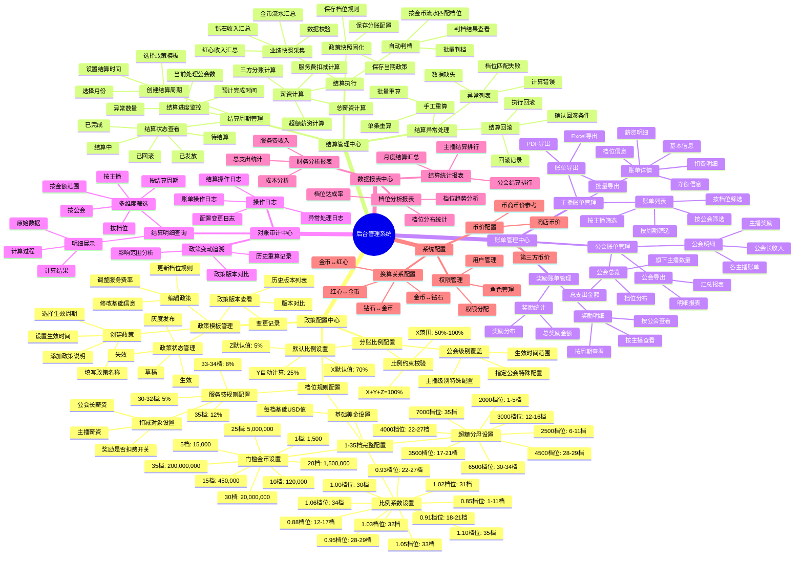
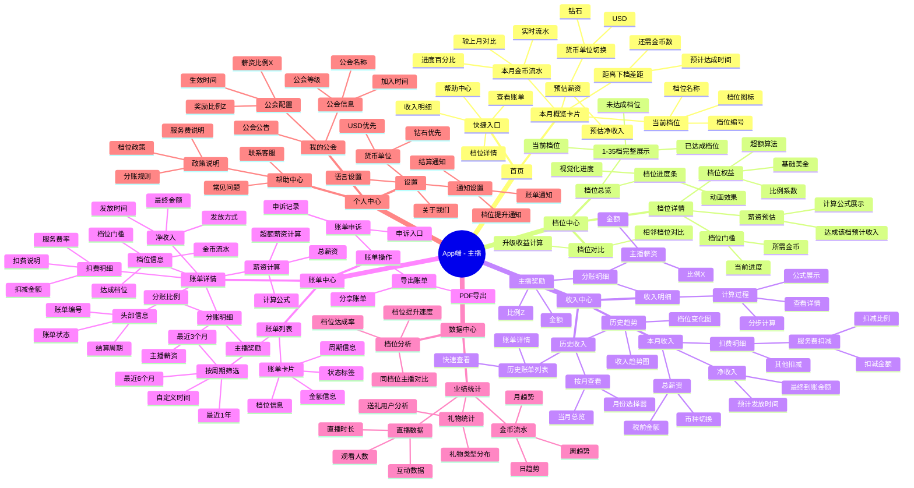
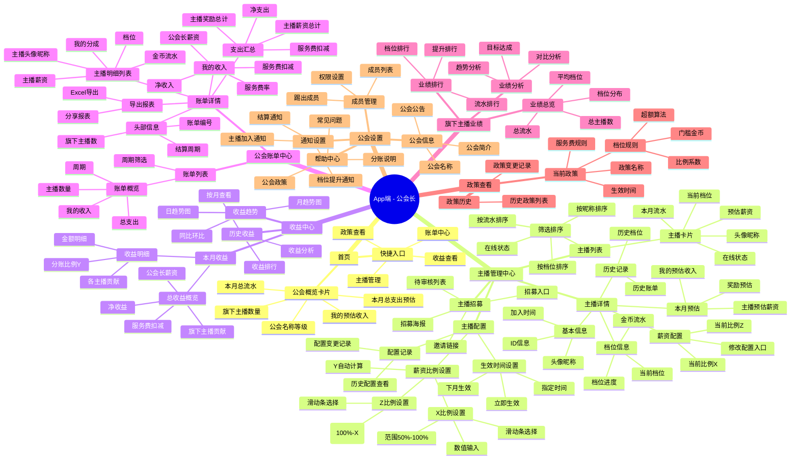
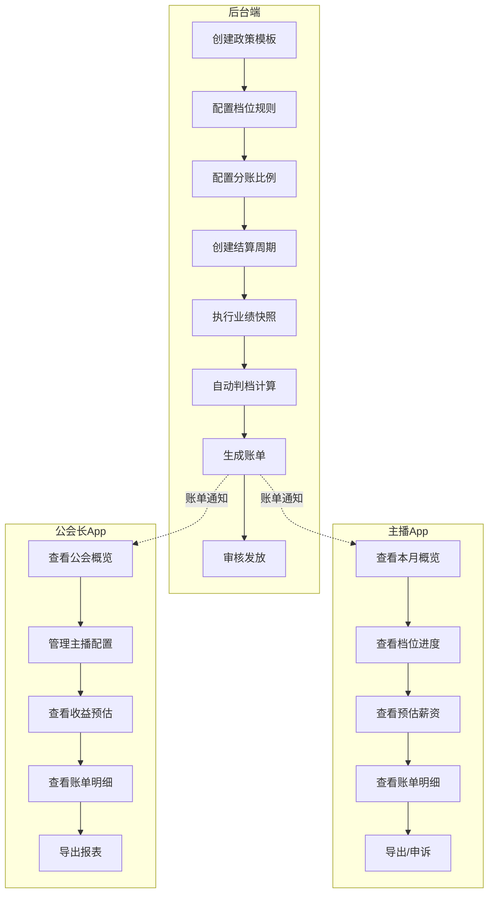

# 功能结构思维导图：月度公会薪资政策系统

## 1. 后台管理系统 (Admin/运营端)

## 2. App端 (主播端)

## 3. App端 (公会长端)

## 4. 系统功能模块对照表

| 功能域 | 后台端 | 主播App | 公会长App |
|--------|--------|---------|-----------|
| **政策配置** | 完整CRUD | 只读查看 | 只读查看 |
| **档位规则** | 完整配置 | 查看详情 | 查看详情 |
| **分账配置** | 默认+覆盖 | 查看自己的 | 配置旗下主播 |
| **结算执行** | 触发+监控 | 查看结果 | 查看结果 |
| **账单查看** | 全部账单 | 仅自己的 | 公会总览+明细 |
| **数据分析** | 全量分析 | 个人分析 | 公会分析 |
| **异常处理** | 手工处理 | 申诉入口 | - |

## 5. 核心业务流程

## 6. 权限矩阵

| 功能 | 超级管理员 | 运营 | 财务 | 主播 | 公会长 |
|------|------------|------|------|------|--------|
| 政策模板管理 | ✓ | ✓ | - | - | - |
| 档位规则配置 | ✓ | ✓ | - | - | - |
| 分账比例配置 | ✓ | ✓ | - | - | 只读/配置旗下 |
| 结算执行 | ✓ | ✓ | - | - | - |
| 结算审核 | ✓ | - | ✓ | - | - |
| 账单查看(全部) | ✓ | ✓ | ✓ | - | - |
| 账单查看(自己) | - | - | - | ✓ | - |
| 账单查看(公会) | - | - | - | - | ✓ |
| 数据导出 | ✓ | ✓ | ✓ | 自己的 | 自己的 |
| 系统配置 | ✓ | - | - | - | - |